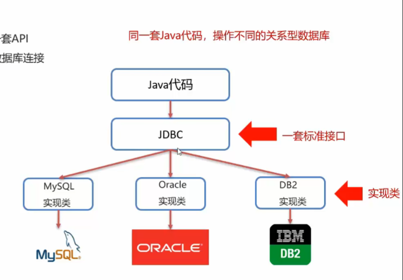
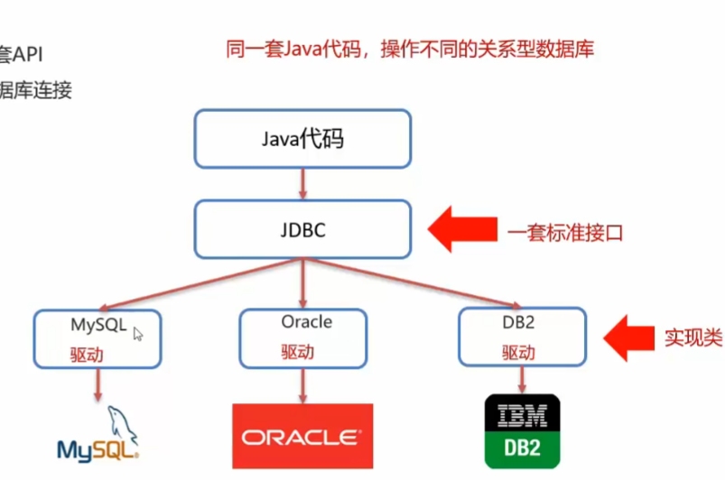
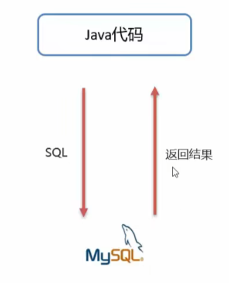
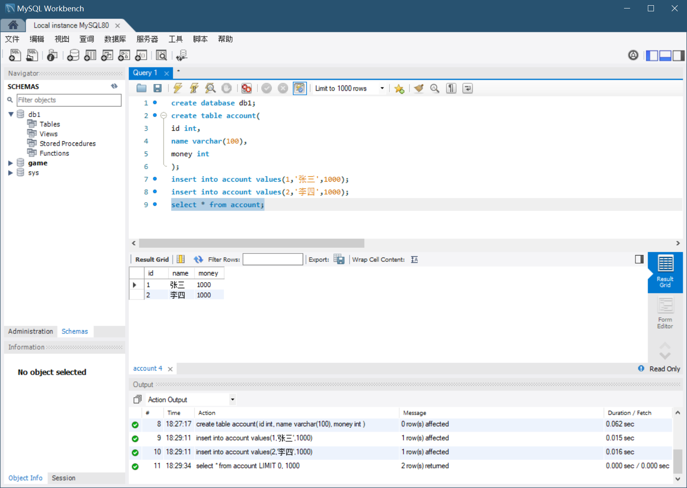
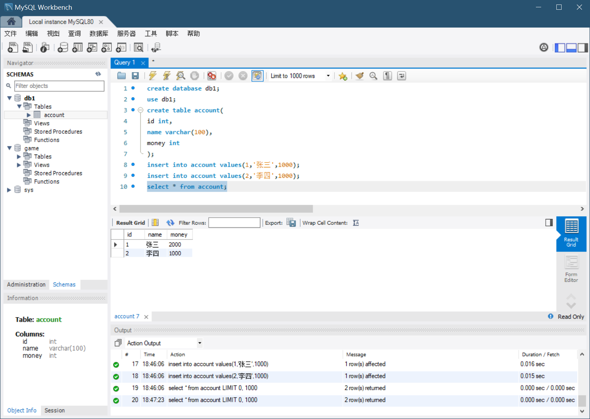
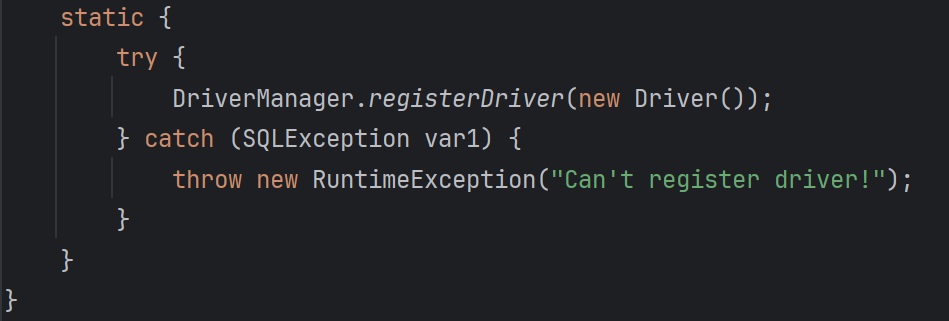

# 一、JDBC简介&快速入门

- JDBC就是使用Java语言操作关系型数据库的一套API

  ```java
  //1.注册驱动
  Class.forName("com.mysql.jdbc.Driver");
  //2.获取链接对象
  String url = "jdbc:mysql://127.0.0.1:3306/db1?useSSL=false";
  String username = "root";
  String password = "1234";
  Connection conn DriverManager.getConnection(url,username,password);
  //3.定义sql
  String sql = "upadate account set money = 2000 where id = 1";
  //4.获取执行sql的对象
  Statement stmt = conn.createStatement();
  //5.执行sql
  int count = stmt.executeUpdate(sql);
  //6.处理结果
  //System.out.println(count);
  //7.释放资源
  stmt.close();
  conn.close();
  ```


## 1.JDBC 简介

JDBC概念：

- JDBC就是使用Java语言操作关系型数据库的一套API
- 全称（**J**ava **D**ata**B**ase **C**onnectivity）Java 数据库连接

JDBC本质：

- 官方（sun公司）定义的一套操作所有关系型数据库的规则，即接口
- 各个数据库厂商去实现这套接口，提供数据库驱动jar包
- 我们可以使用这套接口（JDBC）编程，真正执行的代码是驱动jar包中的实现类

JDBC好处：

- 各数据库厂商使用相同的接口，Java代码不需要针对不同的数据库分别开发
- 可随时替换底层数据库，访问数据库的Java代码基本不变


**我们需要用同一套Java代码，操作不同的关系型数据库，JDBC实际上是一套标准接口，Java借此操作不同的关系型数据库**






## 2.JDBC 快速入门

步骤：

1. 创建工程，导入驱动jar包

   

2. 注册驱动

   `Class.forName("com.mysql.jdbc.Driver");`

3. 获取连接

   `Connection conn = DriverManager.getConnection(url,username,password);`

4. 定义SQL语句

   `String sql = "update...";`

5. 获取执行SQL对象

   `Statement stmt = conn.createStatement();`

6. 执行SQL

   `stmt.executeUpdate(sql);`

7. 处理返回结果

8. 释放资源




第一步创建项目、导入jar包相对基础，笔记中不做详细介绍，这里直接展示成功创建项目、导入好jar包，初始化好数据库之后的效果


初始化数据库




示例代码：

```java
package com.itheima.jdbc;

//TODO JDBC快速入门

import com.mysql.jdbc.Driver;

import java.sql.Connection;
import java.sql.DriverManager;
import java.sql.Statement;

public class JDBCDemo {
    public static void main(String[] args) throws Exception {

        //1.注册驱动
        Class.forName("com.mysql.jdbc.Driver");

        //2.获取连接
        String url="jdbc:mysql://127.0.0.1:3306/db1?useSSL=false";
        String username="root";
        String password="admin";
        Connection conn = DriverManager.getConnection(url, username, password); //获取连接对象

        //3.定义sql
        String sql="update account set money=2000 where id=1;";

        //4.获取执行sql的对象 Statement
        Statement stmt = conn.createStatement();

        //5.执行sql
        int count = stmt.executeUpdate(sql); //返回的是受影响的数据的行数

        //6.处理结果
        System.out.println(count);

        //7.释放资源
        stmt.close();
        conn.close();

    }
}
```

> 上述代码中URL意味着什么的详细解释：
>
> 1. 整体 URL 格式解释
>    - 在 Java 中，使用 JDBC（Java Database Connectivity）连接 MySQL 数据库时，`jdbc:mysql://`是连接 MySQL 数据库的协议前缀，它告诉程序要使用 JDBC 连接 MySQL 数据库。`127.0.0.1`是数据库服务器的 IP 地址，在这里`127.0.0.1`代表本地主机，也就是程序运行的这台机器本身。`3306`是 MySQL 数据库服务默认的端口号，用于在网络通信中标识 MySQL 服务进程。`db1`是要连接的数据库的名称，这部分指定了程序要访问的具体数据库资源。
> 2. `?useSSL=false`部分的解释
>    - SSL 介绍：
>      - SSL（Secure Sockets Layer）即安全套接层，是一种安全协议，用于在客户端和服务器之间建立加密的通信通道。在数据库连接的场景中，使用 SSL 可以保护数据在客户端和数据库服务器之间传输时的安全性，防止数据被窃取或篡改。
>    - 参数含义：
>      - `useSSL=false`是一个连接参数。当设置为`false`时，表示不使用 SSL 协议来建立连接。这可能是因为在开发或测试环境中，开发者可能暂时不需要加密的连接，或者可能遇到了 SSL 配置相关的问题而选择暂时禁用 SSL 连接。这种设置可以简化连接过程，但同时也意味着数据在传输过程中没有加密保护。
>
> 总的来说，`jdbc:mysql://127.0.0.1:3306/db1?useSSL = false`这个 URL 完整地指定了连接本地 MySQL 服务器上`db1`数据库的方式，并且明确表示不使用 SSL 协议来加密连接。


执行更新之后的数据库



这里张三的money更新成了2000，说明Java代码执行成功了


# 二、JDBC API 详解

## 1.DriverManager

- DriverManager（驱动管理类）作用：
  1. 注册驱动
  2. 获取数据库连接


1.注册驱动

`Class.forName("com.mysql.jdbc.Driver");`

- 查看Driver类源码



**提示：**

- **MySQL 5之后的驱动包，可以省略注册驱动的步骤**
- **自动加载jar包中META-INF/services/java.sql.Driver文件中的驱动类**


2.获取连接

`Connection conn = DriverManager.getConnection(url, username, password);`

- 参数

  1. url：连接路径

     语法：`jdbc:mysql://ip地址(域名):端口号/数据库名称?参数键值对1&参数键值对2...`

     示例：`jdbc:mysql://127.0.0.1:3306/db1`

     细节：

     - 如果连接的是本机的MySQL服务器，并且MySQL服务默认端口是3306，则url可以简写为：jdbc:mysql:///数据库名称?参数键值对
     - 配置 useSSL=false 参数，禁用安全连接方式，解决警告提示

  2. user：用户名

  3. password：密码


示例代码：

```java
package com.itheima.jdbc;

//TODO JDBC快速入门

import java.sql.Connection;
import java.sql.DriverManager;
import java.sql.Statement;

//TODO JDBC API 详解：DriverManager

public class JDBCDemo2_DriverManager {
    public static void main(String[] args) throws Exception {

        //1.注册驱动
//        Class.forName("com.mysql.jdbc.Driver");

        //2.获取连接：如果连接的是本机MySQL，并且端口是默认的3306，可以简化书写
        String url="jdbc:mysql:///db1?useSSL=false";
        String username="root";
        String password="admin";
        Connection conn = DriverManager.getConnection(url, username, password); //获取连接对象

        //3.定义sql
        String sql="update account set money=2000 where id=1;";

        //4.获取执行sql的对象 Statement
        Statement stmt = conn.createStatement();

        //5.执行sql
        int count = stmt.executeUpdate(sql); //返回的是受影响的数据的行数

        //6.处理结果
        System.out.println(count);

        //7.释放资源
        stmt.close();
        conn.close();

    }
}
```


## 2.Connection

- Connection（数据库连接对象）作用：
  1. 获取执行 SQL 的对象
  2. 管理事务


1.获取执行 SQL 的对象

- 普通执行SQL对象

  `Statement createStatement()`

- 预编译SQL的执行SQL对象：防止SQL注入

  `PreparedStatement prepareStatement(sql)`

- 执行存储过程的对象（不常用，不重点讲解）

  `CallableStatement prepareCall(sql)`


2.事务管理

- MySQL 事务管理

  开启事务：`BEGIN; / START TRANSACTION;`

  提交事务：`COMMIT;`

  回滚事务：`ROLLBACK`

  

  MySQL默认自动提交事务

- JDBC 事务管理：Connection接口中定义了3个对应的方法

  开启事务：`setAutoCommit(boolean autoCommit):true为自动提交事务；false为手动提交事务，即为开启事务`

  提交事务：`commit()`

  回滚事务：`rollback()`（出现错误会回滚到开始事务之前的状态）

  利用try catch完成事务的回滚


**包围代码的快捷键：ctrl + alt + t （例如try catch）**


示例代码：

```java
package com.itheima.jdbc;

//TODO JDBC快速入门

import java.sql.Connection;
import java.sql.DriverManager;
import java.sql.SQLException;
import java.sql.Statement;

//TODO JDBC API 详解：Connection

public class JDBCDemo3_Connection {
    public static void main(String[] args) throws Exception {

        //1.注册驱动
//        Class.forName("com.mysql.jdbc.Driver");

        //2.获取连接：如果连接的是本机MySQL，并且端口是默认的3306，可以简化书写
        String url="jdbc:mysql:///db1?useSSL=false";
        String username="root";
        String password="admin";
        Connection conn = DriverManager.getConnection(url, username, password); //获取连接对象

        //3.定义sql
        String sql1="update account set money=3000 where id=1;";
        String sql2="update account set money=3000 where id=2;";

        //4.获取执行sql的对象 Statement
        Statement stmt = conn.createStatement();

        try {
            //开启事务
            conn.setAutoCommit(false);

            //5.执行sql
            int count1 = stmt.executeUpdate(sql1); //返回的是受影响的数据的行数

            //6.处理结果
            System.out.println(count1);

//            int i=3/0;

            //5.执行sql
            int count2 = stmt.executeUpdate(sql2); //返回的是受影响的数据的行数

            //6.处理结果
            System.out.println(count2);

            //提交事务
            conn.commit();
        } catch (Exception e) {
            //回滚事务
            conn.rollback();

            throw new RuntimeException(e);
        }

        //7.释放资源
        stmt.close();
        conn.close();

    }
}

```

如果try内出现问题，比如出现int i=3/0这种问题，JDBC事务管理会将状态回滚到开始事务前的状态，也就是sql1和sql2都未执行的状态

如果没有添加事务，那么sql1执行后发生错误，sql2就不会执行了，就会出现执行了一半停止的情况


## 3.Statement

