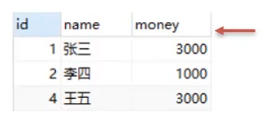
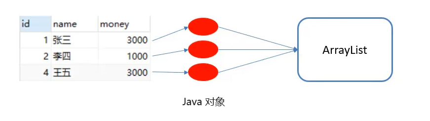
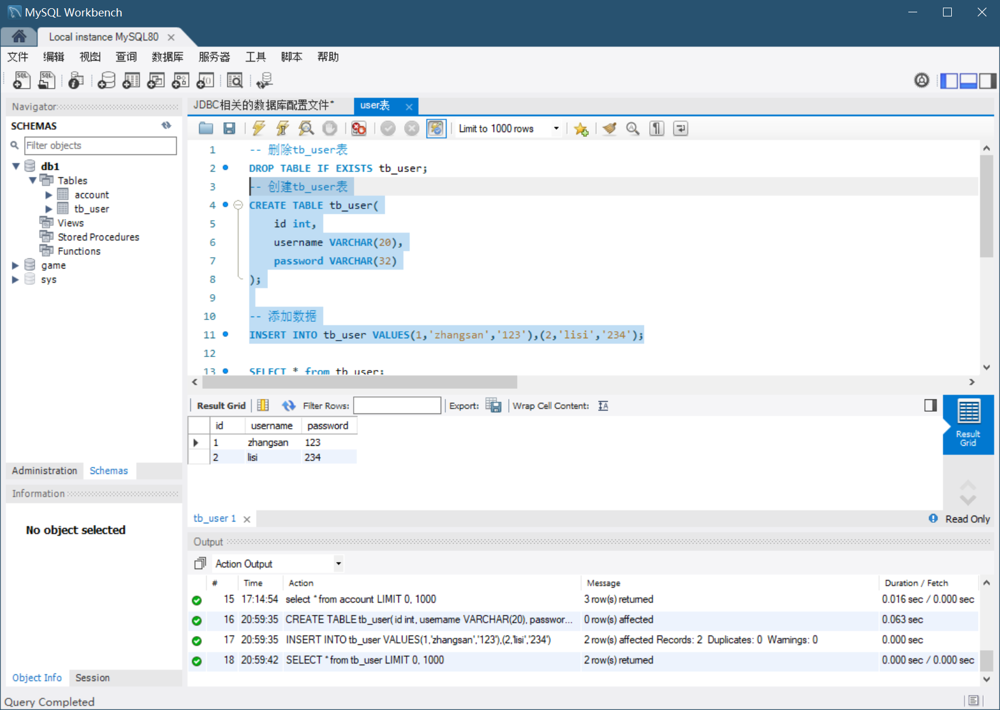
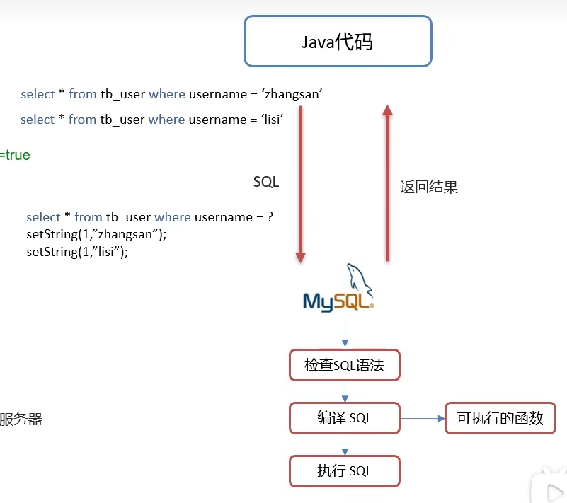
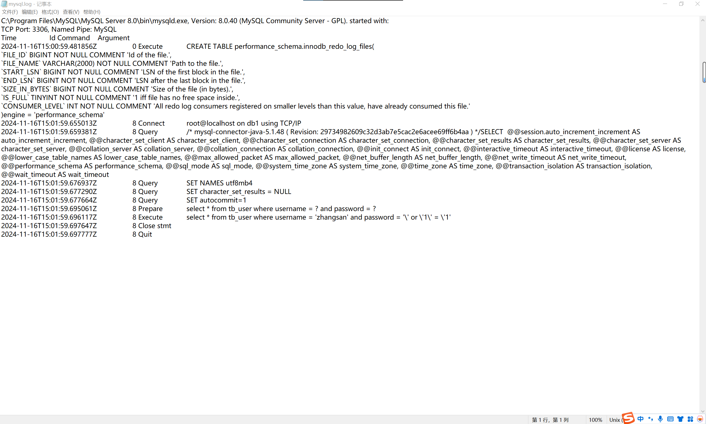
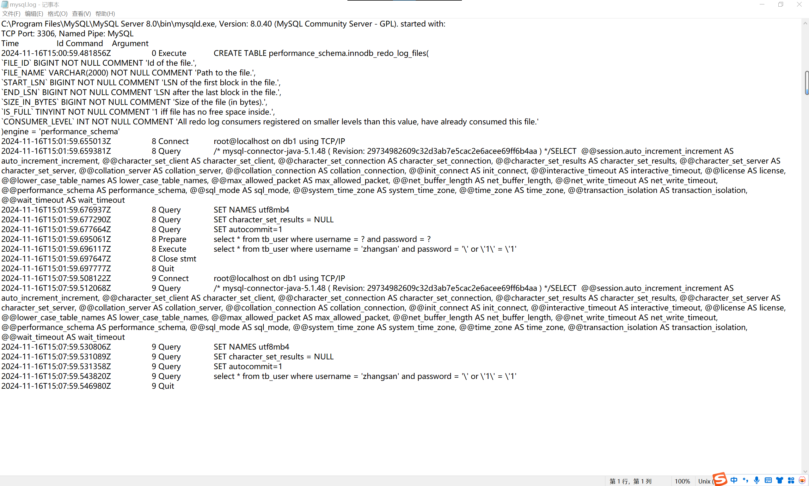
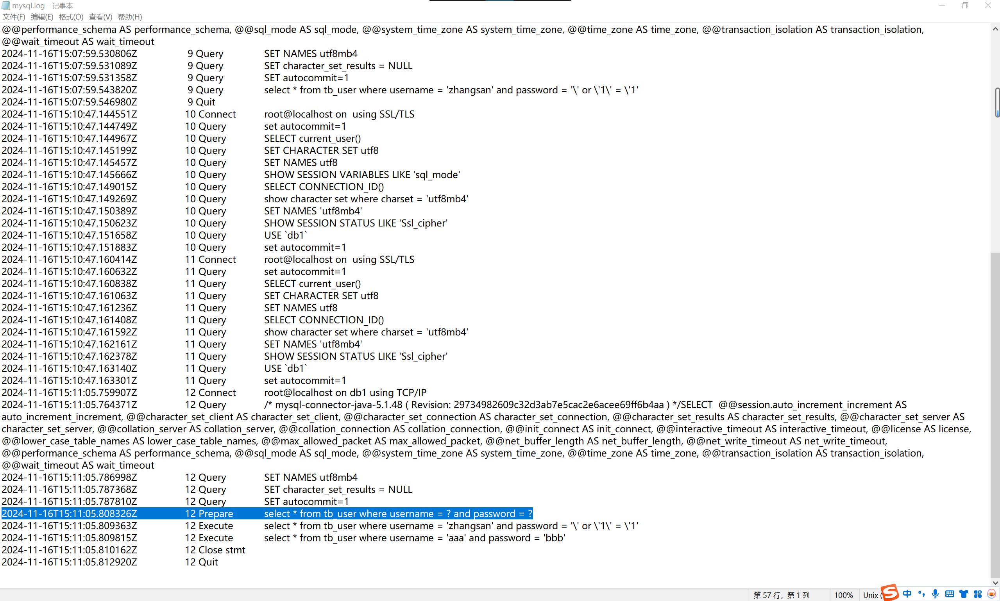
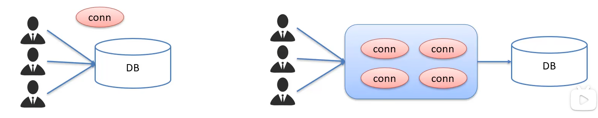
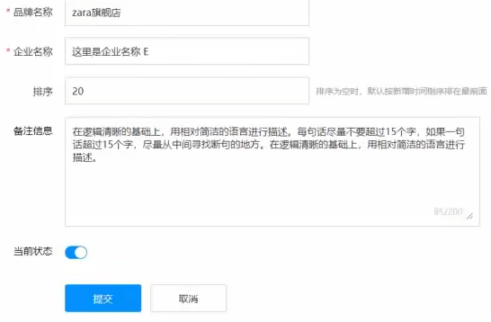

# 一、JDBC简介&快速入门

- JDBC就是使用Java语言操作关系型数据库的一套API

  ```java
  //1.注册驱动
  Class.forName("com.mysql.jdbc.Driver");
  //2.获取链接对象
  String url = "jdbc:mysql://127.0.0.1:3306/db1?useSSL=false";
  String username = "root";
  String password = "1234";
  Connection conn DriverManager.getConnection(url,username,password);
  //3.定义sql
  String sql = "upadate account set money = 2000 where id = 1";
  //4.获取执行sql的对象
  Statement stmt = conn.createStatement();
  //5.执行sql
  int count = stmt.executeUpdate(sql);
  //6.处理结果
  //System.out.println(count);
  //7.释放资源
  stmt.close();
  conn.close();
  ```


## 1.JDBC 简介

JDBC概念：

- JDBC就是使用Java语言操作关系型数据库的一套API
- 全称（**J**ava **D**ata**B**ase **C**onnectivity）Java 数据库连接

JDBC本质：

- 官方（sun公司）定义的一套操作所有关系型数据库的规则，即接口
- 各个数据库厂商去实现这套接口，提供数据库驱动jar包
- 我们可以使用这套接口（JDBC）编程，真正执行的代码是驱动jar包中的实现类

JDBC好处：

- 各数据库厂商使用相同的接口，Java代码不需要针对不同的数据库分别开发
- 可随时替换底层数据库，访问数据库的Java代码基本不变


**我们需要用同一套Java代码，操作不同的关系型数据库，JDBC实际上是一套标准接口，Java借此操作不同的关系型数据库**


## 2.JDBC 快速入门

步骤：

1. 创建工程，导入驱动jar包

   

2. 注册驱动

   `Class.forName("com.mysql.jdbc.Driver");`

3. 获取连接

   `Connection conn = DriverManager.getConnection(url,username,password);`

4. 定义SQL语句

   `String sql = "update...";`

5. 获取执行SQL对象

   `Statement stmt = conn.createStatement();`

6. 执行SQL

   `stmt.executeUpdate(sql);`

7. 处理返回结果

8. 释放资源


第一步创建项目、导入jar包相对基础，笔记中不做详细介绍，这里直接展示成功创建项目、导入好jar包，初始化好数据库之后的效果


初始化数据库


示例代码：

```java
package com.itheima.jdbc;

//TODO JDBC快速入门

import com.mysql.jdbc.Driver;

import java.sql.Connection;
import java.sql.DriverManager;
import java.sql.Statement;

public class JDBCDemo {
    public static void main(String[] args) throws Exception {

        //1.注册驱动
        Class.forName("com.mysql.jdbc.Driver");

        //2.获取连接
        String url="jdbc:mysql://127.0.0.1:3306/db1?useSSL=false";
        String username="root";
        String password="admin";
        Connection conn = DriverManager.getConnection(url, username, password); //获取连接对象

        //3.定义sql
        String sql="update account set money=2000 where id=1;";

        //4.获取执行sql的对象 Statement
        Statement stmt = conn.createStatement();

        //5.执行sql
        int count = stmt.executeUpdate(sql); //返回的是受影响的数据的行数

        //6.处理结果
        System.out.println(count);

        //7.释放资源
        stmt.close();
        conn.close();

    }
}
```

> 上述代码中URL意味着什么的详细解释：
>
> 1. 整体 URL 格式解释
>    - 在 Java 中，使用 JDBC（Java Database Connectivity）连接 MySQL 数据库时，`jdbc:mysql://`是连接 MySQL 数据库的协议前缀，它告诉程序要使用 JDBC 连接 MySQL 数据库。`127.0.0.1`是数据库服务器的 IP 地址，在这里`127.0.0.1`代表本地主机，也就是程序运行的这台机器本身。`3306`是 MySQL 数据库服务默认的端口号，用于在网络通信中标识 MySQL 服务进程。`db1`是要连接的数据库的名称，这部分指定了程序要访问的具体数据库资源。
> 2. `?useSSL=false`部分的解释
>    - SSL 介绍：
>      - SSL（Secure Sockets Layer）即安全套接层，是一种安全协议，用于在客户端和服务器之间建立加密的通信通道。在数据库连接的场景中，使用 SSL 可以保护数据在客户端和数据库服务器之间传输时的安全性，防止数据被窃取或篡改。
>    - 参数含义：
>      - `useSSL=false`是一个连接参数。当设置为`false`时，表示不使用 SSL 协议来建立连接。这可能是因为在开发或测试环境中，开发者可能暂时不需要加密的连接，或者可能遇到了 SSL 配置相关的问题而选择暂时禁用 SSL 连接。这种设置可以简化连接过程，但同时也意味着数据在传输过程中没有加密保护。
>
> 总的来说，`jdbc:mysql://127.0.0.1:3306/db1?useSSL = false`这个 URL 完整地指定了连接本地 MySQL 服务器上`db1`数据库的方式，并且明确表示不使用 SSL 协议来加密连接。


执行更新之后的数据库


这里张三的money更新成了2000，说明Java代码执行成功了


# 二、JDBC API 详解

## 1.DriverManager

- DriverManager（驱动管理类）作用：
  1. 注册驱动
  2. 获取数据库连接


1.注册驱动

`Class.forName("com.mysql.jdbc.Driver");`

- 查看Driver类源码


**提示：**

- **MySQL 5之后的驱动包，可以省略注册驱动的步骤**
- **自动加载jar包中META-INF/services/java.sql.Driver文件中的驱动类**


2.获取连接

`Connection conn = DriverManager.getConnection(url, username, password);`

- 参数

  1. url：连接路径

     语法：`jdbc:mysql://ip地址(域名):端口号/数据库名称?参数键值对1&参数键值对2...`

     示例：`jdbc:mysql://127.0.0.1:3306/db1`

     细节：

     - 如果连接的是本机的MySQL服务器，并且MySQL服务默认端口是3306，则url可以简写为：jdbc:mysql:///数据库名称?参数键值对
     - 配置 useSSL=false 参数，禁用安全连接方式，解决警告提示

  2. user：用户名

  3. password：密码


示例代码：

```java
package com.itheima.jdbc;

//TODO JDBC快速入门

import java.sql.Connection;
import java.sql.DriverManager;
import java.sql.Statement;

//TODO JDBC API 详解：DriverManager

public class JDBCDemo2_DriverManager {
    public static void main(String[] args) throws Exception {

        //1.注册驱动
//        Class.forName("com.mysql.jdbc.Driver");

        //2.获取连接：如果连接的是本机MySQL，并且端口是默认的3306，可以简化书写
        String url="jdbc:mysql:///db1?useSSL=false";
        String username="root";
        String password="admin";
        Connection conn = DriverManager.getConnection(url, username, password); //获取连接对象

        //3.定义sql
        String sql="update account set money=2000 where id=1;";

        //4.获取执行sql的对象 Statement
        Statement stmt = conn.createStatement();

        //5.执行sql
        int count = stmt.executeUpdate(sql); //返回的是受影响的数据的行数

        //6.处理结果
        System.out.println(count);

        //7.释放资源
        stmt.close();
        conn.close();

    }
}
```


## 2.Connection

- Connection（数据库连接对象）作用：
  1. 获取执行 SQL 的对象
  2. 管理事务


1.获取执行 SQL 的对象

- 普通执行SQL对象

  `Statement createStatement()`

- 预编译SQL的执行SQL对象：防止SQL注入

  `PreparedStatement prepareStatement(sql)`

- 执行存储过程的对象（不常用，不重点讲解）

  `CallableStatement prepareCall(sql)`


2.事务管理

- MySQL 事务管理

  开启事务：`BEGIN; / START TRANSACTION;`

  提交事务：`COMMIT;`

  回滚事务：`ROLLBACK`

  

  MySQL默认自动提交事务

- JDBC 事务管理：Connection接口中定义了3个对应的方法

  开启事务：`setAutoCommit(boolean autoCommit):true为自动提交事务；false为手动提交事务，即为开启事务`

  提交事务：`commit()`

  回滚事务：`rollback()`（出现错误会回滚到开始事务之前的状态）

  利用try catch完成事务的回滚


**包围代码的快捷键：ctrl + alt + t （例如try catch）**


示例代码：

```java
package com.itheima.jdbc;

//TODO JDBC快速入门

import java.sql.Connection;
import java.sql.DriverManager;
import java.sql.SQLException;
import java.sql.Statement;

//TODO JDBC API 详解：Connection

public class JDBCDemo3_Connection {
    public static void main(String[] args) throws Exception {

        //1.注册驱动
//        Class.forName("com.mysql.jdbc.Driver");

        //2.获取连接：如果连接的是本机MySQL，并且端口是默认的3306，可以简化书写
        String url="jdbc:mysql:///db1?useSSL=false";
        String username="root";
        String password="admin";
        Connection conn = DriverManager.getConnection(url, username, password); //获取连接对象

        //3.定义sql
        String sql1="update account set money=3000 where id=1;";
        String sql2="update account set money=3000 where id=2;";

        //4.获取执行sql的对象 Statement
        Statement stmt = conn.createStatement();

        try {
            //开启事务
            conn.setAutoCommit(false);

            //5.执行sql
            int count1 = stmt.executeUpdate(sql1); //返回的是受影响的数据的行数

            //6.处理结果
            System.out.println(count1);

//            int i=3/0;

            //5.执行sql
            int count2 = stmt.executeUpdate(sql2); //返回的是受影响的数据的行数

            //6.处理结果
            System.out.println(count2);

            //提交事务
            conn.commit();
        } catch (Exception e) {
            //回滚事务
            conn.rollback();

            throw new RuntimeException(e);
        }

        //7.释放资源
        stmt.close();
        conn.close();

    }
}

```

如果try内出现问题，比如出现int i=3/0这种问题，JDBC事务管理会将状态回滚到开始事务前的状态，也就是sql1和sql2都未执行的状态

如果没有添加事务，那么sql1执行后发生错误，sql2就不会执行了，就会出现执行了一半停止的情况


## 3.Statement

- Statement作用：

  1. 执行SQL语句

- 执行SQL语句

  `int executeUpdate(sql)`：执行DML、DDL语句

  返回值：（1）DML语句影响的行数（2）DDL语句执行后，执行成功也可能返回0

  `ResultSet executeQuery(sql)`：执行DQL语句

  返回值：ResultSet结果集对象


补充：

- DDL：对库和表的增删改查操作
- DML：对数据的增删改操作
- DQL：对数据的查询操作


示例代码（执行DDL和DML）：

```java
package com.itheima.jdbc;

//TODO JDBC快速入门

import org.junit.Test;

import java.sql.Connection;
import java.sql.DriverManager;
import java.sql.Statement;

//TODO JDBC API 详解：Statement

public class JDBCDemo4_Statement {

    //执行DML语句
    @Test
    public void testDML() throws Exception{
        //1.注册驱动
//        Class.forName("com.mysql.jdbc.Driver");

        //2.获取连接：如果连接的是本机MySQL，并且端口是默认的3306，可以简化书写
        String url="jdbc:mysql:///db1?useSSL=false";
        String username="root";
        String password="admin";
        Connection conn = DriverManager.getConnection(url, username, password); //获取连接对象

        //3.定义sql
        String sql="update account set money=3000 where id=1;";

        //4.获取执行sql的对象 Statement
        Statement stmt = conn.createStatement();

        //5.执行sql
        int count = stmt.executeUpdate(sql); //执行完DML语句后，返回的是受影响的数据的行数

        //6.处理结果
//        System.out.println(count);
        if(count>0){
            System.out.println("修改成功！");
        }else{
            System.out.println("修改失败!");
        }

        //7.释放资源
        stmt.close();
        conn.close();
    }

    //执行DDL语句
    @Test
    public void testDDL() throws Exception{
        //1.注册驱动
//        Class.forName("com.mysql.jdbc.Driver");

        //2.获取连接：如果连接的是本机MySQL，并且端口是默认的3306，可以简化书写
        String url="jdbc:mysql:///db1?useSSL=false";
        String username="root";
        String password="admin";
        Connection conn = DriverManager.getConnection(url, username, password); //获取连接对象

        //3.定义sql
        String sql="drop database db2;";

        //4.获取执行sql的对象 Statement
        Statement stmt = conn.createStatement();

        //5.执行sql
        int count = stmt.executeUpdate(sql); //执行完DDL语句后，返回的可能是0

        //6.处理结果
//        System.out.println(count);
//        if(count>0){
//            System.out.println("修改成功！");
//        }else{
//            System.out.println("修改失败!");
//        }
        System.out.println(count);

        //7.释放资源
        stmt.close();
        conn.close();
    }

}
```


## 4.ResultSet

- ResultSet（结果集对象）作用：

  1. 封装了DQL查询语句的结果

  `ResultSet stmt.executeQuery(sql)`：执行DQL语句，返回ResultSet对象

  

  ResultSet就会把例如上表的结果封装起来

  其中还有一个类似游标的东西，就是图中的箭头，游标默认指向的是数据行的上一行（表头行）

  将来要获取数据，首先这个游标行会向下移动一行，然后判断一下当前这行是否为有效行，然后就开始获取数据，然后再向下移动一行，直到无效行

  

- 获取查询结果

  `boolean next()`：（1）将光标从当前位置向下移动一行（2）判断当前行是否为有效行

  返回值

  - true：有效行，当前行有数据
  - false：无效行，当前行没有数据

  `xxx getXxx(参数)`：获取数据

  xxx：数据类型；如：int getInt(参数)；String getString(参数)

  参数：

  - int：列的编号，从1开始，不是从0开始
  - String：列的名称


- 使用步骤：

  1. 游标向下移动一行，并判断该行是否有数据：next()
  2. 获取数据：getXxx(参数)

  ```java
  //循环判断游标是否是最后一行末尾
  while(rs.next()){
  	//获取数据
  	re.getXxx(参数);
  }
  ```


示例代码：

```java
package com.itheima.jdbc;

//TODO JDBC快速入门

import org.junit.Test;

import java.sql.Connection;
import java.sql.DriverManager;
import java.sql.ResultSet;
import java.sql.Statement;

//TODO JDBC API 详解：ResultSet

public class JDBCDemo5_ResultSet {

    //执行DQL语句
    @Test
    public void testResult() throws Exception{
        //1.注册驱动
//        Class.forName("com.mysql.jdbc.Driver");

        //2.获取连接：如果连接的是本机MySQL，并且端口是默认的3306，可以简化书写
        String url="jdbc:mysql:///db1?useSSL=false";
        String username="root";
        String password="admin";
        Connection conn = DriverManager.getConnection(url, username, password); //获取连接对象

        //3.定义sql
        String sql="select * from account";

        //4.获取statement对象
        Statement stmt = conn.createStatement();

        //5.执行sql
        ResultSet rs = stmt.executeQuery(sql);

        //6.处理结果,遍历rs中的所有数据
        //6.1 光标向下移动一行,并且判断当前行是否有数据
//        while(rs.next()){
//            //6.2 获取数据 getXxx()
//            int id = rs.getInt(1);
//            String name = rs.getString(2);
//            int money = rs.getInt(3);
//
//            System.out.println(id);
//            System.out.println(name);
//            System.out.println(money);
//
//            System.out.println("------------------");
//        }

        while(rs.next()){
            //6.2 获取数据 getXxx()
            int id = rs.getInt("id");
            String name = rs.getString("name");
            int money = rs.getInt("money");

            System.out.println(id);
            System.out.println(name);
            System.out.println(money);

            System.out.println("------------------");
        }

        //7.释放资源
        rs.close();
        stmt.close();
        conn.close();

    }

}

```


**ResultSet 案例：**

需求：查询account账户表数据，封装为Account对象中，并且存储到ArrayList集合中



**快速添加get、set方法 快捷键：alt + insert**

```java
package com.itheima.jdbc;

//TODO JDBC快速入门

import com.itheima.pojo.Account;
import org.junit.Test;

import java.sql.Connection;
import java.sql.DriverManager;
import java.sql.ResultSet;
import java.sql.Statement;
import java.util.ArrayList;
import java.util.List;

//TODO JDBC API 详解：ResultSet

public class JDBCDemo5_ResultSet {

    //执行DQL语句
    @Test
    public void testResultSet() throws Exception{
        //1.注册驱动
//        Class.forName("com.mysql.jdbc.Driver");

        //2.获取连接：如果连接的是本机MySQL，并且端口是默认的3306，可以简化书写
        String url="jdbc:mysql:///db1?useSSL=false";
        String username="root";
        String password="admin";
        Connection conn = DriverManager.getConnection(url, username, password); //获取连接对象

        //3.定义sql
        String sql="select * from account";

        //4.获取statement对象
        Statement stmt = conn.createStatement();

        //5.执行sql
        ResultSet rs = stmt.executeQuery(sql);

        //6.处理结果,遍历rs中的所有数据
        //6.1 光标向下移动一行,并且判断当前行是否有数据
//        while(rs.next()){
//            //6.2 获取数据 getXxx()
//            int id = rs.getInt(1);
//            String name = rs.getString(2);
//            int money = rs.getInt(3);
//
//            System.out.println(id);
//            System.out.println(name);
//            System.out.println(money);
//
//            System.out.println("------------------");
//        }

        while(rs.next()){
            //6.2 获取数据 getXxx()
            int id = rs.getInt("id");
            String name = rs.getString("name");
            int money = rs.getInt("money");

            System.out.println(id);
            System.out.println(name);
            System.out.println(money);

            System.out.println("------------------");
        }

        //7.释放资源
        rs.close();
        stmt.close();
        conn.close();

    }

    //查询account账户表数据，封装为Account对象中，并且存储到ArrayList集合中
    //1.定义一个实体类Account
    //2.查询数据,封装到Account对象中
    //3.将Account存入ArrayList集合中

    @Test
    public void testResultSet2() throws Exception{
        //1.注册驱动
//        Class.forName("com.mysql.jdbc.Driver");

        //2.获取连接：如果连接的是本机MySQL，并且端口是默认的3306，可以简化书写
        String url="jdbc:mysql:///db1?useSSL=false";
        String username="root";
        String password="admin";
        Connection conn = DriverManager.getConnection(url, username, password); //获取连接对象

        //3.定义sql
        String sql="select * from account";

        //4.获取statement对象
        Statement stmt = conn.createStatement();

        //5.执行sql
        ResultSet rs = stmt.executeQuery(sql);

        //创建集合
        List<Account> list=new ArrayList<>();

        //6.1 光标向下移动一行,并且判断当前行是否有数据
        while(rs.next()){
            Account account = new Account();

            //6.2 获取数据 getXxx()
            int id = rs.getInt("id");
            String name = rs.getString("name");
            int money = rs.getInt("money");

            //赋值
            account.setId(id);
            account.setName(name);
            account.setMoney(money);

            //存入集合
            list.add(account);

        }

        System.out.println(list);

        //7.释放资源
        rs.close();
        stmt.close();
        conn.close();

    }

}
```


## 5.PreparedStatement

- PreparedStatement作用：
  1. 预编译SQL语句并执行：预防SQL注入问题
- SQL注入是什么：
  1. SQL注入是通过操作输入来修改实现定义好的SQL语句，用以达到执行代码对服务器进行**攻击**的方法


首先我们定义好之后要用到的数据库：




**SQL注入演示：**

需求：完成用户登录

```sql
select * from tb_user where username = 'zhangsan' and password = '123';
```

用户登录和SQL注入演示代码：

```java
package com.itheima.jdbc;

//TODO JDBC快速入门

import com.itheima.pojo.Account;
import org.junit.Test;

import java.sql.Connection;
import java.sql.DriverManager;
import java.sql.ResultSet;
import java.sql.Statement;
import java.util.ArrayList;
import java.util.List;

//TODO 用户登录

public class JDBCDemo6_UserLogin {

    //执行DQL语句
    @Test
    public void testLogin() throws Exception{

        //2.获取连接：如果连接的是本机MySQL，并且端口是默认的3306，可以简化书写
        String url="jdbc:mysql:///db1?useSSL=false";
        String username="root";
        String password="admin";
        Connection conn = DriverManager.getConnection(url, username, password); //获取连接对象

        //接收用户输入的 用户名和密码
        String name="zhangsan";
        String pwd="fasfsafdgb";

        String sql="select * from tb_user where username='"+name+"' and password='"+pwd+"'";

        //获取stmt对象
        Statement stmt = conn.createStatement();

        //执行sql
        ResultSet rs = stmt.executeQuery(sql);

        //判断登录是否成功
        if(rs.next()){
            System.out.println("登录成功!");
        }else{
            System.out.println("登录失败!");
        }

        //7.释放资源
        rs.close();
        stmt.close();
        conn.close();

    }

    //演示SQL注入
    //核心问题在于拼接字符串
    @Test
    public void testLogin_Inject() throws Exception{

        //2.获取连接：如果连接的是本机MySQL，并且端口是默认的3306，可以简化书写
        String url="jdbc:mysql:///db1?useSSL=false";
        String username="root";
        String password="admin";
        Connection conn = DriverManager.getConnection(url, username, password); //获取连接对象

        //接收用户输入的 用户名和密码
        String name="zhangsan";
        String pwd="' or '1' = '1";

        String sql="select * from tb_user where username='"+name+"' and password='"+pwd+"'";
        System.out.println(sql);

        //获取stmt对象
        Statement stmt = conn.createStatement();

        //执行sql
        ResultSet rs = stmt.executeQuery(sql);

        //判断登录是否成功
        if(rs.next()){
            System.out.println("登录成功!");
        }else{
            System.out.println("登录失败!");
        }

        //7.释放资源
        rs.close();
        stmt.close();
        conn.close();

    }
}
```


如何使用PreparedStatement对象来解决SQL注入问题：

1. 获取PreparedStatement对象

   ```java
   //SQL语句中的参数值，使用？占位符替代
   String sql = "select * from tb_user where username = ? and password = ?";
   
   //通过Connect对象获取，并传入对应的sql语句
   PreparedStatement pstmt = conn.prepareStatement(sql);
   ```

2. 设置参数值

   ```
   PreparedStatement对象：setXxx（参数1，参数2）：给？赋值
   	Xxx：数据类型；如setInt（参数1，参数2）
   	参数：
   		参数1：？的位置编号，从1开始
   		参数2：？的值
   ```

3. 执行SQL

   ```
   executeUpdate();/executeQuery(); : 不需要再传递sql
   ```


示例代码：

```java
package com.itheima.jdbc;

//TODO JDBC快速入门

import org.junit.Test;

import java.sql.*;

//TODO JDBC API 详解：PreparedStatement

public class JDBCDemo7_PreparedStatement {

    //执行DQL语句
    @Test
    public void testPreparedStatement() throws Exception{

        //2.获取连接：如果连接的是本机MySQL，并且端口是默认的3306，可以简化书写
        String url="jdbc:mysql:///db1?useSSL=false";
        String username="root";
        String password="admin";
        Connection conn = DriverManager.getConnection(url, username, password); //获取连接对象

        //接收用户输入的 用户名和密码
        String name="zhangsan";
        String pwd="' or '1' = '1";

       //定义sql
        String sql="select * from tb_user where username = ? and password = ?;";

        //获取pstmt对象
        //自动添加转义字符防止SQL注入
        PreparedStatement pstmt = conn.prepareStatement(sql);

        //设置问号的值
        pstmt.setString(1,name);
        pstmt.setString(2,pwd);

        //执行sql
        ResultSet rs = pstmt.executeQuery();

        //判断登录是否成功
        if(rs.next()){
            System.out.println("登录成功!");
        }else{
            System.out.println("登录失败!");
        }

        //7.释放资源
        rs.close();
        pstmt.close();
        conn.close();

    }

    //演示SQL注入
    //核心问题在于拼接字符串
    @Test
    public void testLogin_Inject() throws Exception{

        //2.获取连接：如果连接的是本机MySQL，并且端口是默认的3306，可以简化书写
        String url="jdbc:mysql:///db1?useSSL=false";
        String username="root";
        String password="admin";
        Connection conn = DriverManager.getConnection(url, username, password); //获取连接对象

        //接收用户输入的 用户名和密码
        String name="zhangsan";
        String pwd="' or '1' = '1";

        String sql="select * from tb_user where username='"+name+"' and password='"+pwd+"'";
        System.out.println(sql);

        //获取stmt对象
        Statement stmt = conn.createStatement();

        //执行sql
        ResultSet rs = stmt.executeQuery(sql);

        //判断登录是否成功
        if(rs.next()){
            System.out.println("登录成功!");
        }else{
            System.out.println("登录失败!");
        }

        //7.释放资源
        rs.close();
        stmt.close();
        conn.close();

    }
}

```


## 6.PreparedStatement 原理

- PreparedStatement 好处：

  1. 预编译SQL，性能更高
  2. 防止SQL注入：**将敏感字符转义**

  ①PreparedStatement 预编译功能开启：==useServerPrepStmts=true==

  ②配置MySQL执行日志（重启mysql服务后生效）

  其中生成日志的路径自己修改一下

  ```
  log-output=FILE
  general-log=1
  general_log_file="D:\mysql.log"
  slow-query-log=1
  slow_query_log_file="D:\mysql_slow.log"
  long_query_time=2
  ```

- PreparedStatement 原理：

  1. 在获取PreparedStatement对象时，将sql语句发送给mysql服务器进行检查，编译（这些步骤很耗时）
  2. 执行时就不用再进行这些步骤了，速度更快
  3. 如果sql模板一样，则只需要进行一次检查、编译




使用预编译时的示例代码：

重点是URL处：&useServerPrepStmts=true

```java
    //PreparedStatement原理
    @Test
    public void testPreparedStatement2() throws Exception{

        //2.获取连接：如果连接的是本机MySQL，并且端口是默认的3306，可以简化书写
        //&useServerPrepStmts=true 参数开启预编译功能
        String url="jdbc:mysql:///db1?useSSL=false&useServerPrepStmts=true&allowPublicKeyRetrieval=true";
        String username="root";
        String password="admin";
        Connection conn = DriverManager.getConnection(url, username, password); //获取连接对象

        //接收用户输入的 用户名和密码
        String name="zhangsan";
        String pwd="' or '1' = '1";

        //定义sql
        String sql="select * from tb_user where username = ? and password = ?;";

        //获取pstmt对象
        //自动添加转义字符防止SQL注入
        PreparedStatement pstmt = conn.prepareStatement(sql);

        //设置问号的值
        pstmt.setString(1,name);
        pstmt.setString(2,pwd);

        //执行sql
        ResultSet rs = pstmt.executeQuery();

        //判断登录是否成功
        if(rs.next()){
            System.out.println("登录成功!");
        }else{
            System.out.println("登录失败!");
        }

        //7.释放资源
        rs.close();
        pstmt.close();
        conn.close();

    }
```

使用预编译时的日志文件：




不使用预编译时的示例代码：

```java
    //PreparedStatement原理
    @Test
    public void testPreparedStatement2() throws Exception{

        //2.获取连接：如果连接的是本机MySQL，并且端口是默认的3306，可以简化书写
        //&useServerPrepStmts=true 参数开启预编译功能
        String url="jdbc:mysql:///db1?useSSL=false&allowPublicKeyRetrieval=true";
        String username="root";
        String password="admin";
        Connection conn = DriverManager.getConnection(url, username, password); //获取连接对象

        //接收用户输入的 用户名和密码
        String name="zhangsan";
        String pwd="' or '1' = '1";

        //定义sql
        String sql="select * from tb_user where username = ? and password = ?;";

        //获取pstmt对象
        //自动添加转义字符防止SQL注入
        PreparedStatement pstmt = conn.prepareStatement(sql);

        //设置问号的值
        pstmt.setString(1,name);
        pstmt.setString(2,pwd);

        //执行sql
        ResultSet rs = pstmt.executeQuery();

        //判断登录是否成功
        if(rs.next()){
            System.out.println("登录成功!");
        }else{
            System.out.println("登录失败!");
        }

        //7.释放资源
        rs.close();
        pstmt.close();
        conn.close();

    }
```

不使用预编译时的日志文件：




执行两次类似SQL语句模板的预编译示例代码：

```java
    //PreparedStatement原理
    @Test
    public void testPreparedStatement2() throws Exception{

        //2.获取连接：如果连接的是本机MySQL，并且端口是默认的3306，可以简化书写
        //&useServerPrepStmts=true 参数开启预编译功能
        String url="jdbc:mysql:///db1?useSSL=false&useServerPrepStmts=true&allowPublicKeyRetrieval=true";
        String username="root";
        String password="admin";
        Connection conn = DriverManager.getConnection(url, username, password); //获取连接对象

        //接收用户输入的 用户名和密码
        String name="zhangsan";
        String pwd="' or '1' = '1";

        //定义sql
        String sql="select * from tb_user where username = ? and password = ?;";

        //获取pstmt对象
        //自动添加转义字符防止SQL注入
        PreparedStatement pstmt = conn.prepareStatement(sql);

        //设置问号的值
        pstmt.setString(1,name);
        pstmt.setString(2,pwd);
        ResultSet rs=null;

        //执行sql
         rs = pstmt.executeQuery();

        //设置问号的值
        pstmt.setString(1,"aaa");
        pstmt.setString(2,"bbb");

        //执行sql
         rs = pstmt.executeQuery();

        //判断登录是否成功
        if(rs.next()){
            System.out.println("登录成功!");
        }else{
            System.out.println("登录失败!");
        }

        //7.释放资源
        rs.close();
        pstmt.close();
        conn.close();

    }
```

执行两次类似SQL语句模板的预编译日志文件：

**重点是：只预编译一次，执行了两次**




**还有一个重点：预编译发生在获取PreparedStatement时，不是在设置问号参数传参的时候才编译**

即发生在这一步

```java
//获取pstmt对象
PreparedStatement pstmt = conn.prepareStatement(sql);
```


# 三、数据库连接池

## 1.数据库连接池简介

- **数据库连接池**是个容器，负责分配、管理数据库连接（Connection）
- 它允许应用程序重复使用一个现有的数据库连接，而不是再重新建立一个
- 释放空间时间超过最大空闲时间的数据库连接来避免因为没有释放数据库连接而引起的数据库连接遗漏
- 好处：
  - 资源重用
  - 提升系统响应速度
  - 避免数据库连接遗漏




**数据库连接池实现**

- 标准接口：**DataSource**

  - 官方（SUN）提供的数据库连接池标准接口，由第三方组织实现此接口

  - 功能：获取连接

    `Connection getConnection()`

- 常见的数据库连接池：

  - DBCP
  - C3P0
  - Druid

- Druid（德鲁伊）

  - Druid连接池是阿里巴巴开源的数据库连接池项目
  - 功能强大，性能优秀，是Java语言最好的数据库连接池之一


## 2.Druid 数据库连接池

**Druid使用步骤**

1. 导入jar包 druid-1.1.12.jar
2. 定义配置文件
3. 加载配置文件
4. 获取数据库连接池对象
5. 获取链接


配置文件内容：

```properties
driverClassName=com.mysql.jdbc.Driver
url=jdbc:mysql:///db1?useSSL=false&useServerPrepStmts=true&allowPublicKeyRetrieval=true
username=root
password=admin
# 初始化连接数量
initialSize=5
# 最大连接数
maxActive=10
# 最大等待时间
maxWait=3000
```

**整体上下移动一整行代码快捷键：alt+ shift + 上下键**

示例代码：

```java
package com.itheima.druid;

import com.alibaba.druid.pool.DruidDataSourceFactory;

import javax.sql.DataSource;
import java.io.FileInputStream;
import java.sql.Connection;
import java.util.Properties;

//TODO Druid数据库连接池演示
public class DruidDemo {
    public static void main(String[] args) throws Exception {
        //1.导入jar包

        //2.定义配置文件
        Properties prop = new Properties();

        //3.加载配置文件
        prop.load(new FileInputStream("JDBC-Demo/src/druid.properties"));

        //4.获取连接池对象
        DataSource dataSource = DruidDataSourceFactory.createDataSource(prop);

        //5.获取数据库连接 Connection
        Connection connection = dataSource.getConnection();

        //查看数据库连接对象，成功连接
        System.out.println(connection);

    }
}

```


# 四、小练习

**完成商品品牌数据的增删改查操作**

- 查询：查询所有数据
- 添加：添加品牌
- 修改：根据id修改
- 删除：根据id删除


## 1.环境准备

- 准备环境：
  1. 数据库表 tb_brand
  2. 实体类 Brand
  3. 测试用例


tb_brand文件SQL代码：

```sql
-- 删除tb_brand表
drop table if exists tb_brand;
-- 创建tb_brand表
create table tb_brand
(
    -- id 主键
    id           int primary key auto_increment,
    -- 品牌名称
    brand_name   varchar(20),
    -- 企业名称
    company_name varchar(20),
    -- 排序字段
    ordered      int,
    -- 描述信息
    description  varchar(100),
    -- 状态：0：禁用  1：启用
    status       int
);
-- 添加数据
insert into tb_brand (brand_name, company_name, ordered, description, status)
values ('三只松鼠', '三只松鼠股份有限公司', 5, '好吃不上火', 0),
       ('华为', '华为技术有限公司', 100, '华为致力于把数字世界带入每个人、每个家庭、每个组织，构建万物互联的智能世界', 1),
       ('小米', '小米科技有限公司', 50, 'are you ok', 1);


SELECT * FROM tb_brand;
```

**整列编辑快捷键：alt + 左键**

示例代码：

```java
package com.itheima.example;

//TODO 品牌数据的增删改查操作

public class BrandTest {
}

```


## 2.查询所有

**查询所有数据**

1. 获取Connection
2. **定义SQL**：select * from tb_brand;
3. 获取 PreparedStatement对象
4. **设置参数**：不需要
5. 执行SQL
6. **处理结果**：List\<Brand>
7. 释放资源


示例代码：

```java
package com.itheima.example;

//TODO 品牌数据的增删改查操作

import com.alibaba.druid.pool.DruidDataSourceFactory;
import com.itheima.pojo.Brand;
import org.junit.Test;

import javax.sql.DataSource;
import java.io.FileInputStream;
import java.sql.Connection;
import java.sql.PreparedStatement;
import java.sql.ResultSet;
import java.util.ArrayList;
import java.util.List;
import java.util.Properties;

public class BrandTest {

    /*查询所有:
    * 1.SQL:select * from tb_Brand;
    * 2.参数:不需要
    * 3.结果:List<Brand>
    * */
    //测试用例
    @Test
    public void testSelectAll() throws Exception {
        //1.获取Connection对象
        //直接从DruidDemo复制即可
        //定义配置文件
        Properties prop = new Properties();

        //加载配置文件
        prop.load(new FileInputStream("src/druid.properties"));

        //获取连接池对象
        DataSource dataSource = DruidDataSourceFactory.createDataSource(prop);

        //获取数据库连接 Connection
        Connection conn = dataSource.getConnection();

        //2.定义SQL
        String sql="select * from tb_Brand;";

        //3.获取pstmt对象
        PreparedStatement pstmt = conn.prepareStatement(sql);

        //4.设置参数

        //5.执行SQL
        ResultSet rs = pstmt.executeQuery();

        //6.处理结果 List<Brand> 封装Brand对象，装载到List集合
        Brand brand=null;
        List<Brand> brands=new ArrayList<>();
        while (rs.next()){
            //获取数据
            int id = rs.getInt("id");
            String brandName = rs.getString("brand_name");
            String companyName = rs.getString("company_name");
            int ordered = rs.getInt("ordered");
            String description = rs.getString("description");
            int status = rs.getInt("status");
            //封装Brand对象
            brand=new Brand();
            brand.setId(id);
            brand.setBrandName(brandName);
            brand.setCompanyName(companyName);
            brand.setOrdered(ordered);
            brand.setDescription(description);
            brand.setStatus(status);
            //装载集合
            brands.add(brand);
        }
        System.out.println(brands);
        //7.释放资源
        rs.close();
        pstmt.close();
        conn.close();

    }
}

```


## 3.添加&修改&删除

### ①添加


1. 编写SQL语句

   ```sql
   insert into tb_brand(brand_name,company_name,ordered,description,status)
   values(?,?,?,?,?);
   ```

2. 是否需要参数？需要：除了id之外的所有数据

3. 返回结果如何封装？boolean


示例代码：

```java
    /*添加:
     * 1.SQL:insert into tb_brand(brand_name,company_name,ordered,description,status)
                values(?,?,?,?,?);
     * 2.参数:需要，除了id之外的所有参数信息
     * 3.结果:boolean
     * */
    //测试用例
    @Test
    public void testAdd() throws Exception {
        //接受页面提交的参数
        String brandName = "香飘飘";
        String companyName = "香飘飘";
        int ordered = 1;
        String description = "绕地球一圈";
        int status = 1;


        //1.获取Connection对象
        //直接从DruidDemo复制即可
        //定义配置文件
        Properties prop = new Properties();

        //加载配置文件
        prop.load(new FileInputStream("src/druid.properties"));

        //获取连接池对象
        DataSource dataSource = DruidDataSourceFactory.createDataSource(prop);

        //获取数据库连接 Connection
        Connection conn = dataSource.getConnection();

        //2.定义SQL
        String sql = "insert into tb_brand(brand_name,company_name,ordered,description,status) values(?,?,?,?,?);";

        //3.获取pstmt对象
        PreparedStatement pstmt = conn.prepareStatement(sql);

        //4.设置参数
        pstmt.setString(1, brandName);
        pstmt.setString(2, companyName);
        pstmt.setInt(3, ordered);
        pstmt.setString(4, description);
        pstmt.setInt(5, status);

        //5.执行SQL
        int count = pstmt.executeUpdate(); //受影响的行数

        //6.处理结果
        System.out.println(count > 0);

        //7.释放资源
        pstmt.close();
        conn.close();

    }
```


### ②修改



1. 编写SQL语句

   ```sql
   update tb_brand
   set brand_name=?,
   	company_name=?,
   	ordered=?,
   	description=?,
   	status=?
   where id=?
   ```

2. 是否需要参数？需要：Brand对象所有数据

3. 返回结果如何封装？boolean


示例代码：

```java
    /*修改:
 * 1.SQL:
 * update tb_brand
    set brand_name=?,
	    company_name=?,
	    ordered=?,
	    description=?,
	    status=?
    where id=?
 * 2.参数:需要，所有数据
 * 3.结果:boolean
 * */
    //测试用例
    @Test
    public void testUpdate() throws Exception {
        //接受页面提交的参数
        String brandName = "香飘飘";
        String companyName = "香飘飘";
        int ordered = 1000;
        String description = "绕地球三圈";
        int status = 1;
        int id=4;


        //1.获取Connection对象
        //直接从DruidDemo复制即可
        //定义配置文件
        Properties prop = new Properties();

        //加载配置文件
        prop.load(new FileInputStream("src/druid.properties"));

        //获取连接池对象
        DataSource dataSource = DruidDataSourceFactory.createDataSource(prop);

        //获取数据库连接 Connection
        Connection conn = dataSource.getConnection();

        //2.定义SQL
        String sql = "update tb_brand set brand_name=?,company_name=?,ordered=?,description=?,status=? where id=?";

        //3.获取pstmt对象
        PreparedStatement pstmt = conn.prepareStatement(sql);

        //4.设置参数
        pstmt.setString(1, brandName);
        pstmt.setString(2, companyName);
        pstmt.setInt(3, ordered);
        pstmt.setString(4, description);
        pstmt.setInt(5, status);
        pstmt.setInt(6, id);

        //5.执行SQL
        int count = pstmt.executeUpdate(); //受影响的行数

        //6.处理结果
        System.out.println(count > 0);

        //7.释放资源
        pstmt.close();
        conn.close();

    }
```


### ③删除


1. 编写SQL语句

   ```sql
   delete from tb_brand where id=?;
   ```

2. 是否需要参数？需要：id

3. 返回结果如何封装？boolean


示例代码：

```java
    /*删除:
     * 1.SQL:delete from tb_brand where id=?;
     * 2.参数:需要，id
     * 3.结果:boolean
     * */
    //测试用例
    @Test
    public void testDeleteById() throws Exception {
        //接受页面提交的参数
        int id = 4;


        //1.获取Connection对象
        //直接从DruidDemo复制即可
        //定义配置文件
        Properties prop = new Properties();

        //加载配置文件
        prop.load(new FileInputStream("src/druid.properties"));

        //获取连接池对象
        DataSource dataSource = DruidDataSourceFactory.createDataSource(prop);

        //获取数据库连接 Connection
        Connection conn = dataSource.getConnection();

        //2.定义SQL
        String sql = "delete from tb_brand where id=?;";

        //3.获取pstmt对象
        PreparedStatement pstmt = conn.prepareStatement(sql);

        //4.设置参数
        pstmt.setInt(1, id);

        //5.执行SQL
        int count = pstmt.executeUpdate(); //受影响的行数

        //6.处理结果
        System.out.println(count > 0);

        //7.释放资源
        pstmt.close();
        conn.close();

    }
```
