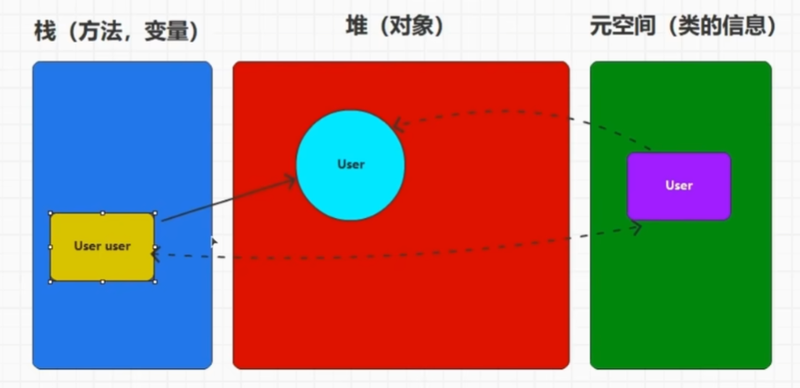
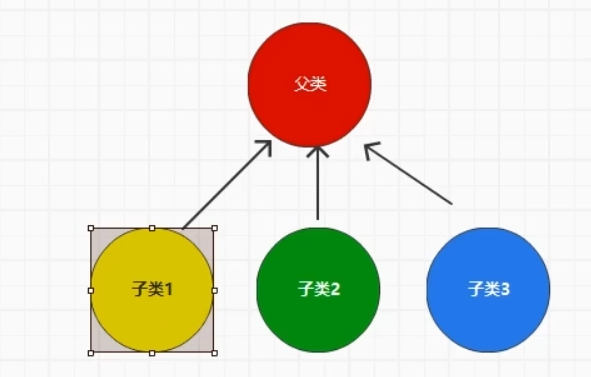
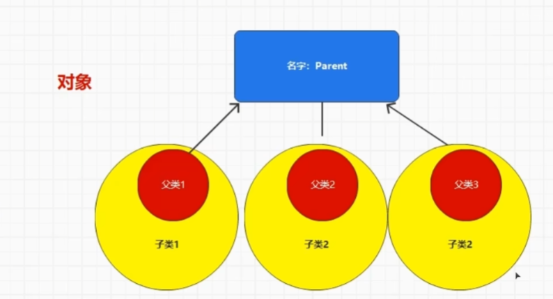
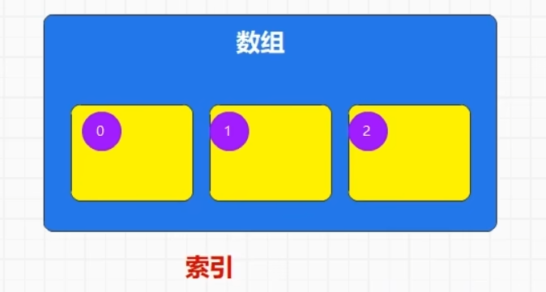
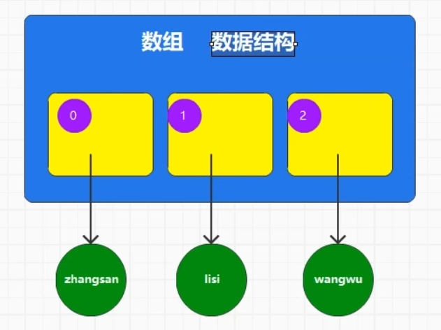
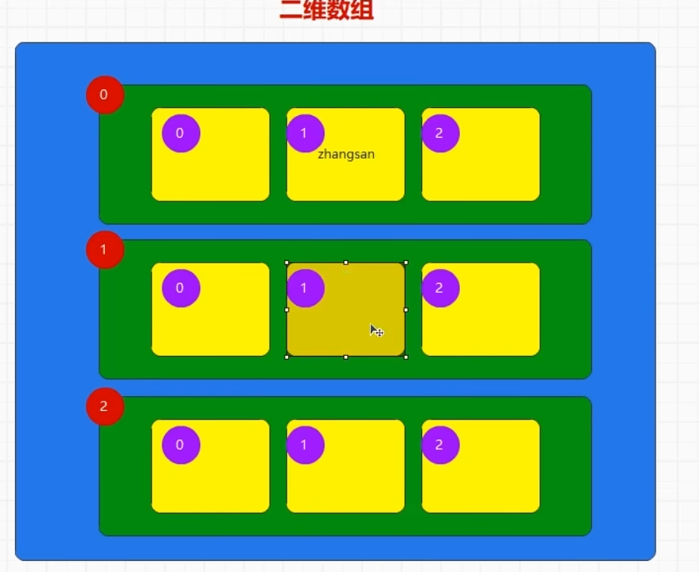
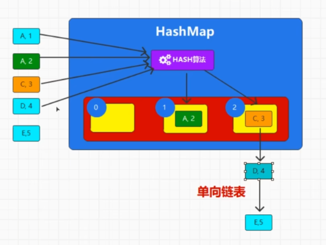
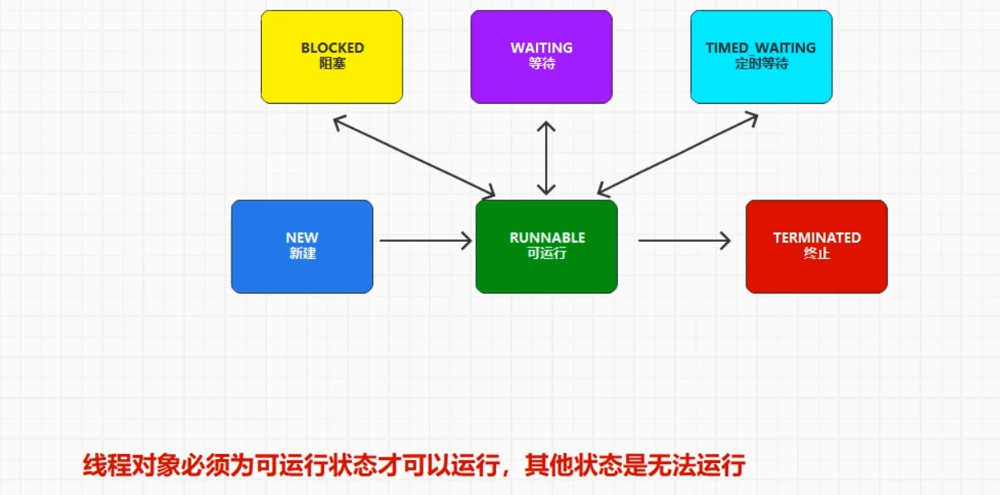
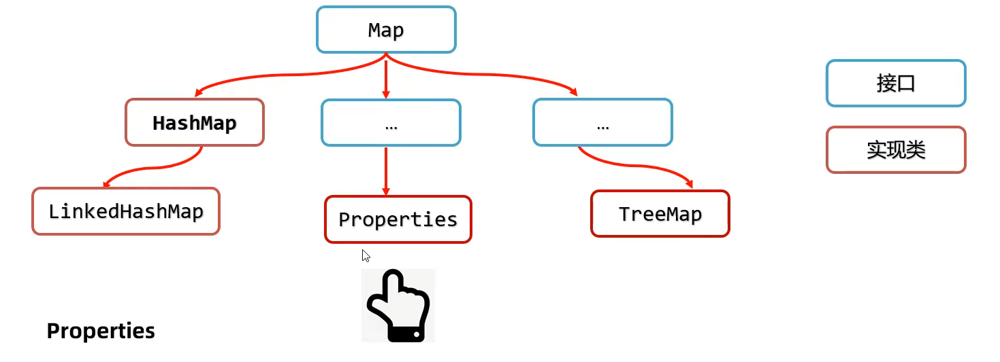

# Java基础复习

配套课程：【尚硅谷】7天搞定Java基础，Java零基础极速入门https://www.bilibili.com/video/BV1o841187iP/?p=5

2023 4 28

# 一、java基础常识


- JDK：java编程环境
- JRE：java运行环境
- JVM：java虚拟机

**编译器文件：**javac.exe

**源文件：**xxx.java

**字节码文件/类文件：**xxx.class

**启动Java虚拟机文件：**java.exe


idea常用快捷键:

1. ctrl + D : 复制当前行
2. ctrl + R : 替换当前文字内容


Java的第一段代码

```java
package chapter01;

public class Java02_HelloJava {
    public static void main(String[] args){
        System.out.println("Hello Java");
    }
}

```


## 1.变量原理

```java
package chapter02;

public class Java01_Variable {
    public static void main(String[] args) {

        //TODO 变量
        //所谓的变量其实就是可以改变的向量存储
        //1.变量的声明
        //数据类型  变量的名称
        String name;//String是一个类，表示一串字符序列

        //2.变量的赋值
        //变量名称 = 数据
        name = "zhangsan";

        //3.变量的使用
        //直接访问变量的名称即可
        System.out.println(name);

        //将变量的声明和赋值在一行代码中完成
        String username = "lisi";
        System.out.println(username);

        //在使用变量之前，必须给变量赋值，将这个操作称之为变量的初始化
    }
}

```


## 2.标识符

```java
package chapter02;

public class Java02_Identifier {
    public static void main(String[] args){

        //TODO 标识符
        //表示数据的符号，称之为标识符
        //变量名称就是标识符
        //标识符主要用于起名
        String name = "zhangsan";

        //TODO 标识符的命名规则
        //1.英文拉丁字母
        String username = "zhangsan";
        String xingming = "lisi";

        //2.符号
        //@,#,%,$
        //标识符只能采用下划线和美元 _ $ ,其他符号不能使用，称之为特殊符号
        //空格也属于特殊符号，所以不能作为标识符使用

        //3.数字
        //阿拉伯数字 0 到 9 可以作为标识符使用,但是不能开头
        //数字如果在标识符的开头位置，那么会被识别为数字，而不是标识符，所以会发生错误
        //String 1name = "zhangsan";
        String name1 = "zhangsan";

        //4.在大括号的范围内，标识符不能重复
        String name2 = "zhangsan";
        //标识符是区分大小写的
        String Name = "zhangsan";

        //5.Java语言中预先定义好了一些标识符名称，称之为关键字或保留字
        //可以使用大写来实现关键字名称的定义，但是容易造成歧义，不建议使用
        String Public = "zhangsan";

        //6.驼峰标识，组合的单词第二个大写
        String userName = "zhangsan";

        //7.标识符的长度
        //没有长度的限制

    }
}

```


# 二、数据类型


## 1.基本数据类型

```java
package chapter02;

public class Java03_Datatype_1 {
    public static void main(String[] args){

        //TODO 基本数据类型

        //TODO 1.整数类型
        //byte : 8位
        byte b = 10;
        //short : 16位
        short s = 10;
        //int : 32位
        int i = 10;
        //long : 64位
        long lon = 10;

        //TODO 2.浮点类型：含有小数点的数据类型
        //根据计算精度分为
        //默认情况下，小数点的数据会被识别为精度较高的双精度double类型
        //float : 单精度浮点类型，数据需要使用F（f）结尾
        float f = 1.0F;
        //double : 双精度浮点类型
        double d = 2.0;

        //TODO 3.字符类型
        //所谓的字符类型，其实就是使用符号表示文字内容
        char c ='@';

        //TODO 4.布尔类型
        //true,false,表示判断条件是否成立，如果成立，取值为true，如果不成立，那么取值为false
        boolean bln = true;

    }
}

```

## 2.数据类型之间的转换

```java
package chapter02;

public class Java03_Datatype_2 {
    public static void main(String[] args){

   //TODO 数据类型的转换

        String name = "zhangsan";
        int age = 30;

        //byte -> short -> int -> long -> float -> double
        byte b =10;

        short s = b;

        int i = s;

        long lon = i;

        float f = lon;

        double d = f;

        //java中范围小的值可以转换为范围大的数据，但是范围大的数据无法直接转换为范围小的数据
        //如果想要将范围大的数据转换为范围小的数据，那么需要使用小括号进行强制转换

        int i1 = (int)d;

    }
}

```

## 3.引用数据类型

```java
package chapter02;

public class Java03_Datatype_3 {
    public static void main(String[] args) {

        //TODO 引用数据类型
        //所谓的引用数据类型，其实就是可以被引用的数据类型
        String s = "abc";

        int i = 10; //10直接存储在向量存储内，没有指向其他数据存储，所以不是引用数据类型
    }
}

```


# 三、运算符


## 1.算数运算符：一元运算符+二元运算符

```java
package chapter02;

public class Java04_Operator {
    public static void main(String[] args) {

        //TODO 运算符
        //所谓的运算符就是参与数据运算的符号。Java定义的，无法自行定义

        //TODO 表达式
        //所谓的表达式就是采用运算符和数据连接在一起形成符合Java语法规则的指令代码，称之为表达式

        //TODO 算数运算符  最小使用的类型是int类型
        //1.二元运算符 ： 两个元素参与运算的运算符，1 + 2
        //  TODO 算术表达式 = 元素1 二元运算符 元素2
        //  TODO 这个表达式是有结果的，就需要有类型，这里的类型是元素中类型最大的那一种
        //   TODO 最小使用的类型是int类型
        System.out.println(1 + 2); // 3
        System.out.println(2 - 2); // 0
        System.out.println(3 * 2); // 6
        System.out.println(4 / 2); // 2
        System.out.println(5 % 2); // 1 （取余，模运算）

        System.out.println(1 / 2); // 0 （int,int）（选俩元素中类型最大的那一种） => int  本来是0.5，这里把小数去掉
        System.out.println(1.0 / 2);//0.5 (double,int) => double

        byte b1 = 10;
        byte b2 = 10;
        //b1 + b2; (byte,byte) 不行
        byte b3 = (byte) (b1 + b2);//强制转换

        System.out.println(1 + 2 * 3);//7
        System.out.println((1 + 2) * 3);//9

        //2.一元运算符 ： 一个元素参与运算的运算符
        //++,--
        //++ 运算符的本质其实就是加1操作的简化版本，自增运算符  自减运算符同理
        //int i = 0;
        //int j = i;
        //i = i + 1;
        int i = 0;
        int j = i++;//TODO 先赋值后运算 先将i赋值给j，然后i = i + 1，++i就是先运算后赋值
        System.out.println("i = " + i);
        System.out.println("j = " + j);

    }
}

```


## 2.赋值运算符

```java
package chapter02;

public class Java04_Operator_1 {
    public static void main(String[] args){

        //TODO 运算符 - 赋值运算符
        //等号就是赋值运算符：将等号右边表达式的结果赋值给左边的变量
        //赋值运算符需要考虑类型的关系
        String name = "zhangsan";
        byte b = 10;
        short s = b;

        //TODO 复合赋值运算符： += ...
        //  如果元素进行运算后重新赋值给自己，那么可以将运算和赋值的符号进行简化
        //  如果使用了复合赋值运算符，那么数据的类型不会发生变化
        int i = 1;
        //i = i + 1;
        i += 1; //先加后等
        System.out.println(i);

        byte b1 = 10;
        //b1 = b1 + 20; //+是二元运算符，最小适用类型是int //int =>byte
        b1 += 20; //复合赋值运算符不会让数据类型发生变化

    }
}

```


## 3.关系运算符

```java
package chapter02;

public class Java04_Operator_2 {
    public static void main(String[] args) {

        //TODO 运算符 - 关系运算符
        //所谓的关系运算符其实就是用于比较两个数据之间关系的运算符
        //关系运算符基本语法结构：
        //关系表达式 元素1（数据1/表达式1） 关系运算符[==,!=,>,>=,<,<=] 元素2（数据2/表达式2）、
        //关系表达式的结果为布尔类型：如果表达式的结果和预想一样，那么结果为true，如果表达式的结果和预想不一样，那么结果为false
        int i = 10;
        int j = 20;
        System.out.println(i > j); //false
        System.out.println(i < j); //true
        System.out.println(i == j); //false，双等号表示两个数据是否相等
        System.out.println(i != j); //true，感叹号表示两个数据是否不相等
        System.out.println(i >= j); //false，大于等于
        System.out.println(i <= j); //true，小于等于
    }
}

```


## 4.逻辑运算符

```java
package chapter02;

public class Java04_Operator_3 {
    public static void main(String[] args) {

        //TODO 运算符 - 逻辑运算符
        //逻辑运算符其实就是用于描述多个条件表达式之间的关系的运算符
        //TODO 基本语法结构：
        //变量 = （条件表达式1） 逻辑运算符 （条件表达式2）
        //结果变量的类型是布尔类型

        //TODO 逻辑运算符：&，称之为与运算
        //与运算，要求两个条件表达式都必须计算出结果，只有两个结果都为true的时候，最终结果为true，其他情况都为false
        int i = 10;
        boolean result = (i > 5) & (i < 20);
        System.out.println(result);

        //TODO 逻辑运算符：|，称之为或运算
        //或运算，要求两个表达式都能计算出结果，只要有任何一个结果为true，那么最后结果都为true
        //两个表达式结果都为false，最终结果才为false
        int j = 10;
        boolean result1 = (j > 5) | (j < 9);
        System.out.println(result1);

        //TODO 逻辑运算符：&&，称为短路与运算
        //短路与运算，会根据第一个条件表达式的结果来判断，是否执行第二个表达式
        //如果第一个表达式的结果为false，那么无需执行第二个表达式
        int t = 10;
        int y = 20;
        boolean result2 = (t > 10) && (++y > 30);
        System.out.println(result2);
        System.out.println(y); //20

        //TODO 逻辑运算符：||，称为短路或运算
        //短路与运算，会根据第一个条件表达式的结果来判断，是否执行第二个表达式
        //如果第一个表达式的结果为true，第二个表达式无需执行
        int n = 10;
        int s = 20;
        boolean result3 = (n == 10) || (++s > 30);
        System.out.println(result3);
        System.out.println(s); //20

        //TODO 逻辑运算符：！，逻辑非（相反）运算符
        int b = 10;
        boolean result4 = i == 10;
        System.out.println(!result4); //false
    }
}

```


## 5.三元运算符

```java
package chapter02;

public class Java04_Operator_4 {
    public static void main(String[] args) {

        //TODO 运算符 - 三元运算符
        //所谓的三元运算符其实就是三个元素参与运算的运算符
        //基本语法结构：
        //变量 = （条件表达式）？（任意表达式1）：（任意表达式2）
        //运算规则：判断条件表达式的结果，如果为true，那么执行表达式1的值，如果为false，执行表达式2的值
        int i = 10;
        int j = 20;

        int k = (i == 10) ? 1 + 1 : 2 + 2;
        System.out.println(k);
    }
}

```


# 四、流程控制

## 1.顺序执行

```java
package chapter03;

public class Java01_FlowControl {
    public static void main(String[] args) {

        //TODO 流程控制
        //所谓的流程控制，其实就是计算机在执行代码时，对指令代码的执行顺序的控制
        //Java中的流程控制主要分三种：
        //1.顺序执行：代码出现的先后顺序，以及语法的先后顺序
        //变量在使用之前，必须声明并且初始化
        int i = 10;
        int j = 20;
        System.out.println(i + j);
        //2.分支执行
        //3.重复执行
    }
}

```

## 2.分支执行

### ①可选分支，必选分支，多分支

```java
package chapter03;

public class Java02_FlowControl {
    public static void main(String[] args) {

        //TODO 流程控制 - 分支执行
        //分支结构
        //TODO 1.可选分支：单分支结构
        System.out.println("第一步");
        System.out.println("第二步");
        //判断：条件表达式的结果知否为true，如果为true，执行分支逻辑，如果为false，不执行分支逻辑
        //判断的语法使用if关键字，表示如果，在条件表达式之前使用，如果结果为true，那么分支逻辑应该在后续的大括号中执行
//        int i = 20;
//        if (i == 10) {
//            System.out.println("分支");
//        }

        //TODO 2.必选分支：双分支结构（二选一）
        //语法上使用if...else操作，这里的else表达其他场合
//        int i = 10;
//        if (i == 10) {
//            System.out.println("分支1");
//        } else {
//            System.out.println("分支2");
//        }

        //TODO 3.多分支结构
        //if...else if...else
        int i = 30;
        if (i == 10) {
            System.out.println("分支1");
        } else if (i == 20) {
            System.out.println("分支2");
        }
//        else {
//            System.out.println("分支3");
//        }

        System.out.println("第三步");


    }
}

```

### ②特殊的分支结构


```java
package chapter03;

public class Java03_FlowControl {
    public static void main(String[] args) {

        //TODO 流程控制 - 分支执行
        //特殊的分支结构
        //switch ( 数据 ) {}
        //switch语法会对数据进行判断，如果等于某一个分支数据的值，那么执行相应分支的逻辑代码和以下的逻辑代码
        //如果一个分支都无法匹配，那么一个分支都不会执行，如果想要无法匹配也需要执行分支（必选分支），那么可以增加default关键字
        //如果想要执行某一个分支后，不想继续执行其他分支的话，可以使用break关键字跳出分支
        System.out.println("第一步");
        System.out.println("第二步");
        int i = 10;
        switch (i) {
            case 10:
                System.out.println("分支1");
                break;
            case 20:
                System.out.println("分支2");
            case 30:
                System.out.println("分支3");
            default: //加上这个就变成必选的了
                System.out.println("其他分支");

        }
        System.out.println("第三步");
    }
}

```

### ③小练习

```java
package chapter03;

public class Java04_FlowControl_test {
    public static void main(String[] args) {

        //TODO 流程控制 - 分支执行 - 小练习
        int age = 30;
        //儿童（0~6），少年（7~17），青年（18~40），中年（41~65），老年（66）
        //if...else if...else if...else ： 多分支判断
        //switch...case...case...default ： 等值分支判断
        if (0 <= age && age <= 6) {
            System.out.println("儿童");
        } else if (7 <= age && age <= 17) {
            System.out.println("少年");
        } else if (18 <= age && age <= 40) {
            System.out.println("青年");
        } else if (41 <= age && age <= 65) {
            System.out.println("中年");
        } else if (66 <= age) {
            System.out.println("老年");
        } else {
            System.out.println("错误");
        }
    }
}

```

## 3.重复执行（循环执行）

### ①while

```java
package chapter03;

public class Java05_FlowControl {
    public static void main(String[] args) {

        //TODO 流程控制 - 重复执行（循环执行）
        //根据条件重复执行某段代码
        //Java中主要用于循环的语法有3个：
        //1.while：有条件重复
        //while (条件表达式) {需要循环的代码}
        //基本的执行原理：while循环会判断条件表达式的结果是否为true
        // 如果为true，会执行大括号内的逻辑代码，代码执行完毕后，会重新对条件表达式进行判断
        // 如果为false，那么跳出循环结构
        System.out.println("第一步");
        int age = 30;
        while (age < 40) { //执行十次
            System.out.println("循环的代码");
            age++;
        }
        //2.do...while
        //3.for
        System.out.println("第二步");
    }
}

```

### ②do...while


```java
package chapter03;

public class Java05_FlowControl {
    public static void main(String[] args) {

        //TODO 流程控制 - 重复执行（循环执行）
        //根据条件重复执行某段代码
        //Java中主要用于循环的语法有3个：
        //1.while：有条件重复
        //while (条件表达式) {需要循环的代码}
        //基本的执行原理：while循环会判断条件表达式的结果是否为true
        // 如果为true，会执行大括号内的逻辑代码，代码执行完毕后，会重新对条件表达式进行判断
        // 如果为false，那么跳出循环结构
        System.out.println("第一步");
        int age = 40;
//        while (age < 40) { //执行十次
//            System.out.println("循环的代码");
//            age++;
//        }

        //2.do...while
        //语法执行原理和while基本相同，区别在于循环代码是否至少执行一次
        //while循环语法可能执行，可能不执行
        //do...while循环语法中的循环代码至少执行一次
        /*
        do {
            循环代码
        } while(条件表达式)
         */
        do {
            System.out.println("循环的代码");
        } while (age < 40);
        //3.for
        System.out.println("第二步");
    }
}

```

### ③for

```java
package chapter03;

public class Java05_FlowControl {
    public static void main(String[] args) {

        //TODO 流程控制 - 重复执行（循环执行）
        //根据条件重复执行某段代码
        //Java中主要用于循环的语法有3个：
        //1.while：有条件重复
        //while (条件表达式) {需要循环的代码}
        //基本的执行原理：while循环会判断条件表达式的结果是否为true
        // 如果为true，会执行大括号内的逻辑代码，代码执行完毕后，会重新对条件表达式进行判断
        // 如果为false，那么跳出循环结构
        System.out.println("第一步");
        int age = 40;
//        while (age < 40) { //执行十次
//            System.out.println("循环的代码");
//            age++;
//        }

        //2.do...while
        //语法执行原理和while基本相同，区别在于循环代码是否至少执行一次
        //while循环语法可能执行，可能不执行
        //do...while循环语法中的循环代码至少执行一次
        /*
        do {
            循环代码
        } while(条件表达式)
         */
        do {
            System.out.println("循环的代码");
        } while (age < 40);

        //3.for
        //如果条件表达式返回结果为false，那么跳过循环语句，直接执行后续代码，如果返回结果为false，那么执行循环语句
        //初始化表达式用于对条件表达式中是用到的变量进行初始化
        //循环代码执行后，会重新进行表达式的判断，如果判断结果为true，会重复执行循环代码
        /*
        for( 初始化表达式 ; 条件表达式 ; 更新表达式 ) {
            循环的代码
        }
         */
        for (int i = 30; i < 40; i++) {
            System.out.println("循环的代码");
            System.out.println(i);
        }

        System.out.println("第二步");
    }
}

```

### ④break和continue关键字

```java
package chapter03;

public class Java05_FlowControl_1 {
    public static void main(String[] args) {

        //TODO 流程控制 - 重复执行（循环执行）
//        for (int i = 0; i < 10; i++) {
//            if (i != 4) {
//                System.out.println(i);
//            }
//        }

        //break关键字会跳出循环，不再执行循环后续的操作
        //continue关键字会跳过循环，执行下一次循环
        for (int i = 0; i < 10; i++) {
            if (i == 4) {
                //切断，跳出循环
                //break;
                continue;
            }
            System.out.println(i);
        }

    }
}

```

### ⑤小练习 - 九层妖塔

```java
package chapter03;

public class Java06_FlowControl_test {
    public static void main(String[] args) {

        //TODO 流程控制 - 小练习
        //九层妖塔
        /*
         *
         ***
         *****
         *******
         *********
         ***********
         *************
         ***************
         *****************
         */

        int level = 9; //优化代码，修改层数改这个数值就可以了

        //0 -> 8
        //1 -> 7
        //2 -> 6
        //...
        for (int i = 0; i < level; i++) {
            for (int n = 0; n < (level - 1) - i; n++) { //最后一层开头不需要空格
                System.out.print(' '); //打印开头的空格
            }

            //0 -> 1
            //1 -> 3
            //2 -> 5
            //3 -> 7
            //...
            for (int j = 0; j < 2 * i + 1; j++) {
                System.out.print('*'); //打印*号
            }
            System.out.println();
        }

    }
}

```


# 五、面向对象

## 1.基本语法

```java
package chapter04;

public class Java01_Object {
    public static void main(String[] args) {

        //TODO 面向对象
        //所谓的面向对象，其实就是分析问题时，以问题所涉及的事或者物为中心的分析方式
        //类和对象
        //类表示归纳和整理
        //对象就表示具体的事物
        //TODO class（类）
        /*
        类的基本语法结构：
        class 类名（命名规范，第一个字母大写） {
        特征（属性），
        功能（方法）

        创建对象的语法：
        new 类名()；
        }
         */

        //问题：做一道菜，红烧排骨
        //类：菜。对象：红烧排骨

        //TODO 1.先声明类
        //TODO 2.创建对象
        //TODO 3.声明属性，所谓的属性就是类中的变量
        //变量类型 变量名称 = 变量值
        //属性类型 属性名称 = 属性值
        //TODO 4.声明方法
        //void 方法名(参数) {功能代码}
        //TODO 5.执行方法
        //对象.属性
        //对象.方法()

        //引用数据类型
        Cooking c = new Cooking();
        c.name = "红烧排骨";
        c.food = "排骨";
        c.execute();

        Cooking c1 = new Cooking();
        c1.name = "红烧鱼";
        c1.food = "鲫鱼";
        c1.execute();
    }
}

class Cooking {

    //特征（属性）
    //名字
    String name;
    //菜的类型
    String type = "红烧";
    //食材
    String food;
    //佐料
    String relish = "大料";

    void execute() {
        System.out.println("菜品名称:" + name);
        System.out.println("菜的类型:" + type);
        System.out.println("菜的食材:" + food);
        System.out.println("菜的佐料:" + relish);

        System.out.println("准备食材");
        System.out.println("准备佐料");
        System.out.println("开始烹饪");
        System.out.println("烹饪完成");
    }
}
```

## 2.案例分析

```java
package chapter04;

public class Java02_Object {
    public static void main(String[] args) {

        //TODO 面向对象

        //类:动物
        //对象:猫,狗
        Animal a1 = new Animal();
        a1.type = "猫";
        a1.name = "小黑";
        a1.run();

        Animal a2 = new Animal();
        a2.type = "狗";
        a2.name = "大黄";
        a2.run();
    }
}

class Animal {

    String type;
    String name;

    void run() {
        System.out.println(type + ' ' + name + "跑开了");
    }
}
```

```java
package chapter04;

public class Java02_Object_1 {
    public static void main(String[] args) {

        //TODO 面向对象
        //狗:2只,小黑,小白
        Dog dog1 = new Dog();
        dog1.color = "white";
        dog1.name = "小白";
        dog1.run();

        Dog dog2 = new Dog();
        dog2.color = "black";
        dog2.name = "小黑";
        dog2.run();
    }
}

class Dog {
    String color;
    String name;

    void run() {
        System.out.println(color + "色的小狗" + name + "跑开了");
    }
}
```

```java
package chapter04;

public class Java02_Object_2 {
    public static void main(String[] args) {

        //TODO 面向对象

        Teacher teacher1 = new Teacher();
        teacher1.name = "zhangsan";
        teacher1.teach();

        Sdudent sdudent1 = new Sdudent();
        sdudent1.name = "lisi";
        sdudent1.sdudy();
    }
}

class Teacher {
    String name;

    void teach() {
        System.out.println(name + "老师在讲课");
    }
}

class Sdudent {
    String name;

    void sdudy() {
        System.out.println("学生" + name + "在听课");
    }
}
```

## 3.类和对象

```java
User04 user = new User04();
```



1. **栈：方法，属性**
2. **堆：对象**
3. **元空间：类的信息**

```java
package chapter04;

public class Java04_Object_class {
    public static void main(String[] args) {

        //TODO 面向对象
        //类:结构体,包含了属性(特征)和方法(行为)
        //会有很多的对象
        //class : 关键字(全是小写的)
        //类名:类的名称,标识符,遵循规则,一般情况下,类名的首写字母是大写的(规范,不必须)

        //对象:类的实例化(具象化)
        //new 类名(),小括号需要增加
        //new 也是关键字,表示创建一个具体的对象,而且使用一次,创建一次,每次都是全新的
        //一般new出来的对象会赋值给变量,方便重复使用
        //变量的类型就是对象的类型
        //TODO 对象是将内存地址赋值给了变量,所以变量其实引用了内存中的对象,所以称之为引用变量
        //而变量的类型称之为引用数据类型
//        new User04();
//        new User04();
//        new User04();
        User04 user = new User04();

        //TODO 特殊的对象:空对象,没有引用的对象,称之为空对象,关键字对象
        //所有引用类型变量的默认取值就是null
        User04 user1 = null;
    }
}

class User04 {

}
```

## 4.属性

```java
package chapter04;

public class Java05_Object_Field {
    public static void main(String[] args) {

        //TODO 面向对象
        //所谓的属性,其实就是类的对象的相同特征
        //语法和变量的声明很像
        //属性类型 属性名称 = 属性值
        //如果在声明属性的同时进行了初始化复制,那么所有对象的属性就完全相同
        //如果希望每一个对象的属性不一致,那么可以不用在声明属性的时候进行初始化
        //那么属性会在构造对象的时候默认初始化,而默认初始化的值取决于属性的类型
        //byte,short,int,long => 0
        //float,double => 0.0
        //boolean flg = false
        //char = 空字符
        //引用数据类型 => null

        //变量的作用域非常小,只在当前的大括号内有效
        //属性不仅仅在当前类中有效,而且可以随着对象在其他地方使用
        //变量使用前必须初始化,否则会出现错误,属性可以不用初始化,因为JVM会帮助我们自动完成初始化
        String name = "zhangsan";

    }
}

class User05 {
    //String name = "zhangsan";
    String name;
}
```

## 5.方法

```java
package chapter04;

public class Java06_Object_Method {
    public static void main(String[] args) {

        //TODO 面向对象 - 方法
        //声明的语法:void 方法名() { 逻辑代码 }
        //声明的语法(补充):[方法的返回值类型][void] 方法名() { 逻辑代码 }
        //这里的void表示方法的结果:没有结果

        //方法的调用方式:对象.方法名()

        //使用用户账号和密码进行登陆
        //名词:用户,账号,密码
        //动词:登陆
        User06 user = new User06();
        boolean registerResult = user.register();
        if (registerResult) {
            System.out.println("注册成功");
            boolean loginResult = user.login();
            if (loginResult) {
                System.out.println("登录成功");
            } else {
                System.out.println("登录失败");
            }
        } else {
            System.out.println("注册失败");
        }

    }
}

class User06 {
    String cccount;
    String password;

    boolean register() { //注册
        System.out.println("用户注册");
        //返回结果:false
        return true;
    }

    boolean login() { //登陆
        System.out.println("用户登陆");
        return false;
    }
}
```

## 6.方法参数

```java
package chapter04;

public class Java07_Object_Method_Param {
    public static void main(String[] args) {

        //TODO 面向对象 - 方法
        //使用外部数据控制方法内部实现的操作,使用的是参数语法实现,也叫做方法参数
        //语法:方法名( 参数类型 参数名称 )
        //参数列表
        //语法:方法名( 参数类型1 参数名称1 , 参数类型2 参数类型2 )

        User07 user = new User07();
        String name = "zhangsan";
        int age = 30;
        //传递参数
        //user.sayHello(name, age);

        //当方法传递多个参数的时候,需要注意:
        //1.参数个数需要匹配
        //2.参数类型需要匹配
        //3.参数顺序需要匹配

        //TODO 4.当参数的个数不确定,但是类型相同时,可以采用特殊的参数语法声明:可变参数
        //如果参数还包含其他含义的参数,那么可变参数应该放在最后
        //语法:参数类型... 参数名称
        user.test(30);
        user.test(30, "zhangsan");
        user.test(30, "zhangsan", "lisi", "wangwu");
    }
}

class User07 {

    void sayHello(String name, int age) {
        //使用参数
        System.out.println("Hello " + name + ',' + age);
    }

    void test(int age, String... name) {
        System.out.println(name);
    }
}
```

## 7.方法参数 - 传值方式

```java
package chapter04;

import netscape.security.UserTarget;

public class Java07_Object_Method_Param_1 {
    public static void main(String[] args) {

        //TODO 面向对象 - 方法
        //Java中方法参数的传递为值传递
        //基本数据类型:数值
        //引用数据类型:引用地址
//        String s = "abc";
//        test(s);
//        System.out.println(s); //"abc10"?
        User user = new User();
        user.name = "zhangsan";
        test(user);
        System.out.println(user.name);

        //字符串拼接机制:
        // 在 Java 中，当一个字符串（如 "zhangsan"）与其他基本数据类型（这里是 int 类型的 10）进行拼接操作时,
        // Java 会自动将基本数据类型转换为字符串类型，然后再进行拼接
        String name = "zhangsan" + 10;
        System.out.println(name);
    }

//    public static void test(int i) {
//        i = i + 10;
//    }

//    public static void test(String s) {
//        s = s + 10;
//    }

    public static void test(User user) {
        user.name = "lisi";
    }
}

class User {
    String name;
}
```

## 8.静态

```java
package chapter04;

public class Java08_Object_Static {
    public static void main(String[] args) {

        //TODO 面向对象
        //针对于具体对象的属性称之为对象属性,成员属性,实例属性
        //针对于具体对象的方法称之为对象方法,成员方法,实例方法
        //把和对象无关,只和类相关的称之为静态
        //和类相关的属性称之为静态属性
        //和类相关的方法称之为静态方法
        //静态语法就是在属性和方法前增加static关键字
//        Chinese c = new Chinese();
//        Chinese c = null;
//        c.name = "zhangsan";
//
//        System.out.println("Hello " + c.name + ", " + c.nationnality);

        //静态不用创建对象就能访问
        Bird.fly();
        System.out.println(Bird.type);
    }
}

class Bird {
    static String type = "鸟";

    static void fly() {
        System.out.println("飞...");
    }
}

class Chinese {
    String name;

    //国籍
    String nationnality = "中国";
}

```

```java
package chapter04;

public class Java08_Object_Static_1 {
    public static void main(String[] args) {

        //TODO 面向对象 - 静态

        //TODO 先有类,再有对象
        //成员方法可以访问静态属性和静态方法
        //静态方法不可以访问成员属性和成员方法
        Test t = new Test();
        t.sex = "女";
        t.test();
//        t.test1();
//        Test.test1();
    }
}

class Test {
    String name; //成员属性
    static String sex; //静态属性

    void test() { //成员方法
//        test1();
//        System.out.println(sex);
        System.out.println("test...");
    }

    static void test1() { //静态方法
//        test();
//        System.out.println(name);
//        System.out.println("test1...");
    }
}


class Bird1 {
    static String type = "鸟";

    static void fly() {
        System.out.println("飞...");
    }
}
```

## 9.静态代码块

```java
package chapter04;

public class Java08_Object_Static_2 {
    public static void main(String[] args) {

        //TODO 面向对象 - 静态

        //TODO 类的信息加载完成后,会自动调用静态代码快,可以完成静态属性的初始化功能
        //TODO 对象准备创建时,也会自动调用代码块,但不是静态的
//        User08.test();
        new User08();
    }
}

class User08 {
    static {
        //静态代码块
        System.out.println("静态代码块执行1");
    }

    static {
        //静态代码块
        System.out.println("静态代码块执行2");
    }

    static void test() {
        System.out.println("test...");
    }

    {
        //静态代码块
        System.out.println("代码块执行1");
    }

    static {
        //静态代码块
        System.out.println("静态代码块执行3");
    }

    {
        //静态代码块
        System.out.println("代码块执行1");
    }
}
```

## 10.包

```java
package chapter04;

public class Java09_Object_Package {
    public static void main(String[] args) {

        //TODO 面向对象 - package - 包
        //package容纳类
        //基本语法:package 包完整路径;
        //路径中的多个包使用.隔开
        //java.long.Object
        //主要功能用于分类管理

        //一个类可以没有包,但是package不能在同一个源码文件中使用多次
        //包名为了区分类名,所以一般全部都是小写
        //java.long.Object  java和long是包,Object是类,为了区分,不强制规定

        //Java中存在不同包的相同名称的类,可以使用包进行区分
        //一般情况下,在使用类的情况下,我们都会使用类的全名(包名 + 类名)
        new java.util.Date();
    }
}

```

## 11.Import - 导入类

**Alt + 回车：自动导入类**

```java
package chapter04;

import java.util.*;
import java.sql.Date;

public class Java10_Object_Import {
    public static void main(String[] args) {

        //TODO 面向对象 - Import
        //import主要用于在使用类之前准备好
        //import语句只能使用在package后,class前
        //import关键字可以多次使用,导入多个类
        //如果同一个包中需要导入大量的类,那么可以使用通配符*简化操作
        //如果import了不同包中相同的类,那么还是需要使用时增加包名

        //chapter04.Java10_Object_Import
//        java.long.String name="zhangsan";
        String name1 = "zhangsan";

        java.util.Date d = new java.util.Date();
        new ArrayList();

        new chapter04.Java10_Object_Import();
        new Java10_Object_Import();
        new User10();
    }
}

class User10 {

}

```

## 12.构造方法

```java
package chapter04;

public class Java11_Object_Instance {
    public static void main(String[] args) {

        //TODO 面向对象 - 构建对象
        //构造方法:专门用于构建对象
        //如果一个类中没有任何的构造方法，那么JVM会自动添加一个公共的,无参的构造方法,方便对象的调用
        //TODO 基本语法:类名(){}
        //1.构造方法也是方法,但是没有void关键字
        //2.方法名和类名完全相同
        //3.如果类中没有构造方法,那么JVM会提供默认的构造方法
        //4.如果类中有构造方法,那么JVM不会提供默认的构造方法
        //5.构造方法也是方法,所以也可以传递参数,但是一般传递参数的目的是用于对象属性的赋值
        System.out.println("before...");
        User11 user = new User11("zhangsan");
        System.out.println("after...");
        user.test();
        System.out.println(user.username);
        //TODO 代码块，是在构造对象之前执行的

    }
}

class User11 {
    String username;

    {
        System.out.println("代码块1");
    }

    User11(String name) {
        username = name;
        System.out.println("user...");
    }

    {
        System.out.println("代码块2");
    }

    void test() {
        System.out.println("test...");
    }

    {
        System.out.println("代码块3");
    }
}
```

## 13.继承

**实际上是对象和对象之间的继承关系，如果是静态类之间的继承，那其中的静态属性就没什么意义了，具体举例详见 -> 33.作用域**



```java
package chapter04;

public class Java12_Object_Extends {
    public static void main(String[] args) {

        //TODO 面向对象 - 继承
        //面向对象中有非常重要的三个特征:继承,封装,多态
        //类存在父子关系,子类可以直接获取到父类的成员属性和方法
        //类的继承只能是单继承,一个类只能有一个父类,不能存在多个父类
        //一个父类可以有多个子类

        //继承采用extends语法:子类 extends 父类
        Child c = new Child();
        System.out.println(c.name);
        c.test();
    }
}

class Parent {
    String name = "zhangsan";

    void test() {
        System.out.println("test");
    }
}

class Child extends Parent {

}
```

## 14.super、this

**这两个关键字是作用于对象的，如果是静态类，没有对象，那就不可以使用**

1. **super.表示父类**
2. **this.表示子类**

```java
package chapter04;

public class Java12_Object_Extends_1 {
    public static void main(String[] args) {

        //TODO 面向对象 - 继承
        //如果父类和子类含有相同的属性,那么可以采用特殊的关键字进行区分
        Child1 c = new Child1();
//        System.out.println(c.name);
        c.test();
    }
}

class Parent1 {
    String name = "zhangsan";
}

class Child1 extends Parent1 {
    String name = "lisi";

    void test() {
        System.out.println(super.name);
        System.out.println(this.name);
        System.out.println(name);
    }
}
```

## 15.继承、构造方法



```java
package chapter04;

public class Java12_Object_Extends_2 {
    public static void main(String[] args) {

        //TODO 面向对象 - 继承
        //构造方法
        //父类对象是在子类对象创建前创建完成的,创建子类对象前,会调用父类的构造方法完成父类的创建
        //默认情况下,子类对象创建时,会默认调用父类的构造方法完成父类对象的创建,使用的是super方式,只不过JVM自动完成
        //如果父类提供构造方法,那么JVM不会提供默认的构造方法,那么子类应该显示调用super方法构建父类对象
        Child2 c1 = new Child2();
        Child2 c2 = new Child2();
        Child2 c3 = new Child2();

        //new : 只会构建一个对象
        //子类中的父类属性是继承过来的,并不是真的创建了一个父类对象,只有子类对象,里面包含了父类属性,构建器也是在创建对象之后运行的
    }
}

class Parent2 {
    String username;

    Parent2(String name) {
        username = name;
        System.out.println("parent...");
    }
}

class Child2 extends Parent2 {
    Child2() {
        super("zhangsan");
        System.out.println("child...");
    }
}
```

## 16.多态

```java
package chapter04;

public class Java13_Object {
    public static void main(String[] args) {

        //TODO 面向对象 - 多态
        //所谓的多态,就是一个对象在不同场景下表现出来的不同状态和形态
        //多态语法其实就是对对象的使用场景进行了约束
        //一个对象可以使用的功能取决于引用变量的类型
        Person p = new Person();
        p.testPerson();
        Person p1 = new Boy();
        p1.testPerson();
        Person p2 = new Girl();
        p2.testPerson();

        Boy boy = new Boy();
        boy.testBoy();

        Girl girl = new Girl();
        girl.testGirl();
    }
}

class Person {
    void testPerson() {
        System.out.println("test person...");
    }
}

class Boy extends Person {
    void testBoy() {
        System.out.println("test boy...");
    }
}

class Girl extends Person {
    void testGirl() {
        System.out.println("test girl...");
    }
}
```

## 17.方法重载

```Java
package chapter04;

public class Java14_Object {
    public static void main(String[] args) {

        //TODO 面向对象
        //一个类中,不要能声明相同的方法,也不能声明相同的属性
        //这里相同的方法指的是方法名,参数列表相同,和返回值类型无关
        //如果方法名相同,但是参数列表(个数,顺序,类型)不相同,会认为是不同的方法,只不过名称一样
        //这个操作在Java中称为方法的重载
        //构造方法也存在方法的重载
        User14 user = new User14("zhangsan");
        user.login(1111);
        user.login("123123");
        user.login("zhangsan", "123123");
    }
}

class User14 {
    User14() {
        System.out.println("user...");
    }

    User14(String name) {
        System.out.println("user..." + name);
    }

    void login(String account, String password) {
        System.out.println("账号,密码登录");
    }

    void login(int tel) {
        System.out.println("手机验证码登录");
    }

    void login(String wx) {
        System.out.println("微信,支付宝登录");
    }
}
```

## 18.方法重载 - 小练习

```java
package chapter04;

public class Java14_Object_1 {
    public static void main(String[] args) {

        //TODO 面向对象
        //如果在一个构造方法中,想要调用其他的构造方法,那么需要使用特殊的关键字:this
        User141 user1 = new User141();
//        User141 user2 = new User141("zhangsan");
//        User141 user3 = new User141("zhangsan", "男");
    }
}

class User141 {
    User141() {
        this("zhangsan");
    }

    User141(String name) {
        this(name, "男");
    }

    User141(String name, String sex) {
        System.out.println(name + ',' + sex);
    }
}
```

```java
package chapter04;

public class Java14_Object_2 {
    public static void main(String[] args) {

        //TODO 面向对象
        byte b = 10;
//        test(b); //bbb
        //byte => 8
        //short => 16
        //char => 16
        //int => 32
        //基本数据类型在匹配方法时,可以在数值不变的情况下,扩大数据的精度
        //byte类型无法和char类型做转换,char没有负数,但是byte存在负数

        test(b);
    }

//    static void test(byte b) {
//        System.out.println("bbb");
//    }

//    static void test(short s) {
//        System.out.println("sss");
//    }

    static void test(char c) {
        System.out.println("ccc");
    }

    static void test(int i) {
        System.out.println("iii");
    }
}

```

```java
package chapter04;

public class Java14_Object_3 {
    public static void main(String[] args) {

        //TODO 面向对象
//        AAA aaa = new AAA();
//        BBB aaa = new BBB();
        BBB aaa = new BBB(); //使用什么方法取决于用的什么类型
        test(aaa);

        //多态其实就是约束了对象的使用场景,给了BBB但是当成AAA来用
        //方法的重载:方法名相同,参数列表不同(个数,顺序,类型)
        //如果找不到,会提升数据类型,找父类:
        //AAA -> Object
        //BBB -> AAA -> Object
    }

    static void test(AAA aaa) {
        System.out.println("aaa");
    }

//    static void test(BBB bbb) {
//        System.out.println("bbb");
//    }
}

class AAA {

}

class BBB extends AAA {

}
```

## 19.方法重写

```java
package chapter04;

public class Java15_Object {
    public static void main(String[] args) {

        //TODO 面向对象
        //方法的重写:父类对象的方法其实主要体现通用性,无法在特殊的场合下使用
        //          如果子类对象需要在特殊的场合下使用,那么就需要重写方法的逻辑,这个操作在Java中称之为方法的重写
        //这里的重写,并不意味着父类的方法被覆盖掉,只是在当前场合中不适用,如果使用super关键字,还是可以访问
        //方法的重写要求,子类的方法和父类的方法,方法名相同,返回值类型相同,参数列表相同
        Child15 child = new Child15();
        child.test();
    }
}

class Parent15 {
    String name = "zhangsan";

    void test() {
        System.out.println("parent test...");
    }
}

class Child15 extends Parent15 {
    String name = "lisi";

    void test() {
        System.out.println(this.name);
        System.out.println(super.name);
        super.test();
        System.out.println("child test...");
    }
}
```

## 20.方法重写 - 小练习

```java
package chapter04;

public class Java15_Object_1 {
    public static void main(String[] args) {

        //TODO 面向对象 - 重写
//        CCC ccc = new CCC();
//        DDD ddd = new DDD();
        CCC ddd = new DDD();
        //一个对象能使用什么方法,取决于引用变量的类型
        //一个对象能使用什么属性,取决于引用变量的类型

        //一个对象的方法具体的使用(直接,间接)是需要看具体的对象的
        //一个对象的属性具体的使用是不需要看具体的对象的
        //TODO 属性在哪里声明,在哪里使用
        System.out.println(ddd.sum());
    }
}

class CCC {
    int i = 10;

    int sum() {
        return getI() + 10;
    }

    int getI() {
        return i;
    }
}

class DDD extends CCC {
    int i = 20;

    int sum() {
        return getI() + 20;
    }

    int getI() {
        return i;
    }
}
```

## 21.递归

```java
package chapter04;

public class Java16_Object_Recursion {
    public static void main(String[] args) {

        //TODO 面向对象 - 递归
        //所谓的递归:方法调用自身,称之为递归方法
        //例如想求20以内的奇数之和
        //1 + 3 + 5 + 7 + 9 + ... + 19
        int result = computeAP(20);
        System.out.println(result);

        //阶乘 : 5! => 5 * 4 * 3 * 2 * 1
        //0的阶乘为1
        //一个大于1的阶乘等于这个数乘以这个数减一的阶乘
        int result1 = computeFactorial(5);
        System.out.println(result1);

        //1.递归方法应该有跳出的逻辑
        //2.调用自身时,传递的参数应该有规律
    }

    /*
    1是递归边界
    先不断的递归调用,到达边界之后开始逐步返回结果向上累加

    计算过程:
    当第一次调用computeAP(20)时，由于 20 是偶数，先将其变为 19。
    然后判断 19 不等于 1，执行return 19 + computeAP(17)。
    接着调用computeAP(17)，同样进行判断和计算，得到17 + computeAP(15)。
    以此类推，不断进行递归调用，直到num等于 1 时，开始返回结果并逐步向上累加。
    最终，通过这种递归的方式，实现了对 20 以内奇数的累加，得到结果 100。
     */
    public static int computeAP(int num) {
        num = num % 2 == 0 ? num - 1 : num;
        if (num == 1) {
            return 1;
        } else {
            return num + computeAP(num - 2);
        }
    }

    public static int computeFactorial(int num) {
        if (num <= 1) {
            return 1;
        } else {
            return num * computeFactorial(num - 1);
        }
    }
}
```

## 22.访问权限

```java
package chapter04;

public class Java17_Object_Access {
    public static void main(String[] args) {

        //TODO 面向对象 - 访问权限
        //public:公共的,访问权限修饰符
        //TODO Java的源码中,公共类只能有一个,而且必须与源码文件名相同
        //main方法:main方法是由JVM调用的,JVM调用时应该可以任意调用,而不用考虑权限问题

        //TODO Java中的访问权限主要分4中:
        // 1.private:私有的,同一个类中可以使用
        // 2.(default):默认权限,当不设定任何权限时,JVM会默认提供权限,包(路径权限)权限(同一个包下可以访问)(其他包和子包都不可以访问)
        // 3.protected:受保护的权限,子类可以访问,包权限(同包也可以访问)
        // 4.public:公共的,任意使用

        User17 user = new User17();
//        System.out.println(user.name);
        System.out.println(user.username);
        System.out.println(user.sex);
        System.out.println(user.age);
    }
}

class User17 {
    private String name;
    public String username;
    String sex;
    protected int age;

    void test() {
        System.out.println(name);
        System.out.println(username);
        System.out.println(age);
    }
}

class Child17 extends User17 {
    void test() {
        System.out.println(age);
    }
}
```

## 23.访问权限 - 小练习

```java
package chapter04;

public class Java17_Object_Access_1 {
    public static void main(String[] args) {

        //TODO 面向对象 - 访问权限
        Person17 person = new Person17();

        //private:同类
        //default:同类,同包(路径)
        //protected:同类,同包(路径),子类(优先保护和自己直接相关的子类)
        //public:公共的
        //所谓的访问权限,其实就是访问属性,方法的权力和限制
        //谁访问? Java17_Object_Access_1 -> super -> java.long.Object
        //访问谁的? Person17 -> super -> java.long.Object(clone)
//        Person.clone(); //所有类的父类都有Object类,clone是Object的一个protected方法,按理说子类可以访问,这里为什么不能用呢
    }
}

class Person17 {
    void test() throws Exception {
        clone();
    }
}
```

## 24.内部类 / 外部类

**.var：快捷创建对象**

```java
package chapter04;

public class Java18_Object {
    public static void main(String[] args) {

        //TODO 面向对象 - 外部类 - 内部类
        //Java中不允许外部类使用private，protected修饰
        //只能使用public或者默认修饰
        //所谓的外部类，就是在源码中直接声明的类
        //所谓的内部类，就是类中声明的类

        //内部类被当成外部类的属性使用即可

        //因为内部类可以看作外部类的属性，所以需要构建外部类对象才可以使用
        OuterClass outer = new OuterClass();
        OuterClass.InnerClass innerClass = outer.new InnerClass();
    }

}

class OuterClass {
    public class InnerClass {

    }
}
```

## 25.单例模式

```java
package chapter04;

public class Java19_Object {
    public static void main(String[] args) {

        //TODO 面向对象 - 单例模式
        //JVM默认给类提供的构造方法，其实就是公共的，无参的构造方法
        //1.类的创建过程复杂
        //2.类的对象消耗资源
//        User19 user = new User19();
        User19 instance1 = User19.getInstance();
        User19 instance2 = User19.getInstance();
        User19 instance3 = User19.getInstance();
        User19 instance4 = User19.getInstance();
        User19 instance5 = User19.getInstance();
        User19 instance6 = User19.getInstance();

        System.out.println(instance1 == instance6); //true
        System.out.println(instance1.equals(instance6)); //也是判断两个对象的内存地址是否相等 true
    }
}

class User19 {
    private static User19 user19 = null;

    private User19() {

    }

    public static User19 getInstance() { //静态方法不能访问成员属性，所以上面user19需要加static
        if (user19 == null) {
            user19 = new User19();
        }
        return user19;

    }
}
```

## 26.final

```java
package chapter04;

public class Java20_Object {
    public static void main(String[] args) {

        //TODO 面向对象
        //如何保证在初始化一个数据之后不能再修改他？
        //Java中提供了一种语法,可以在数据初始化后不被修改,使用关键字final
        //final可以修饰变量,变量的值一旦初始化后无法修改
        //final可以修饰属性,那么JVM不能自动进行初始化,需要自己进行初始化,属性值不能发生变化
        //一般将final修饰的变量称之为常量,或者不可变变量
        //final可以修饰方法，这个方法不能被子类重写(子类可以继承父类,但是方法逻辑改不了)
        //final可以修饰类,这样类就没有子类了
        //final不可以修饰构造方法
        //final可以修饰方法的参数,一旦修饰,参数就无法修改

        final String name = "zhangsan";
        //name = "wangwu";
        System.out.println(name);

        User20 user = new User20("wangwu");
        //user.name = "zhangsan";
        System.out.println(user.name);

        //user.name = "lisi";
        System.out.println(user.name);
    }
}

final class User20 {
    public final String name;

    public User20(String name) {
        this.name = name;
    }

    public final void test() {

    }

    public void test1(final String name) {
//        name = "lisi";
    }
}

//class Child20 extends User20 {
//    public void test() {
//
//    }
//}
```

## 27.抽象

```java
package chapter04;

public class Java21_Object_Abstract {
    public static void main(String[] args) {

        //TODO 面向对象 - 抽象 - Abstract
        //抽象类
        //抽象方法

        //分析问题:对象(具体) => 类(抽象)
        //编写代码:类(抽象) => 对象(具体)
    }
}

```

## 28.抽象类和抽象方法

```java
package chapter04;

public class Java21_Object_Abstract {
    public static void main(String[] args) {

        //TODO 面向对象 - 抽象 - Abstract
        //抽象类 : 不完整的类,就是抽象类
        //          abstract class 类名
        //      因为类不完整,所以无法直接构造对象
        //抽象方法 : 只有声明,没有实现的方法
        //          abstract 返回值类型 方法名(参数)

        //分析问题:对象(具体) => 类(抽象)
        //编写代码:类(抽象) => 对象(具体)

        //如果一个类中含有抽象方法,那么这个类是抽象类
        //如果一个类是抽象类,它的方法不一定是抽象方法
        //抽象类无法直接构建对象,但是可以通过子类间接构建对象
        //如果抽象类中含有抽象方法,那么子类继承抽象类,需要重写抽象方法,将方法补充完整

        //abstract关键字不能和final同时使用(抽象类和抽象方法都不可以同时出现这俩关键字)
//        Person21 person21 = new Person21();
        Chinese21 chinese21 = new Chinese21();
        chinese21.eat();
    }
}

abstract class Person21 {
    public abstract void eat();

    public void test() {

    }
}

class Chinese21 extends Person21 {
    public void eat() {
        System.out.println("中国人使用筷子吃饭");
    }
}
```

## 29.接口

```java
package chapter04;

import jdk.nashorn.internal.runtime.UnwarrantedOptimismException;

public class Java22_Object {
    public static void main(String[] args) {

        //TODO 面向对象 - 接口
        //所谓的接口,可以简单理解为规则
        //基本语法:interface 接口名称 { 规则属性 , 规则的行为 }
        //接口其实是抽象的
        //规则的属性必须为固定值,而且不能修改
        //属性和行为的访问权限必须为公共的
        //属性应该是静态的
        //行为应该是抽象的
        //接口和类是两个层面的东西
        //接口可以继承其他的接口
        //类的对象需要遵循接口,在Java中,这个遵循,称之为实现(implements),类需要实现接口,而且可以实现多个接口
        Computer computer = new Computer();
        Light light = new Light();
        computer.usb1 = light;
        Light light1 = new Light();
        computer.usb2 = light1;
        computer.powerSupply();
    }
}

interface USBInterface {

}

interface USBSupply extends USBInterface { //提供能源
    public void powerSupply();
}

interface USBReceive extends USBInterface { //接收能源
    public void powerReceive();
}

class Computer implements USBSupply {
    public USBReceive usb1;
    public USBReceive usb2;

    public void powerSupply() {
        System.out.println("电脑提供能源");
        usb1.powerReceive();
        usb2.powerReceive();
    }
}

class Light implements USBReceive {
    public void powerReceive() {
        System.out.println("电灯接收能源");
    }
}
```

## 30.枚举

```java
package chapter04;

public class Java23_Object_Enum {
    public static void main(String[] args) {

        //TODO 面向对象 - 枚举
        //枚举是一个特殊的类,其中包含了一组特定的对象,这些对象不会发生改变,一般都使用大写的标识符
        //枚举使用enum关键字使用
        //枚举会将对象放置在最前面,那么和后面的语法需要使用分号隔开
        //枚举类不能创建对象，他的对象是在内部自行创建
        System.out.println(City.BEIJING.name);
        System.out.println(City.SHANGHAI.code);
        System.out.println(MyCity.BEIJING.name);
        System.out.println(MyCity.SHANGHAI.code);
    }
}

class MyCity {
    public String name;
    public int code;

    private MyCity(String name, int code) {
        this.name = name;
        this.code = code;
    }

    public static final MyCity BEIJING = new MyCity("北京", 1001);
    public static final MyCity SHANGHAI = new MyCity("上海", 1002);
}

enum City {
    BEIJING("北京", 1001), SHANGHAI("上海", 1002);

    City(String name, int code) {
        this.name = name;
        this.code = code;
    }

    public String name;
    public int code;
}
```

## 31.匿名类

```java
package chapter04;

public class Java24_Object {
    public static void main(String[] args) {

        //TODO 面向对象 - 匿名类
        //在某种场合下,类的名字不重要,我们只想使用类中的方法或功能
        //那么此时我们可以采用特殊的语法:匿名类
        //所谓的匿名类,就是没有名字的类

        Me me = new Me();
//        me.sayHello(new Zhangsan());
        me.sayHello(new Person24() {
            public String name() {
                return "wangwu";
            }
        });

        me.sayHello(new Person24() {
            public String name() {
                return "zhaoliu";
            }
        });

        new Bird24().fly();
        
        new Fly() {
            public void fly() {
                System.out.println("使用飞行器飞翔");
            }
        }.fly();
    }
}

interface Fly {
    public void fly();
}

class Bird24 implements Fly {
    public void fly() {
        System.out.println("使用翅膀飞翔");
    }
}

abstract class Person24 {
    public abstract String name();
}

class Me {
    public void sayHello(Person24 person24) {
        System.out.println("Hello " + person24.name());
    }
}

class Zhangsan extends Person24 {
    public String name() {
        return "zhangsan";
    }
}

class Lisi extends Person24 {
    public String name() {
        return "lisi";
    }
}
```

## 32.bean规范

```java
package chapter04;

public class Java25_Object {
    public static void main(String[] args) {

        //TODO 面向对象
        //类的主要两种
        //1.主要用于编写逻辑
        //2.主要用于建立数据模型(下面的例子User25就数据数据模型)
        //TODO 重点是建立数据模型(bean)
        //TODO bean类的设计规范:bean规范
        //1.类要求必须含有无参,公共的构造方法
        //2.属性必须私有化,然后提供公共的,set,get构造方法
        User25 user = new User25();
        user.setAccount("admin");
        user.setPassword("admin");
        System.out.println(login(user));
    }

    //登录功能不应该设置在用户类里,因为不需要每个用户都有自己的登录方法,这个功能交给服务器就好了(目前这个类代指服务器)
    public static boolean login(User25 user) {
        if (user.getAccount().equals("admin") && user.getPassword().equals("admin")) {
            return true;
        } else {
            return false;
        }

    }
}

class User25 {
    //用户的账号和密码应该是私有的,所以这里的属性应该是private,外界访问或者修改应该提供对应的方法
    private String account;
    private String password;

    public String getAccount() {
        return account;
    }

    public String getPassword() {
        return password;
    }

    public void setAccount(String account) {
        this.account = account;
    }

    public void setPassword(String password) {
        this.password = password;
    }
}
```

## 33.作用域

```java
package chapter04;

public class Java26_Object {
    public static void main(String[] args) {

        //TODO 面向对象 - 作用域
        User26 user = new User26();
        user.test();
    }
}

class Person26 {
    public static String name = "zhangsan";
}

class User26 extends Person26 {
    public static String name = "lisi";

    //    public void test() {
////        String name = "wangwu";
//
//        //如果属性和(局部)变量的名称相同,访问时如果不加修饰符,那么优先访问变量
//        System.out.println(this.name);
//        System.out.println(super.name);
//    }
    public static void test() {
        //我们所谓的继承,实际上是对象和对象之间的继承,所以说super,this是对象之间的关系
        //但是当前的name属性已经和对象没关系了,也就失去了对象的意义
        //所以这里就不要纠结super和this的问题了
        //如果想访问Person26的name,还真就得Person26.name
        System.out.println(Person26.name);
    }
}
```


# 六、常见类和对象

## 1.Object

```java
package chapter05;

public class Java01_Object {
    public static void main(String[] args) {

        //TODO 常见类和对象
        //java.long.Object : 对象
        Object obj = new Person01();

        //将对象转换成字符串
        //toString默认打印的就是对象的内存地址,所以,为了能够更直观的理解对象的内容,所以可以重写这个方法
        String s = obj.toString();
        System.out.println(s); //结果为:chapter05.User01@4554617c,其中4554617c代表该对象的哈西值,且为16进制的结果

        //TODO 获取对象的内存地址
        int i = obj.hashCode(); //简单的理解为:获取了对象的内存地址(并不是真正的内存地址,只是可以这么理解)
        System.out.println(i); //结果为:1163157884,这里也是该对象的哈西值,且和上面的4554617c是一个意思,只是这里显示的数字为10进制的

        //TODO 判断两个对象是否相等,如果相等,返回true,如果不相等,则返回false
        //equals方法比较对象时,默认比较的就是内存地址
        Person01 otherPerson = new Person01();
        System.out.println(otherPerson.hashCode());
        System.out.println(obj.equals(otherPerson));

        //getClass获取对象的类型信息
        Class<?> aClass = obj.getClass();
        System.out.println(aClass.getSimpleName());
        System.out.println(aClass.getPackage());
    }
}

class Person01 {
    public String name = "zhangsan";

    //ctrl + o 快捷键快速重写某个方法
//    @Override
//    public String toString() {
//        return "Person[" + name + "]"; // + 拼接字符串
//    }


    @Override
    public boolean equals(Object obj) {
        return true;
    }
}

class User01 extends Person01 {

}
```

## 2.数组



```java
package chapter05;

public class Java02_Object {
    public static void main(String[] args) {

        //TODO 常见类和对象
        //数组
        User02 user1 = new User02();
        User02 user2 = new User02();
        User02 user3 = new User02();
        User02 user4 = new User02();

        user1.test();
        user2.test();
        user3.test();
        user4.test();

        //0,1,2,3
        User02[] user02s = new User02[4];
        for (int i = 0; i < user02s.length; i++) {
            user02s[i] = new User02();
        }
        for (int i = 0; i < user02s.length; i++) {
            user02s[i].test();
        }

        //TODO 数组的声明方式:类型[] 变量
        //TODO 数组的创建:new 类型[容量]
        String[] names = new String[3];
        //给数组的小格子添加数据,添加的方式为 : 数组变量[索引] = 数据
        //添加数据和访问数据试,索引是不能超过指定范围的(0 ~ 数组总长度 - 1)
        //如果重复给相同的索引添加数据,那么等同于修改数据
        names[0] = "zhangsan";
        names[0] = "zhaoliu";
        names[1] = "lisi";
        names[2] = "wangwu";

        //查询(访问)数据,访问的方式为 : 数组变量[索引]
//        System.out.println(names[0]);
//        System.out.println(names[1]);
//        System.out.println(names[2]);
        System.out.println("**************************************");
        for (int i = 0; i < 3; i++) {
            System.out.println(names[i]);
        }
    }
}

class User02 {
    public void test() {
        System.out.println("test...");
    }
}
```

## 3.数组 - 二维数组

**数组实际上记录了对数据的引用（可以是对象）**





```java
package chapter05;

public class Java03_Object {
    public static void main(String[] args) {

        //TODO 常见类和对象
        //数组
        //创建数组的时候编译器会自动帮我们赋默认值
        String[] nums = new String[3];
//        nums[0] = 1;
        for (String num : nums) {
            System.out.println(num); //String本质上也是对象,所以这里是null
        }

        String[] names = {"zhangsan", "lisi", "wangwu"};
        System.out.println(names);
        for (String name : names) {
            System.out.println(name);
        }

        //二维数组(叫二维数组,但不是真的二维)
        System.out.println(names.length);
        String[][] names2 = {{"zhangsan", "lisi", "wangwu"}, {"zhangsan", "lisi"}, {"zhangsan"}};

        //标准的二维数组
        String[][] names3 = new String[3][3];

        names3[0][1] = "zhangsan";

        System.out.println(names3[0][1]);

        //遍历数组的每个元素
        for (int row = 0; row < 3; row++) { //row行
            for (int col = 0; col < 3; col++) { //col列
                System.out.println("第" + (row + 1) + "行 " + "第" + (col + 1) + "列 的值为 " + names3[row][col]);
            }
        }

    }
}
```

## 4.数组 - 九层妖塔

```java
package chapter05;

public class Java03_Object_Test {
    public static void main(String[] args) {

        //TODO 常见类和对象
        //二维数组
        /*

         九层妖塔
         *
         ***
         *****

         */
        int row = 9;
        int col = 2 * row - 1;

        String[][] nineTower = new String[row][col];

        for (int i = 0; i < row; i++) {
            for (int j = 0; j < col; j++) {
                nineTower[i][j] = "-";
                nineTower[i][row - 1] = "*";
                for (int n = 0; n <= i; n++) {
                    nineTower[i][row - 1 - n] = "*";
                    nineTower[i][row - 1 + n] = "*";
                }
            }
        }
        for (int i = 0; i < row; i++) {
            for (int j = 0; j < col; j++) {
                System.out.print(nineTower[i][j]);
            }
            System.out.println();
        }

    }
}
```

## 5.数组 - 冒泡排序

```java
package chapter05;

public class Java03_Object_Test_1 {
    public static void main(String[] args) {

        //TODO 常见类和对象
        //数组
        int[] nums = {1, 4, 3, 5, 2};
        for (int num : nums) {
            System.out.println(num);
        }
        //TODO 希望获取到的数据, 1,2,3,4,5
        for (int j = 0; j < nums.length - 1; j++) {
            for (int i = 0; i < nums.length - 1; i++) {
                if (nums[i] > nums[i + 1]) {
                    int tmp = nums[i + 1];
                    nums[i + 1] = nums[i];
                    nums[i] = tmp;
                }
            }
        }
        for (int num : nums) {
            System.out.println(num);
        }

    }
}
```

## 6.数组 - 选择排序

```java
package chapter05;

public class Java03_Object_Test_2 {
    public static void main(String[] args) {

        //TODO 常见类和对象
        //数组 - 选择排序
        int[] nums = {1, 4, 3, 5, 2};

        int maxIndex = 0;

        for (int i = 0; i < nums.length; i++) {
            for (int n = 0; n < nums.length - i; n++) {
                if (nums[n] > nums[maxIndex]) {
                    maxIndex = n;
                }
            }
            int tmp = nums[nums.length - 1 - i];
            nums[nums.length - 1 - i] = nums[maxIndex];
            nums[maxIndex] = tmp;
            maxIndex = 0;
        }

        for (int num : nums) {
            System.out.println(num);
        }

    }
}
```

## 7.数组 - 二分查找法

```java
package chapter05;

public class Java03_Object_Test_3 {
    public static void main(String[] args) {

        //TODO 常见类和对象
        //数组 - 数据查询
        int[] nums = {1, 2, 3, 4, 5, 6, 7};

        //查询目标
        int targetNum = 5;
        int start = 0;
        int end = nums.length - 1;
        int middle = 0;
        int targetIndex = 0;
        while (start <= end) {
            middle = (start + end) / 2;
            if (nums[middle] > targetNum) {
                end = middle - 1;
            } else if (nums[middle] == targetNum) {
                targetIndex = middle;
                break;
            } else {
                start = middle + 1;
            }
        }
        System.out.println("数据在数组的位置：" + targetIndex);

    }
}
```

## 8.字符串

```java
package chapter05;

public class Java04_Object_String {
    public static void main(String[] args) throws Exception {

        //TODO 常见类和对象
        //TODO 字符串连续字符组成形成的数据整体
        //字符串类:java.long.String
        //字符串,字符,字节的关系
        String name = "zhangsan";
        String name2 = "zhangsan";
        String name3 = "zhangsan";
        String name4 = "zhangsan";
        String name1 = new String("zhangsan"); //ctrl + p 可以显示所有构建方法

        //char数组可以变成字符串
        char[] cs = {'a', '中', '国'};
        String s = new String(cs);
        System.out.println(s);

        byte[] bs = {-28, -72, -83, -27, -101, -67}; //三个字节得到一个字符,前三个是中,后三个是国
        String s1 = new String(bs, "UTF-8");
        System.out.println(s1);

        //转义字符: \" => 文字内容的双引号
        //\'(') , \t(制表符,tab键) , \n(换行) , \\(\)
        String s2 = "\"";
        System.out.println(s2);
        System.out.println("\'");
        System.out.println("a\tb");
        System.out.println("c\nd");
        System.out.println("e\\f");
    }
}
```

## 9.字符串 - 拼接，比较，截断，替换，大小写，查询

```java
package chapter05;

public class Java04_Object_String_1 {
    public static void main(String[] args) throws Exception {

        //TODO 常见类和对象
        //TODO 字符串操作

        //TODO 拼接:将多个字符串拼在一起
//        String s = "a" + "b"; //"ab"
//        String s1 = "ab"; //上下两种写法完全没有区别
//
//        String s2 = "abc" + 1 + 2; //abc12
//        String s3 = 1 + "abc" + 2; //1abc2
//        String s4 = 1 + 2 + "abc"; //3abc TODO 加号会从左到右顺序计算
//
//        System.out.println(s.hashCode());
//        System.out.println(s1.hashCode());
//        System.out.println(s2);
//        System.out.println(s3);
//        System.out.println(s4);
//
//        System.out.println(s1.concat("abc")); //ababc concat()字符串拼接功能

        //TODO 字符串的比较
//        String a = "a";
//        String b = "A";

        //判断是否相等,字符串的每一个字符都相等才是相等
//        System.out.println(a.equals(b));
        //忽略大小写的相等
//        System.out.println(a.equalsIgnoreCase(b));

        //比较大小
        //i = 正数,a > b
        //i = 负数,a < b
        //i = 0,a = b

//        byte b1 = (byte) 'A';
//        byte b2 = (byte) 'a';
//        System.out.println("A = " + b1);
//        System.out.println("a = " + b2);
//
//        int i = a.compareTo(b); //得出的是字节码的差值
//        System.out.println(i);
        //忽略大小写的比较
//        System.out.println(a.compareToIgnoreCase(b));

        //TODO 字符串的截断操作:截取字符串的操作
//        String s = "  Hello World   ";
        //子字符串
        //substring方法用于截取字符串,现在传递两个参数
        // 第一个参数标识截取字符串的起始位置(索引,包含)
        // 第二个参数标识截取字符串的结束位置(索引,不包含)
        //包前不包后
//        System.out.println(s.substring(0, 3));
//        System.out.println(s.substring(0, "Hello".length()));
//        System.out.println(s.substring(6, s.length()));
        //substring方法如果只传递一个参数,那么就表示从指定位置开始截取字符串,然后截取到最后
//        System.out.println(s.substring(6));

        //分解字符串:根据指定的规则对字符串进行分解,可以将一个完整的字符串,分解成几个部分
//        String[] s1 = s.split(",");
//        System.out.println(s1.length);
//        for (String string : s1) {
//            System.out.println(string);
//        }

        //TODO trim:去掉字符串的首尾空格的意思
//        System.out.println("!" + s.trim() + "!");

        //TODO 字符串的替换
//        String s = "Hello World zhangsan"; //想得到的替换结果是Hello Java Java
//        //替换
//        System.out.println(s.replace("World", "Java"));
//        //replaceAll按照指定的规则进行替换
//        System.out.println(s.replaceAll("World|zhangsan", "Java"));

        //TODO 字符串的大小写转换
//        String s = "Hello World";
//
//        System.out.println(s.toLowerCase()); //全部变成小写
//        System.out.println(s.toUpperCase()); //全部变成大写
//        String className = "user"; //u + ser
//
//        String s1 = className.substring(0, 1); //u
//        String s2 = className.substring(1); //ser
//
//        System.out.println(s1.toUpperCase() + s2);

        //TODO 字符串的查找
        String s = " ";
//        char[] chars = s.toCharArray(); //得到字符数组
//        byte[] bytes = s.getBytes("UTF-8"); //得到字节码数组
        //charAt可以传递索引定位字符串中指定位置的字符
//        System.out.println(s.charAt(1));
        //indexOf方法用于获取数据在字符串中第一次出现的位置
//        System.out.println(s.indexOf("World")); //找到该字符串在原字符串的位置
        //lastIndexOf方法用于获取数据在字符串中最后一次出现的位置
//        System.out.println(s.lastIndexOf("World"));

        //是否包含指定的字符串,返回布尔类型
//        System.out.println(s.contains("Hello123"));
        //判断字符串是否以指定的数据开头,返回布尔类型
//        System.out.println(s.startsWith("Hello"));
        //判断字符串是否以指定的数据结尾,返回布尔类型
//        System.out.println(s.endsWith("World"));
        //判断字符串是否为空,空格其实是一个特殊的字符,所以看不到,但是不为空
        System.out.println(s.isEmpty());


    }
}
```


## 10.字符串 - StringBuilder

```java
package chapter05;

public class Java04_Object_String_2 {
    public static void main(String[] args) throws Exception {

        //TODO 常见类和对象

        //StringBuilder:构建字符串

//        String s = "";
//        for (int i = 0; i < 100; i++) {
//            s = s + i; //0123,...
//        }
//        System.out.println(s);

        //"a" + "b" => "ab"

//        StringBuilder stringBuilder = new StringBuilder();
//        for (int i = 0; i < 100; i++) {
//            stringBuilder.append(i);
//        }
//        System.out.println(stringBuilder.toString());

        StringBuilder stringBuilder = new StringBuilder();
        stringBuilder.append("abc"); //将"abc"追加到stringBuilder的末尾
        System.out.println(stringBuilder.toString());
        System.out.println(stringBuilder.length());
        System.out.println(stringBuilder.reverse()); //反转字符串
        stringBuilder.insert(1, "d"); //在b前面插入d adbc
    }
}
```

## 11.包装类

```java
package chapter05;

public class Java05_Object_Datatype {
    public static void main(String[] args) throws Exception {

        //TODO 常见类和对象
        //byte short int long
        //float double
        //char
        //boolean
        //所有继承了Object类的类型都称为引用数据类型,包括字符串和数组

        //TODO 包装类
//        Byte b = null;
//        Short s = null;
//        Integer i = null;
//        Long l = null;
//        Float f = null;
//        Double d = null;
//        Character c = null;
//        Boolean bln = null;
        int i = 10;
//        Integer i1 = new Integer(i);
        //TODO 将基本数据类型转换为包装类型
        //TODO 自动装箱
//        Integer i1 = Integer.valueOf(i);
        Integer i1 = i; //实际上这句话和上面这个一模一样,只是省略了Integer.valueOf,因为非常常用

        //自动拆箱
//        int i2 = i1.intValue();
        int i2 = i1; //实际上这句话和上面这个一模一样,只是省略了intValue(),因为非常常用
    }
}
```

## 12.日期类

```java
package chapter05;

import java.text.SimpleDateFormat;
import java.util.Date;
import java.util.SimpleTimeZone;

public class Java06_Object_Date {
    public static void main(String[] args) throws Exception {

        //TODO 常见类和对象
        //Date:日期类
        //时间戳:单位毫秒
        System.out.println(System.currentTimeMillis());

        //Date:日期类
        //Calender:日历类
        Date date = new Date();
        System.out.println(date);

        //Java格式化日期格式:
        //y (Y) -> 年 -> yyyy
        //m (M) -> MM : 月份 , mm : 分钟
        //d (D) -> dd : 一个月中的日期 , D : 一年中的日期
        //h (H) -> h : 12进制 , HH : 24进制
        //s (S) -> s : 秒 , S : 毫秒

        //Date -> String
        SimpleDateFormat sdf = new SimpleDateFormat("yyyy-MM-dd");
        String format = sdf.format(date); //转换为指定格式的字符串
        System.out.println(format);

        //String -> Date
        String DateString = "2022-06-01";
        Date parse = sdf.parse(DateString);//对字符串进行解析,转换为Date
        System.out.println(parse);

        //根据时间戳构建指定的日期对象
//        date.setTime(System.currentTimeMillis());
        //获取时间戳
//        date.getTime();
        System.out.println(parse.before(date));
        System.out.println(parse.after(date));
    }
}
```

## 13.日历类

```java
package chapter05;

import java.text.SimpleDateFormat;
import java.util.Calendar;
import java.util.Date;

public class Java07_Object_Date {
    public static void main(String[] args) throws Exception {

        //TODO 常见类和对象

        //日历类
        //获取当前日期的日历对象
        Calendar instance = Calendar.getInstance();
        System.out.println(instance);

        System.out.println(instance.get(Calendar.YEAR));
        System.out.println(instance.get(Calendar.MONTH)); //从0开始,所以假如现在是10月,但是显示9
        System.out.println(instance.get(Calendar.DATE));
        System.out.println(instance.get(Calendar.DAY_OF_WEEK)); //周日是 1，周一为 2，周二为 3，周三为 4
//        System.out.println(instance.get(Calendar.DAY));

        instance.setTime(new Date()); //让日历指向某一天
        instance.add(Calendar.YEAR, -1); //将当前的年份减一年,其他日,月同理
    }
}
```

## 14.打印日历类

```java
package chapter05;

import java.util.Calendar;
import java.util.Date;

public class Java07_Object_Date_Test {
    public static void main(String[] args) throws Exception {

        //TODO 常见类和对象
        //打印当前日历
        System.out.println("周一\t周二\t周三\t周四\t周五\t周六\t周日\t");
        //获取当前日期的日历对象
        Calendar firstDate = Calendar.getInstance();
        //把日历对象设定为当前月的第一天:10-01
        firstDate.set(Calendar.DAY_OF_MONTH, 1);
        //获取当前月最大的日期:31
        int maxDay = firstDate.getMaximum(Calendar.DAY_OF_MONTH);
        for (int i = 0; i < maxDay; i++) {
            //当前日期是周几
            int weekX = firstDate.get(Calendar.DAY_OF_WEEK);
            //当前日期是几号
            int mouthY = firstDate.get(Calendar.DAY_OF_MONTH);
            if (i == 0) {
                if (weekX == Calendar.SUNDAY) {
                    for (int n = 0; n < 6; n++) {
                        System.out.print("\t");
                    }
                    System.out.println(weekX);
                } else {
                    for (int j = 0; j < weekX - 2; j++) { //weekX的值 周日是 1，周一为 2，周二为 3，周三为 4
                        System.out.print("\t");
                    }
                    System.out.print(mouthY);
                    System.out.print("\t");
                }

            } else {
                //不是一号的场合
                if (weekX == Calendar.SUNDAY) {
                    System.out.println(mouthY);
                } else {
                    System.out.print(mouthY);
                    System.out.print("\t");
                }
            }
            //打印日历后应该增加一天
            firstDate.add(Calendar.DATE, 1);

        }

    }
}
```

## 15.工具类

```java
package chapter05;

import java.text.SimpleDateFormat;
import java.util.Calendar;
import java.util.Date;
import java.util.Random;
import java.util.UUID;

public class Java08_Object_Date_Util {
    public static void main(String[] args) throws Exception {

        //TODO 常见类和对象
        //封装工具类

        System.out.println(StringUtil.isEmpty(null));
        System.out.println(StringUtil.isEmpty(""));
        System.out.println(StringUtil.isEmpty("    "));
        System.out.println(StringUtil.isEmpty("abc"));

        System.out.println(StringUtil.makeString());
        System.out.println(StringUtil.makeString("abcdefg123456", 6));

        System.out.println(StringUtil.formatDate(new Date(), "yyyy-MM-dd"));
        System.out.println(StringUtil.parseDate("2024-10-11", "yyyy-MM-dd"));
    }
}

//字符串工具类
//1.工具类不应该创建对象才能使用,也就意味着,可以直接使用类中的属性和方法,一般都声明为静态的
//2.工具类对外提供的属性和方法都应该是公共的
//3.为了使用者开发方便,应该尽量提供丰富的方法和属性
class StringUtil {
    //非空判断
    public static boolean isEmpty(String s) {
        //1.如果字符串为null,为空
        //2.如果字符串为空字符串,为空
        //3.如果字符串全都是空格,为空
        //其中23是可以一起判断的
        if (s == null || "".equals(s.trim())) {
            return true;
        }

        return false;
    }

    public static boolean isNotEmpty(String s) {
        return !isEmpty(s);
    }

    //生成随机字符串
    public static String makeString() {
        return UUID.randomUUID().toString();
    }

    public static String makeString(String from, int len) {
        if (len < 1) {
            return "";
        } else {
            char[] chars = from.toCharArray();
            StringBuilder stringBuilder = new StringBuilder();
            for (int i = 0; i < len; i++) {
                Random random = new Random();
                int n = random.nextInt(chars.length);
                char c = chars[n];
                stringBuilder.append(c);
            }
            return stringBuilder.toString();
        }
    }

    //转换字符串 : ISO8859-1 => str => UTF-8
    //source 来源
    public static String transform(String source, String encodeFrom, String encodeTo) throws Exception {
        byte[] bytes = source.getBytes(encodeFrom);
        return new String(bytes, encodeTo);
    }

    //字符串转换为日期
    //parse 解析,format 格式
    public static Date parseDate(String dateString, String format) throws Exception {
        SimpleDateFormat simpleDateFormat = new SimpleDateFormat(format);
        return simpleDateFormat.parse(dateString);
    }

    //日期转换为字符串
    public static String formatDate(Date date, String format) throws Exception {
        SimpleDateFormat simpleDateFormat = new SimpleDateFormat(format);
        return simpleDateFormat.format(date);
    }

}
```

## 16.比较

```java
package chapter05;

import java.util.Calendar;

public class Java09_Object {
    public static void main(String[] args) throws Exception {

        //TODO 常见类和对象
//        //等于
//        //基本数据类型,双等号比较数值
//        int i = 10;
//        int j = 10;
//        System.out.println(i == j);
//        double d = 10.0;
//        System.out.println(i == d);
//
//        //引用数据类型,双等号比较变量的内存地址
//        String s = "abc"; //字符串常量池
//        String s1 = "abc";
//        String s2 = new String("abc");
//        System.out.println(s == s1);
//        System.out.println(s == s2);
//        //equals用于比较字符串内容是否一致
//        System.out.println(s.equals(s2));
//
//        User9 user1 = new User9();
//        User9 user2 = new User9();
//        System.out.println(user1 == user2);
//        System.out.println(user1.equals(user2));

        //包装类型,也是引用数据类型
        //包装类型的比较建议用equals,不建议用双等号,因为以下原因
        //int => Integer => JVM为了操作方便,简化了很多操作
        //Integer缓存:-128 ~ 127
        Integer i1 = Integer.valueOf(-129);
        Integer i2 = Integer.valueOf(-129);

        System.out.println(i1 == i2);
        System.out.println(i1.equals(i2));

        //TODO 简单的说就是:以后所有的引用数据类型建议用equals,基本数据类型建议用双等号

    }
}

class User9 {
    //实际情况可以重写,但不是这么重写的
    @Override
    public int hashCode() {
        return 1;
    }

    @Override
    public boolean equals(Object obj) {
        return true;
    }
}
```


# 七、异常

## 1.介绍

```java
package chapter06;

public class Java01_Exception {
    public static void main(String[] args) {
        //TODO - 错误

        //1.类型转换出现了错误,纯粹是TODO 语法上的错误
        String s = "123";
//        Integer i = (Integer) s;
        Integer i = Integer.parseInt(s);

        //2.递归没有跳出的逻辑:StackOverflowError 栈溢出异常 : TODO Error 错误
        //尽量避免
//        test();

        //3.访问一个为空对象的成员方法时,出现了错误:java.lang.NullPointerException(TODO 异常)
        //Java中异常分为两大类:
        //3.1 可以通过代码恢复正常逻辑执行的异常,称之为运行期异常 : RuntimeException
        //3.2 不可以通过代码恢复正常逻辑执行的异常,称之为编译期异常 : Exception(范围最大的异常)
        User user = null;
        System.out.println(user.toString());
    }

    public static void test() {
        test();
    }
}

class User {

}

```

## 2.基础语法

```java
package chapter06;

public class Java02_Exception {
    public static void main(String[] args) {

        //TODO - 异常
        /*

        异常处理语法:

        TODO try : 尝试
        TODO catch : 捕捉
            捕捉多个异常的时候,需要先捕捉范围小的异常,然后再捕捉范围大的异常
        TODO finally : 最终

        try {
            可能会出现异常的代码
            如果出现异常,那么JVM会将异常进行封装,形成一个具体的异常类,然后将这个异常抛出
            所有的异常对象都可以被抛出
        } catch ( 抛出的异常对象 对象引用 ) {
            异常的解决方案
        } catch() {

        } finally {
            无论解决没解决,最终一定会执行的代码逻辑
        }

         */
        int i = 0;
        int j = 0;

        try {
            j = 10 / i;
        } catch (ArithmeticException e) {
//            e.getMessage(); //错误的消息
//            e.getCause(); //错误的原因
//            e.printStackTrace(); //打印异常发生时堆栈跟踪信息
            i = 10;
            j = 10 / i;
        } finally {
            System.out.println("最终执行的代码");
        }

        System.out.println(j);

    }
}
```

## 3.常见异常 - 1

```java
package chapter06;

public class Java03_Exception {
    public static void main(String[] args) {

        //TODO - 异常
        //1.除数为0的算术异常:java.lang.ArithmeticException
        //  运行期异常
        int i = 0;
        if (i != 0) {
            int j = 10 / i;
        }

        //2.空指针异常:java.lang.NullPointerException
        //  调用了一个为空对象的成员属性或成员方法时,就会发生异常
        User3 user3 = null;
//        if (user3 != null) {
//            System.out.println(user3.toString());
//        }
        try {
//            System.out.println(user3.toString());
            System.out.println(User3.name);
        } catch (NullPointerException e) {
            System.out.println("对象为空,需要分析对象为空的原因");
        }

    }
}

class User3 {
    public static String name = "zhangsan";
}
```

## 4.常见异常 - 2

```java
package chapter06;

public class Java04_Exception {
    public static void main(String[] args) {

        //TODO - 异常
        //3.索引越界:ArrayIndexOutOfBoundsException
        String[] names = new String[3];
        names[0] = "zhangsan";
        names[1] = "lisi";
        names[2] = "wangwu";
        if (names.length == 4) {
            names[3] = "zhaoliu";
        }

        for (int i = 0; i < names.length; i++) {
            System.out.println(names[i]);
        }

        //4.字符串索引越界:StringIndexOutOfBoundsException
        String s = "abc";
//        System.out.println(s.charAt(4)); //返回指定索引位置的字符
        System.out.println(s.substring(3)); //大于字符串长度才睡出错
    }
}

```

## 5.常见错误 - 3

```java
package chapter06;

public class Java05_Exception {
    public static void main(String[] args) {

        //TODO - 异常
        //5.格式化异常:NumberFormatException
//        String s = "a123";
//        Integer i = Integer.parseInt(s);
//
//        System.out.println(i);

        //6.类型转换错误:ClassCastException
        Object obj = new User5();
        if (obj instanceof Emp5) { //判断对象是不是特定类型的实例
            Emp5 emp = (Emp5) obj;
        }
    }
    
}

class User5 {

}

class Emp5 {

}
```

## 6.转换异常

```java
package chapter06;

public class Java07_Exception {
    public static void main(String[] args) throws Exception {

        //TODO - 异常
        User8 user8 = new User8();

        int i = 10;
        int j = 0;
        
        try {
            user8.test(i, j);
        } catch (Exception e) {
            e.printStackTrace();
        }

    }
}

class User8 {
    //异常转换
    //如果方法中可能会出现问题,那么需要声明,告诉其他人,这个方法可能会出现问题
    //此时需要使用关键字throws
    //如果程序中需要手动抛出异常对象,那么需要使用throw关键字,然后new出异常对象
    public void test(int i, int j) throws Exception {
        try {
            System.out.println(i / j);
        } catch (ArithmeticException e) {
            throw new Exception();
        }

    }
}
```

## 7.自定义异常

```java
package chapter06;

import netscape.security.UserTarget;

public class Java08_Exception {
    public static void main(String[] args) throws Exception {

        //TODO - 异常
        String account = "admin";
        String password = "admin";

        try {
            login(account, password);
        } catch (AccountException accountException) {
            System.out.println("账号不正确,需要重新修正");
        } catch (PasswordException passwordException) {
            System.out.println("密码不正确,需要重新修正");
        } catch (LoginException loginException) {
            System.out.println("其他登录的相关错误,需要确认");
        }
    }

    public static void login(String account, String password) throws LoginException {
        if (!"admin".equals(account)) {
            throw new AccountException("账号不正确");
        }
        if (!"admin".equals(password)) {
            throw new PasswordException("密码不正确");
        }
        System.out.println("登录成功");
    }

}

class AccountException extends LoginException {
    public AccountException(String massage) {
        super(massage);
    }
}

class PasswordException extends LoginException {
    public PasswordException(String massage) {
        super(massage);
    }
}

//TODO 自定义异常
class LoginException extends Exception {
    public LoginException(String massage) {
        super(massage);
    }
}
```


# 八、集合

## 1.介绍

```java
package chapter07;

public class Java01_Collection {
    public static void main(String[] args) {

        //TODO 集合
        //生活中也有集合的概念，是一个动词

        //Java中的集合是一个名词，数据的一种容器，用于容纳数据
        //Java提供了完整的集合框架

        //TODO 问题:什么时候需要一个容纳数据的容器,也就是集合对象?
        // Java集合框架中就包含了对不确定个数的数据处理的集合类

        //TODO 问题:如果只是为了容纳数据,可以是直接使用数组,为什么要学习集合?
        // 数组使用起来不方便,在数据的个数不确定的场合,数组使用起来不是很方便

        //TODO 总结 : 对不确定的有关系的数据进行相同的逻辑处理的场合,使用集合是一个不错的选择

        //TODO 根据数据的不同,Java的集合分为两大体系:
        //1.单一数据体系 : Collection接口定义了相关的规则
        //2.成对出现的数据体系 : Collection接口定义了相关的规则
        //  所谓的成对的数据,就是两个数据有关系,可以根据第一个数据关联到第二个数据
        //  也称之为键值对数据 , [ 123123(身份证号) , 张三 ] => [ key , value ]


    }
}

```

## 2.常用接口和类

```java
package chapter07;

public class Java02_Collection {
    public static void main(String[] args) {

        //TODO 集合
        //1. Collection接口
        //  常用子接口:
        //  List : 列表,按照插入顺序保存数据(第一个往里放,第一个取出来的就是它),数据可以重复的
        //      具体的实现类: ArrayList,LinkedList
        //  Set : 集,无序保存,数据不能重复
        //      具体的实现类: HashSet
        //  Queue : 队列,先进先出
        //      具体的实现类: ArrayBlockingQueue

        //2. Map接口
        //      具体的实现类: HashMap,Hashtable


    }
}

```

## 3.ArrayList - 基本操作

```java
package chapter07;

import java.util.ArrayList;

public class Java03_Collection_List {
    public static void main(String[] args) {

        //TODO 集合 - Collection - List
        //          ArrayList : Array + List
        //TODO List : 列表,清单
        //  按照数据插入顺序进行存储
        //TODO Array : 数组,阵列

        //TODO 创建第一个集合对象: ArrayList
        ArrayList list = new ArrayList(3); //Alt + 回车: 自动包含      ctrl + p: 显示该方法参数列表
        //1.不需要传递构造参数,直接new就可以,底层数组为空数组
        //2.构造参数需要传递一个int类型的值,用于设定底层数组的长度
        //3.构造参数需要传递一个Collection集合类型的值,用于将其他集合中的数据放置在当前集合中

        //TODO 增加数据
        // add方法可以增加数据,只要将数据作为参数传递到add方法即可
        // 添加数据时,如果集合中没有任何数据,那么底层会创建长度为10的数组

        //TODO 使用ArrayList的情况下，使用指定大小构造器，扩容后容量会变为指定大小的 1.5 倍

        list.add("zhangsan");
        list.add("zhangsan");
        list.add("wangwu");
        list.add("zhaoliu");
        //TODO 访问集合中的数据
        //获取集合中的条数
        System.out.println(list.size());
        //获取指定位置的数据,可以采用索引的方式
        System.out.println(list.get(1));
        //遍历集合中的数据
        for (int i = 0; i < list.size(); i++) {
            System.out.println("遍历集合中的数据:" + list.get(i));
        }
        //TODO 如果循环遍历集合数据时,那么可以采用特殊的for循环
        //for (循环对象:集合)
        for (Object obj : list) {
            System.out.println("特殊遍历集合中的数据:" + obj);
        }

        //TODO 修改数据
        //将指定位置的数据进行修改,set方法需要传递两个参数,第一个参数表示数据的位置,第二个参数表示要修改的值
        //这个方法会返回结果,返回的就是更新前的值
        Object oldVal = list.set(1, "lisi");
        System.out.println("修改前的值:" + oldVal);

        //TODO 删除数据
        //将指定位置的数据进行删除,remove方法需要传递一个参数,这个参数表示要删除的数据的位置
        //这个方法会返回结果,返回的就是删除的值
        Object removeVal = list.remove(1);
        System.out.println("删除的值:" + removeVal);

        //TODO 打印集合对象
        System.out.println(list);

        System.out.println("main方法执行完毕");

    }
}

```

## 4.ArrayList - 常用方法

```java
package chapter07;

import java.util.ArrayList;

public class Java04_Collection_List_ArrayList {
    public static void main(String[] args) {

        //TODO 集合 - Collection - List
        //ArrayList的常用方法
        ArrayList list = new ArrayList();

        list.add("zhangsan");
        list.add("lisi");
        list.add("wangwu");
        list.add("zhangsan");
        list.add("zhangsan");

        //add方法可以传递2个参数,第一个参数表示数据增加的位置(索引),第二个参数表示数据
        //list.add(1, "zhaoliu");

        ArrayList otherlist = new ArrayList();
        list.add("1");
        list.add("2");
        list.add("3");
        list.addAll(otherlist);

        //size方法表示集合内部数据的数量
        System.out.println(list.size());
        //清空集合中的数据
        //list.clear();
        //删除指定集合中的数据
        list.removeAll(otherlist);
        //判断集合中的数据是否为空
        System.out.println(list.isEmpty());

        //用于判断集合中时候存在某条数据,返回布尔类型的值
        System.out.println(list.contains("zhangsan"));
        //用于获取数据在索引中的第一个位置,如果数据不存在,那么返回-1
        System.out.println(list.indexOf("zhangsan"));
        System.out.println(list.lastIndexOf("zhangsan"));

        //转换成数组
        Object[] array = list.toArray();

        //复制新集合
        Object clone = list.clone();
        ArrayList list1 = (ArrayList) clone;

        System.out.println(list);
        System.out.println(list1);

    }
}

```

## 5.Linkedlist - 基本操作

```java
package chapter07;

import java.util.ArrayList;
import java.util.LinkedList;

public class Java05_Collection_List_LinkedList {
    public static void main(String[] args) {

        //TODO 集合 - Collection - List
        //LinkedList : Linked(连接) + List
        //构建集合对象
        LinkedList list = new LinkedList();

        //增加第一个数据
        list.add("zhangsan");
        list.add("lisi");
        list.add("wangwu");
//        list.addFirst("lisi");
//        list.add(1, "wangwu");

        //TODO 获取数据
//        System.out.println(list.getFirst());
//        System.out.println(list.getLast());

        //TODO 获取数据（遍历数据）
//        System.out.println(list.get(1));
//        for (int i = 0; i < list.size(); i++) {
//            System.out.println(list.get(i));
//        }
//
//        for (Object o : list) {
//            System.out.println(o);
//        }

        //修改数据
//        list.set(1,"zhaoliu");
        
        //删除数据
        list.remove("zhangsan");

        //打印集合的数据
        System.out.println(list);


    }
}

```

## 6.Linkedlist - 常用方法

```java
package chapter07;

import java.util.LinkedList;

public class Java05_Collection_List_LinkedList_1 {
    public static void main(String[] args) {

        //TODO 集合 - Collection - List
        //LinkedList : Linked(连接) + List
        //构建集合对象
        LinkedList list = new LinkedList();

        //追加数据
        list.add("zhangsan");
        list.add("lisi");
        list.add("wangwu");

        //向指定的位置增加数据
//        list.add(1, "zhaoliu");
//        list.addFirst("1");
//        list.addLast("2");
//
//        LinkedList list1 = new LinkedList();
//        list.add("zhangsan1");
//        list.add("lisi2");
//        list.add("wangwu3");
//        list.addAll(list1);
//
//        System.out.println(list.remove("1"));
//        System.out.println(list.remove()); //删除第一个
//        list.removeFirst();
//        list.removeLast();
//        list.remove(1);

        System.out.println(list.size());
        System.out.println(list.isEmpty());
//        list.clear();
//        list.contains("1");
//        list.element(); //获取第一个数据
//        list.indexOf("");
//        list.lastIndexOf("");
        list.push("aaa"); //添加数据到第一个
        System.out.println(list.pop()); //弹出第一个数据(删除链表内部的数据同时,外部获取到)

        System.out.println(list);


    }
}

```

## 7.泛型 - 介绍

```java
package chapter07;

import javax.jws.soap.SOAPBinding;
import java.util.ArrayList;

public class Java06_Collection {
    public static void main(String[] args) {

        //TODO 集合 - Collection
        //泛型语法
        //<>内约束存放的数据类型
        ArrayList<Person6> list = new ArrayList();

//        Person6 user6 = new User6(); //左边限制使用场景,右边限制使用的方法
//        user6.testUser();
//        user6.testPerson();

        Person6 person6 = new Person6();
        User6 user6 = new User6();

        list.add(person6);
//        list.add(user6);

//        list.remove(0);

        //从集合中获取的对象类型为object
//        Object o = list.get(0);
        //如果想要执行对象的方法,那么需要进行强制类型转换
//        if (o instanceof Person6) {
//            Person6 p = (Person6) o;
//            p.testPerson();
//        }
        Person6 p = list.get(0);
        p.testPerson();


    }
}

class Person6 {
    public void testPerson() {
        System.out.println("Person...");
    }
}

class User6 {
    public void testUser() {
        System.out.println("user...");
    }
}
```

## 8.泛型 - 基本使用

```java
package chapter07;

import java.util.ArrayList;

public class Java07_Collection_Generic {
    public static void main(String[] args) {

        //TODO 集合 - Collection
        //泛型语法
        //TODO 泛型和类型的区别
        //用于约束外部对象的使用场景,就是类型
        //用于约束内部对象的使用场景,就是泛型
        //有时,也把泛型称之为类型参数
        MyContainer<User7> myContainer = new MyContainer();
//        myContainer.data = new Object();

        //TODO 虽然User7是Object的子类,但是这里不能传入User7的对象,因为
        // 1.类型存在多态的使用
        // 2.泛型没有多态
//        test(myContainer);

    }

    public static void test(MyContainer<Object> myContainer) {
        System.out.println(myContainer);
    }
}

//TODO 容器类
//这里的C类似参数,数据data暂时没有被确定类型,使用的时候传入的什么类型这里的data就是什么类型
class MyContainer<C> {
    public C data;
}

class User7 {

}
```

## 9.比较器

```java
package chapter07;

import java.util.ArrayList;
import java.util.Comparator;

public class Java08_Collection_Sort {
    public static void main(String[] args) {

        //TODO 集合 - Collection
        //Sort 排序
        ArrayList list = new ArrayList();
        list.add(1);
        list.add(3);
        list.add(2);

        //1, 3, 2 => 3, 1, 2 => 3, 2, 1
        //3, 2, 1

        //排序需要传递一个实现了比较器接口的对象
        list.sort(new NumberComparator());

        System.out.println(list);

    }
}

class NumberComparator implements Comparator<Integer> { //ctrl + o: 选择需要重写的方法
    @Override
    public int compare(Integer o1, Integer o2) {
        //TODO 如果第一个数比第二个数要大,那么返回结果为正数,表示升序
//        return o1 - o2;
        //TODO 如果第一个数比第二个数要小,那么返回结果为负数,表示降序
//        return o2 - o1;
        //TODO 如果第一个数比第二个数一样大,那么返回结果为0
        return 0;
    }
}

```

## 10.ArrayList和LinkedList的对比

1. 增加第一条数据，LinkedList会比ArrayList快
2. 增加第二条数据，ArrayList会比LinkedList快
3. 增加第三条数据，ArrayList会比LinkedList快
4. 增加第四条数据（超过容量），LinkedList会比ArrayList快
5. 插入数据，LinkedList会比ArrayList快
6. 查询数据时，根据索引查询数据，ArrayList更快。如果没有索引的话，两个List没有本质区别
7. （LinkedLink实际上是没有索引的，他里面的索引实际上是顺序号）

## 11.HashSet

```java
package chapter07;

import java.util.ArrayList;
import java.util.Comparator;
import java.util.HashSet;

public class Java09_Collection_Set {
    public static void main(String[] args) {

        //TODO 集合 - Collection - set
        //HashSet : Hash + Set
        //Hash : 哈希算法,散列算法(严格意义上不可逆)
        // (哈希算法计算同一个值的结果是固定的,假设用哈希计算A结果为2,再次计算A结果还是2)
        // 所以我们可以往HashSet放重复的数据,但是存储的数据不会有重复的,例如往HashSet内放两次A,但是最后HashSet内只存一个A
        //ArrayList : 数组(有容量这个参数)
        //LinkedList : 链表(没有容量这个参数)
        HashSet set = new HashSet(); //底层确实是数组,但是Hash算法导致数据放入数组的时候顺序被打乱
        //TODO 增加数据
        set.add("zhangsan");
        set.add("zhangsan");
        set.add("lisi");
        set.add("wangwu");

        //TODO 修改数据(实际上没有直接修改的方法,只能先删除再增加)

        //TODO 删除数据
        set.remove("wangwu");

        //TODO 查询数据(没有对应的查询方式,得不到数据的索引,经过hash计算后也不知道数据位置.但是可以遍历)
        for (Object o : set) {
            System.out.println(o);
        }

        System.out.println(set);


    }
}


```

## 12.HashSet - 常用方法

```java
package chapter07;

import java.util.ArrayList;
import java.util.HashSet;

public class Java09_Collection_Set_1 {
    public static void main(String[] args) {

        //TODO 集合 - Collection - set
        HashSet set = new HashSet();

        ArrayList List = new ArrayList();
        List.add("zhangsan");
        List.add("lisi");
        List.add("wangwu");
        set.addAll(List);

        Object[] array = set.toArray();
        System.out.println(set.isEmpty());
//        set.clear();
        System.out.println(set.contains("zhangsan"));
        System.out.println(set.size());
        Object clone = set.clone();
        System.out.println(clone);

        System.out.println(set);

    }
}


```

## 13.HashSet - 重复数据

```java
package chapter07;

import javax.jws.soap.SOAPBinding;
import java.util.HashSet;

public class Java09_Collection_Set_2 {
    public static void main(String[] args) {

        //TODO 集合 - Collection - set
        //HashSet 底层数据结构为 数组 + 链表

        HashSet set = new HashSet();

        User9 user1 = new User9();
        user1.id = 1001;
        user1.name = "zhangsan";
        System.out.println(user1.hashCode()); //hashCode值可以类比为内存地址,user1和user2内存地址不一样,所以这里hash算法认为是两个不同的对象

        User9 user2 = new User9();
        user2.id = 1001;
        user2.name = "wangwu";
        System.out.println(user2.hashCode());

        User9 user3 = new User9();
        user3.id = 1002;
        user3.name = "lisi";
        System.out.println(user3.hashCode());

        set.add(user1);
        set.add(user2);
        set.add(user3);

        System.out.println(set);

    }
}

class User9 {
    public int id;
    public String name;

    @Override
    //类似于内存地址
    public int hashCode() {
        return id;
    }

    @Override
    //判断两个对象的属性是否完全相同
    public boolean equals(Object obj) {
        if (obj instanceof User9) {
            User9 otherUser = (User9) obj;
            if (otherUser.id == this.id) {
                if (otherUser.name.equals(this.name)) {
                    return true;
                }
            }
            return false;
        } else {
            return false;
        }
    }

    @Override
    public String toString() {
        return "User[" + id + "," + name + "]";
    }
}
```

## 14.Queue

```java
package chapter07;

import java.util.ArrayList;
import java.util.concurrent.ArrayBlockingQueue;

public class Java10_Collection_Queue {
    public static void main(String[] args) throws Exception {

        //TODO 集合 - Collection - Queue
        //ArrayBlockingQueue : Array + Blocking(阻塞,堵住) + Queue
        ArrayBlockingQueue queue = new ArrayBlockingQueue(3); //底层数组容量,这里意味着最多放三条数据
        //add方法如果增加不了数据,直接发生错误
//        queue.add("zhangsan");
//        queue.add("lisi");
//        queue.add("wangwu");
//        queue.add("zhaoliu"); //发生错误,Queue full(满了)

//        queue.put("zhangsan");
//        System.out.println("第一个人挂号");
//        queue.put("lisi");
//        System.out.println("第二个人挂号");
//        queue.put("wangwu");
//        System.out.println("第三个人挂号");
//        //三个数据已满,之后的数据被阻塞
//        queue.put("zhaoliu");
//        System.out.println("第四个人挂号");

        boolean zhangsan = queue.offer("zhangsan"); //返回boolean类型表示数据是否放入成功
        System.out.println(zhangsan);
        boolean lisi = queue.offer("lisi");
        System.out.println(lisi);
        boolean wangwu = queue.offer("wangwu");
        System.out.println(wangwu);
        boolean zhaoliu = queue.offer("zhaoliu");
        System.out.println(zhaoliu);

//        System.out.println(queue.poll()); //poll从集合中取出数据(取最先放入的那个数据),取出后集合内就没有取出的数据了
//        System.out.println(queue.poll());
//        System.out.println(queue.poll());
//        System.out.println(queue.poll());

        System.out.println(queue.take());
        System.out.println(queue.take());
        System.out.println(queue.take());
        //三个数据已经全部取出,这时处于阻塞状态,等新的数据进入还会继续取出
        System.out.println(queue.take());

//        queue.size();
//        queue.isEmpty();
//        queue.clear();
//        queue.contains();

        System.out.println(queue);

    }
}

```

## 15.HashMap

**底层结构：数组 + 单向链表（采用红黑二叉树）**



```java
package chapter07;

import java.util.HashMap;

public class Java11_Collection_Map {
    public static void main(String[] args) throws Exception {

        //TODO 集合 - Map
        //HashMap ： Hash + Map
        //数据存储是无序的
        //由于也使用的Hash算法,所以不能放重复数据,Hash算法会根据<K,V>键值对的Key来判断数据是否相同,相同的数据会直接覆盖原数据
        HashMap map = new HashMap();

        //添加数据:put
        //修改数据,put方法也可以修改数据,返回值就是被修改的值
        map.put("zhangsan", "1");
        System.out.println(map.put("zhangsan", "4"));
        map.put("lisi", "2");
        map.put("wangwu", "3");

        //TODO 查询数据
        System.out.println(map.get("zhangsan"));

        //TODO 删除数据
        map.remove("zhangsan");

        System.out.println(map);

    }
}

```

## 16.HashMap - 常用方法

```java
package chapter07;

import java.util.Collection;
import java.util.HashMap;
import java.util.Map;
import java.util.Set;

public class Java11_Collection_Map_1 {
    public static void main(String[] args) throws Exception {

        //TODO 集合 - Map
        //HashMap ： Hash + Map
        //数据存储是无序的
        //由于也使用的Hash算法,所以不能放重复数据,Hash算法会根据<K,V>键值对的Key来判断数据是否相同,相同的数据会直接覆盖原数据
        HashMap<String, String> map = new HashMap();

        //添加数据 + 修改数据
//        map.put("a", "0");
//        Object oldVal = map.put("a", "1"); //返回旧的值,如果没有旧的值就返回空
////        System.out.println(oldVal);
//
//        //添加数据
//        map.putIfAbsent("b", "2");
//        map.putIfAbsent("b", "3"); //该方法就是:如果b已经有数据了那就不会覆盖
//
//        //修改数据
//        Object b = map.replace("c", "4"); //返回修改之前的值,且只会替换和修改,不会添加新的数据
//        System.out.println(b);

        map.clear();
        map.put("zhangsan", "1");
        map.put("lisi", "2");
        map.put("wangwu", "3");

        //TODO 获取map集合中所有的key
//        Set set = map.keySet();
//        for (Object o : set) {
//            System.out.println(map.get(o));
//        }
//        System.out.println(map.containsKey("zhangsan"));
//
//        Collection values = map.values();
//        map.containsValue("1");
//
//        System.out.println(map);

        //TODO 获取键值对对象
//        Set<Map.Entry<String, String>> entries = map.entrySet(); //Entry表示map中的一个键值对
//        for (Map.Entry<String, String> entry : entries) {
//            System.out.println(entry);
//            System.out.println(entry.getKey() + "=" + entry.getValue()); //和上面这行输出的完全一样，一个意思
//        }

//        map.remove("zhangsan");
        map.remove("zhangsan", "1"); //只有当zhangsan = 1时才会删除

//        map.size();
//        map.isEmpty();
//        map.clear();
//        map.clone();

        System.out.println(map);

    }
}

```

## 17.Hashtable

```java
package chapter07;

import java.util.HashMap;
import java.util.Hashtable;

public class Java11_Collection_Map_2 {
    public static void main(String[] args) throws Exception {

        //TODO 集合 - Map
        //Hashtable
        Hashtable hashtable = new Hashtable();
//        hashtable.put(null, null);
        HashMap hashMap = new HashMap();
        hashMap.put(null, null);
//        hashtable.put();
//        hashtable.get();
//        hashtable.remove();
        //TODO 1.底层实现方式不一样 : 继承的父类不一样
        //TODO 2.底层结构的容量不同 : HashMap默认数组容量为16,Hashtable默认数组容量为11
        //TODO 3.HashMap的K,V都可以为null,Hashtable的K,V不能为null
        //TODO 4.HashMap的数据定位采用的Hash算法,但是Hashtable采用的就是hashcode
        //TODO 5.HashMap的多线程性能较高,但是Hashtable较低(没有考虑)

    }
}

```

## 18.迭代器

```java
package chapter07;

import java.util.HashMap;
import java.util.Iterator;
import java.util.Set;

public class Java11_Collection_Map_3 {
    public static void main(String[] args) throws Exception {

        //TODO 集合 - Map
        HashMap<String, Integer> map = new HashMap<String, Integer>();
        map.put("a", 1);
        map.put("b", 2);
        map.put("c", 3);

        Set<String> keys = map.keySet();

//        for (String key : keys) {
//            if ("b".equals(key)) {
//                map.remove(key);
//            }
//            System.out.println(map.get(key));
//        }

        //TODO 迭代器
        Iterator<String> iterator = keys.iterator();
        //hasNext方法用于判断是否存在下一条数据
        while (iterator.hasNext()) {
            //获取下一条数据
            String key = iterator.next();
            if ("b".equals(key)) {
                //remove方法只能对当前数据删除
                iterator.remove();
            }
            System.out.println(map.get(key));
        }


    }
}

```

## 19.工具类

```java
package chapter07;

import java.util.Arrays;
import java.util.List;

public class Java12_Collection_Util {
    public static void main(String[] args) throws Exception {

        //TODO 集合 - Arrays
        int[] is = {3, 5, 1, 2, 4};
        int[] is1 = {1, 2, 3, 4, 5};
        int[] is2 = {1, 2, 3, 4, 5, 6};

        //静态方法可以直接使用
        System.out.println(Arrays.toString(is));
        System.out.println(is);

        //构建集合的同时传入数据
        List<Integer> list = Arrays.asList(1, 2, 3, 4, 5);

        //排序(默认为升序)
        Arrays.sort(is);
        System.out.println(Arrays.toString(is));

        //二分查找法,必须是排序后的数组,下面是查找5所在的位置
        System.out.println(Arrays.binarySearch(is, 5));

        //数组的比较,相同的位置每个值相等就是true
        System.out.println(Arrays.equals(is2, is1));


    }
}

```

## 20.问题汇总（报错）

```java
package chapter07;

import java.util.ArrayList;
import java.util.HashMap;
import java.util.LinkedList;

public class Java13_Collection_Exception {
    public static void main(String[] args) {

        //TODO 集合 - Exception
        //容量 : 不能小于0
        ArrayList list = new ArrayList(10);
        list.add("a");
        list.add("b");
        list.add("c");

        //如果访问的集合是数组,那么索引的范围就是0到数组长度-1
        //如果访问的集合是list,那么索引的范围就是0到数据长度-1
//        System.out.println(list.get(3));

        //NoSuchElementException : 没有这样的元素
        LinkedList list1 = new LinkedList();
        list1.add("a");
        System.out.println(list1.getFirst());
        
        HashMap map = new HashMap();
        map.put("a", "1");
        map.put("b", "2");
        map.put("c", "3");

        //HashMap一但循环遍历时,增加或删除数据就会发生错误
        for (Object o : map.keySet()) {
            if ("b".equals(o)) {
//                map.put("d", "4");
            }
            System.out.println(map.get(o));
        }


    }
}

```


# 九、IO

## 1.数据流处理

```java
package chapter08;

public class Java01_IO {
    public static void main(String[] args) {

        //TODO Java 数据 + 流(转)操作
        //数据从哪里来,到哪里去
        //TODO IO
        //I : Input, 输入(In)
        //O : Output, 输出(Out)
        //stream : 流转

    }
}

```

## 2.文件流

```java
package chapter08;

import java.io.File;

public class Java02_IO_File {
    public static void main(String[] args) throws Exception {

        //TODO Java IO - 文件流

        //TODO File : 文件类型(文件,文件夹),属于java.io包
        //创建文件对象,使用文件路径关联系统文件
        String filePath = "E:\\c.---c.---java-exercise\\JavaCode\\java-top-speed\\data";
        File file = new File(filePath);
        System.out.println(file);
        //文件对象的操作
        //TODO 判断当前的文件对象是否为文件(确认不是文件夹)
        System.out.println(file.isFile());
        //TODO 判断当前的文件对象是否为文件夹(确认不是文件)
        System.out.println(file.isDirectory());
        //TODO 判断文件对象是否存在关联(指向的文件是否存在)
        System.out.println(file.exists());

        if (file.exists()) {
            //TODO 文件对象存在的情况
            System.out.println("文件对象存在");
            if (file.isFile()) {
                System.out.println("文件对象关联的是一个文件");
                System.out.println(file.getName()); //文件名称
                System.out.println(file.length()); //文件大小
                System.out.println(file.lastModified()); //最后修改时间
                System.out.println(file.getAbsolutePath()); //当前文件的绝对路径
            } else if (file.isDirectory()) {
                System.out.println("文件对象关联的是一个文件夹");
                System.out.println(file.getName()); //文件夹名称
                System.out.println(file.lastModified()); //最后修改时间
                System.out.println(file.getAbsolutePath()); //当前文件夹的绝对路径

                String[] list = file.list(); //当前目录下的每一个文件的名称
                System.out.println("文件夹中的文件:");
                for (String s : list) {
                    System.out.println(s);
                }

                System.out.println("文件夹中的文件对象:");
                File[] files = file.listFiles();
                for (File file1 : files) {
                    System.out.println(file1);
                }

            }
        } else {
            //TODO 文件对象不存在的情况
            System.out.println("文件对象不存在,没有关联成功");
            //TODO 创建多级文件目录
//            file.mkdirs(); //mk表示创建,dir表示目录,s代表可以创建多级目录
            //TODO 创建新文件
//            file.createNewFile();
        }

    }
}

```

## 3.文件复制

```java
package chapter08;

import java.io.*;

public class Java03_IO_File_Copy {
    public static void main(String[] args) {

        //TODO Java IO - 文件复制

        //TODO 数据源文件对象
        File srcfile = new File("E:\\c.---c.---java-exercise\\JavaCode\\java-top-speed\\data\\word.txt");
        //TODO 数据目的地文件对象(自动生成文件)
        File destfile = new File("E:\\c.---c.---java-exercise\\JavaCode\\java-top-speed\\data\\word.txt.copy");

        //TODO 文件输入流(管道对象)
        //TODO 文件输出流(管道对象)
        FileInputStream in = null;
        FileOutputStream out = null;
        try {
            in = new FileInputStream(srcfile);
            out = new FileOutputStream(destfile);

            //TODO 打开阀门,流转数据(输入)
            int data = -1;
            //TODO 打开阀门,流转数据(输出)
            out.write(data);

            //TODO 问题1 : 代码重复性比较强
            //TODO 问题2 : 多读数据
//            data = in.read();
//            out.write(data);
//
//            data = in.read();
//            out.write(data);
//
//            data = in.read();
//            out.write(data);
//
//            data = in.read();
//            out.write(data);
//
//            //TODO 如果文件数据已经全部读取完毕后,那么再去读取数据,读取的结果就是-1,表示无效(结尾)
//            data = in.read();
//            if (data != -1) {
//                out.write(data);
//            }
////            System.out.println(data); //这里data是-1
            while ((data = in.read()) != -1) {
                out.write(data);
            }

        } catch (IOException e) {
            throw new RuntimeException(e);
        } finally {
            if (in != null) {
                try {
                    in.close();
                } catch (IOException e) {
                    throw new RuntimeException(e);
                }
            }
            if (out != null) {
                try {
                    out.close();
                } catch (IOException e) {
                    throw new RuntimeException(e);
                }
            }
        }


    }
}

```

## 4.缓冲流

```java
package chapter08;

import java.io.*;

public class Java04_IO_File_Copy_Buffer {
    public static void main(String[] args) {

        //TODO Java IO - 文件复制 - 缓冲

        //TODO 数据源文件对象
        File srcfile = new File("E:\\c.---c.---java-exercise\\JavaCode\\java-top-speed\\data\\word.txt");
        //TODO 数据目的地文件对象(自动生成文件)
        File destfile = new File("E:\\c.---c.---java-exercise\\JavaCode\\java-top-speed\\data\\word.txt.copy");

        //TODO 文件输入流(管道对象)
        //TODO 文件输出流(管道对象)
        FileInputStream in = null;
        FileOutputStream out = null;

        //TODO 缓冲输入流(管道对象)
        //TODO 缓冲输出流(管道对象)
        BufferedInputStream buffin = null;
        BufferedOutputStream buffout = null;

        //TODO 缓冲区(水桶)
        byte[] cache = new byte[1024];

        try {
            in = new FileInputStream(srcfile);
            out = new FileOutputStream(destfile);

            buffin = new BufferedInputStream(in);
            buffout = new BufferedOutputStream(out);

            //TODO 打开阀门,流转数据(输入)
            int data = -1;

            while ((data = buffin.read(cache)) != -1) {
                buffout.write(cache, 0, data); //从缓冲区的0开始写,然后把data全部写完(意味着缓冲区没满也可以将装进去的一部分数据写出去)
                //最后只循环1次,Java03中的循环写入需要循环5次
            }

        } catch (IOException e) {
            throw new RuntimeException(e);
        } finally {
            if (buffin != null) {
                try {
                    buffin.close();
                } catch (IOException e) {
                    throw new RuntimeException(e);
                }
            }
            if (buffout != null) {
                try {
                    buffout.close();
                } catch (IOException e) {
                    throw new RuntimeException(e);
                }
            }
        }


    }
}

```

## 5.字符流

```java
package chapter08;

import java.io.*;

public class Java06_IO_File_Copy_String_1 {
    public static void main(String[] args) {

        //TODO Java IO - 文件复制 - 字符串

        //TODO 数据源文件对象
        File srcfile = new File("E:\\c.---c.---java-exercise\\JavaCode\\java-top-speed\\data\\word.txt");
        //TODO 数据目的地文件对象(自动生成文件)
        File destfile = new File("E:\\c.---c.---java-exercise\\JavaCode\\java-top-speed\\data\\word.txt.copy");

        //TODO 字符输入流(管道对象)
        BufferedReader reader = null;
        //TODO 字符输出流(管道对象)
        PrintWriter writer = null; //打印输出流
        try {
            reader = new BufferedReader(new FileReader(srcfile)); //通过字符的方式读取文件
            writer = new PrintWriter(destfile);

            //TODO 打开阀门,流转数据(输入)
            //读取文件中的一行数据(字符串)
            String line = null;

            StringBuilder ss = new StringBuilder();

            while ((line = reader.readLine()) != null) {
                System.out.println(line);
                writer.println(line);
            }
            //刷写数据
            writer.flush(); //把内部缓冲区的数据全部强制输出到目的地

            //Unicode编码
            //byte => -128 ~ 127
            //ascii码 => 0 ~ 127

        } catch (IOException e) {
            throw new RuntimeException(e);
        } finally {
            if (reader != null) {
                try {
                    reader.close();
                } catch (IOException e) {
                    throw new RuntimeException(e);
                }
            }
            if (writer != null) {
                writer.close();
            }
        }


    }
}

```

## 6.序列化

```java
package chapter08;

import java.io.*;

public class Java07_IO_Object {
    public static void main(String[] args) {

        //TODO Java IO - 文件复制 - 序列化 & 反序列化

        //TODO 数据文件对象
        File datafile = new File("E:\\c.---c.---java-exercise\\JavaCode\\java-top-speed\\data\\obj.det");

        //TODO 对象输出流(管道对象)
        ObjectOutputStream objectOut = null;
        FileOutputStream out = null;

        //TODO 对象输入流
        ObjectInputStream objectIn = null;
        FileInputStream in = null;
        try {
            //Java中只有增加了特殊标记的类,才能在写文件时进行序列化操作
            //这里的标记其实就是一个接口 Serializable
//            User user = new User();
//            objectOut.writeObject(user);
//            objectOut.flush();

            //TODO 从文件中读取数据转换成对象
            in = new FileInputStream(datafile);
            objectIn = new ObjectInputStream(in);
            Object o = objectIn.readObject();
            System.out.println(o);

        } catch (Exception e) {
            throw new RuntimeException(e);
        } finally {
            if (objectOut != null) {
                try {
                    objectOut.close();
                } catch (IOException e) {
                    throw new RuntimeException(e);
                }
            }

        }


    }
}

class User implements Serializable {

}

```

## 7.常见异常

```java
package chapter08;

import java.io.*;

public class Java08_IO_Exception {
    public static void main(String[] args) {

        //TODO Java IO
        //FileNotFoundException
        FileInputStream in = null;
        //ClassNotFoundException, NotSerializableException
        ObjectInputStream objectIn = null;
        ObjectOutputStream objOut = null;

        try {
            in = new FileInputStream("xxx");

            in.read();
            objOut.writeObject();
            objectIn.readObject();
        } catch (Exception e) {
        } finally {
            if (in != null) {
                try {
                    in.close();
                } catch (IOException e) {
                    throw new RuntimeException(e);
                }
            }
        }


    }
}

```


# 十、线程

## 1.线程中的进程

1. 咱们自己的程序就是一个进程
2. 进程的名字就是执行的类的名字

## 2.进程中的线程

```java
package chapter09;

public class Java01_Thread {
    public static void main(String[] args) {

        //TODO 线程
        //Thread是线程类
        //currentThread 方法用于获取当前正在运行的线程
        //getName 方法用于获取线程的名称
        //main方法运行在main线程中
        System.out.println(Thread.currentThread().getName());


    }
}

```

1. Java程序在运行的时候默认就会产生一个进程
2. 这个进程会有一个主线程
3. 代码都在主线程中执行

## 3.自己的第一个线程

```java
package chapter09;

public class Java01_Thread {
    public static void main(String[] args) {

        //TODO 线程
        //Thread是线程类
        //currentThread 方法用于获取当前正在运行的线程
        //getName 方法用于获取线程的名称

        //TODO 创建线程
//        Thread t = new Thread();
        MyThread t = new MyThread();

        //TODO 启动线程
        t.start();

        //main方法运行在main线程中
        System.out.println(Thread.currentThread().getName());
    }
}

//TODO 声明自定义线程类
class MyThread extends Thread {
    //重写运行指令

    @Override
    public void run() {
        System.out.println("MyThread : " + Thread.currentThread().getName());
    }
}
```

## 4.线程的生命周期



## 5.线程执行方式（串行和并发）

```java
package chapter09;

public class Java02_Thread {
    public static void main(String[] args) throws Exception {

        //TODO 线程 - 执行方式(串行,并发)
        //串行执行:多个线程连接成串,然后按照顺序执行
        //并发执行:多个线程是独立的,谁抢到了CPU的执行权,谁就能执行

        MyThread1 t1 = new MyThread1();
        MyThread2 t2 = new MyThread2();

        t1.start();
        t2.start();

        //将线程连接成串
        t1.join();
        t2.join();

        System.out.println("main线程执行完毕");
    }
}

//TODO 第一个线程
class MyThread1 extends Thread {
    //重写运行指令

    @Override
    public void run() {
        System.out.println("MyThread-1 : " + Thread.currentThread().getName());
    }
}

//TODO 第二个线程
class MyThread2 extends Thread {
    //重写运行指令

    @Override
    public void run() {
        System.out.println("MyThread-2 : " + Thread.currentThread().getName());
    }
}
```

## 6.线程休眠

```java
package chapter09;

public class Java03_Thread {
    public static void main(String[] args) throws Exception {

        //TODO 线程 - 休眠
        //休眠3秒钟
        while (true) {
            Thread.sleep(3000); //单位:毫秒
            System.out.println("main线程执行完毕");
        }

    }
}

```

## 7.工作

```java
package chapter09;

public class Java04_Thread_Run {
    public static void main(String[] args) throws Exception {

        //TODO 线程 - 运行

//        MyThread3 t3 = new MyThread3();
//        t3.start();
//
//        MyThread4 t4 = new MyThread4();
//        t4.start();

//        MyThread5 t5 = new MyThread5("t5");
//        MyThread5 t55 = new MyThread5("t55");
//
//        t5.start();
//        t55.start();

        //TODO 构建线程对象时,可以只把逻辑传递给这个对象
        //    传递逻辑时,需要遵循规则:() -> { 逻辑 }
        Thread t6 = new Thread(() -> {
            System.out.println("线程执行1");
        });

        t6.start();

        Thread t7 = new Thread(() -> {
            System.out.println("线程执行2");
        });

        t7.start();

        //TODO 构建线程对象时,可以传递实现了Runnable接口的类的对象,一般使用匿名类
        Thread t8 = new Thread(new Runnable() {
            @Override
            public void run() {
                System.out.println("t8线程执行");
            }
        });

        t8.start();

        System.out.println("main线程执行");

    }
}

//TODO 自定义线程
//1.继承线程类(父类)
//2.重学run方法
class MyThread3 extends Thread {
    @Override
    public void run() {
        System.out.println("t3 线程执行");
    }
}

class MyThread4 extends Thread {
    @Override
    public void run() {
        System.out.println("t4 线程执行");
    }
}

class MyThread5 extends Thread {
    private String threadName;

    public MyThread5(String name) {
        threadName = name;
    }

    @Override
    public void run() {
        System.out.println(threadName + " 线程执行");
    }
}
```

## 8.线程池

```java
package chapter09;

import java.util.concurrent.Executor;
import java.util.concurrent.ExecutorService;
import java.util.concurrent.Executors;

public class Java05_Thread_Pool {
    public static void main(String[] args) throws Exception {

        //TODO 线程 - 线程池
        //所谓的线程池,其实就是线程对象的容器
        //可以根据需要,在启动时,创建一个或者多个线程对象
        //Java中有4中比较常见的线程池
        //1.创建固定数量的线程对象
        //  ExecutorService是线程服务对象
//        ExecutorService executorService = Executors.newFixedThreadPool(3);
        //2.根据需求动态创建线程
//        ExecutorService executorService = Executors.newCachedThreadPool(); //Cached : 缓存
        //3.单一线程(方便顺序执行)
//        ExecutorService executorService = Executors.newSingleThreadExecutor();
        //4.定时调度线程(每个线程在什么时候执行可以去定义它)
        ExecutorService executorService = Executors.newScheduledThreadPool(3);


        for (int i = 0; i < 5; i++) {
            executorService.submit(new Runnable() {
                @Override
                public void run() {
                    System.out.println(Thread.currentThread().getName());
                }
            });
        }

    }
}

```

## 9.同步

```java
package chapter09;

import com.sun.webkit.ThemeClient;

import javax.swing.plaf.TableHeaderUI;
import java.util.Hashtable;
import java.util.concurrent.ExecutorService;
import java.util.concurrent.Executors;

public class Java06_Thread_Syn {
    public static void main(String[] args) throws Exception {

        //TODO 线程 - 同步
        //synchronized - 同步关键字
        //多个线程访问同步方法时,只能一个一个访问,同步操作
//        new Hashtable<>(); //同步类型的,安全
        //synchronized关键字还可以修饰代码块,称之为同步代码块
        /*
        synchronized( 用于同步的对象 ){
            处理逻辑
        }

         */
        Num num = new Num();

        User user = new User(num);
        user.start();

        Bank bank = new Bank(num);
        bank.start();

    }
}

class Num {

}

class Bank extends Thread {
    private Num num;

    public Bank(Num num) {
        this.num = num;
    }

    public void run() {

        synchronized (num) {
            try {
                Thread.sleep(2000);
            } catch (InterruptedException e) {
                throw new RuntimeException(e);
            }
            System.out.println("9:00,开门,开始叫号");
            num.notifyAll(); //用于唤醒在对象监视器上等待的所有线程
        }

    }
}

class User extends Thread {
    //    public synchronized void test() {
//
//    }
    private Num num;

    public User(Num num) {
        this.num = num;
    }

    public void run() {

        synchronized (num) {
            System.out.println("我是号码1,银行还没开门,我需要等一会儿");
            try {
                num.wait();
            } catch (InterruptedException e) {
                throw new RuntimeException(e);
            }
            System.out.println("叫到我的号了,该我办业务了");
        }

    }
}
```

## 10.阻塞 - wait和sleep

```java
package chapter09;

import java.util.concurrent.ExecutorService;
import java.util.concurrent.Executors;

public class Java07_Thread_Blocking {
    public static void main(String[] args) throws Exception {

        //TODO 线程 - 阻塞
        //wait & sleep
        //1.名字
        //  wait : 等待
        //  sleep : 休眠
        //2.从属关系
        //  wait : Object, 成员方法(每个对象都有而且都能用,但是用法有区别)
        //  sleep : Thread, 静态方法(只跟这个Thread类有关系,跟别的无关)
        //3.使用方式
        //  wait : 只能使用在同步代码中
        //  sleep : 可以在任意的地方使用
        //4.阻塞时间
        // wait : 超时时间(会发生错误)
        // sleep : 休眠时间(不会发生错误)
        //5.同步处理
        //  wait : 如果执行wait方法,那么其他线程有机会执行当前的同步操作
        //  sleep : 如果执行sleep方法,那么其他线程是没有有机会执行当前的同步操作
        
    }
}

```

## 11.线程安全问题

```java
package chapter09;

public class Java08_Thread_Safe {
    public static void main(String[] args) throws Exception {

        //TODO 线程安全
        //所谓的线程安全问题,其实就是多个线程并发执行时,修改了共享内存中共享对象的属性,导致的数据冲突问题

        //线程创建了栈
        //对象创建了堆

        User7 user = new User7();

        Thread t1 = new Thread(() -> {
            user.name = "zhangsan";
            try {
                Thread.sleep(1000);
            } catch (InterruptedException e) {
                throw new RuntimeException(e);
            }
            System.out.println(user.name);
        });

        Thread t2 = new Thread(() -> {
            user.name = "lisi";
            try {
                Thread.sleep(1000);
            } catch (InterruptedException e) {
                throw new RuntimeException(e);
            }
            System.out.println(user.name);
        });
        t1.start();
        t2.start();

        System.out.println("主线程执行完毕");

    }
}

class User7 {
    public String name;
}
```

# 十一、反射

## 1.镜中的自己

```java
package chapter10;

public class Java01_Reflect {
    public static void main(String[] args) {
        //TODO 反射

        //多态
        User user = new Child();
        user.test1();
//        user.test2();

        //类对象(把编译后的字节码文件当成对象)
        Class<? extends User> aClass = user.getClass();

    }
}

class User {
    public void test1() {
        System.out.println("test1...");
    }
}

class Child extends User {
    public void test2() {
        System.out.println("test2...");
    }
}
```

## 2.字节码

```java
package chapter10;

import java.lang.reflect.Constructor;
import java.lang.reflect.Field;
import java.lang.reflect.Method;
import java.lang.reflect.Modifier;

public class Java01_Reflect {
    public static void main(String[] args) throws Exception {
        //TODO 反射

        //多态
        User user = new Child();
        user.test1();
//        user.test2();

        //类对象(把编译后的字节码文件当成对象)
        Class<? extends User> aClass = user.getClass();

        //TODO 获取类的名称
        System.out.println(aClass.getName()); //获取类的完整名称(包含包名)
        System.out.println(aClass.getSimpleName()); //获取类的名称
        System.out.println(aClass.getPackage().getName()); //获取类的包的名称

        //TODO 获取类的父类
        Class<?> superclass = aClass.getSuperclass();
        System.out.println(superclass);

        //TODO 获取类的接口
        Class<?>[] interfaces = aClass.getInterfaces();
        System.out.println(interfaces.length);

        //TODO 获取类的属性
        Field f = aClass.getField("xxxxx"); //根据属性名称获取属性(获取的是public访问权限的属性,其他权限的属性无法取到)
        Field f1 = aClass.getDeclaredField("xxxxx"); //所有权限的属性都可以取到

        Field[] fields = aClass.getFields(); //获取全部public权限的属性
        Field[] declaredFields = aClass.getDeclaredFields(); //获取所有权限的所有属性

        //TODO 获取类的方法
        Method method = aClass.getMethod("test2"); //获取public权限的某个方法
        aClass.getDeclaredMethod("test2"); //获取所有权限的某个方法

        Method[] methods = aClass.getMethods(); //获取全部public权限的方法
        Method[] declaredMethods = aClass.getDeclaredMethods(); //获取全部权限的所有方法

        //TODO 构造方法
        Constructor<? extends User> constructor = aClass.getConstructor(); //返回一个public构造方法对象
        Constructor<?>[] constructors = aClass.getConstructors(); //返回所有public构造方法对象
        Constructor<? extends User> declaredConstructor = aClass.getDeclaredConstructor(); //返回一个构造方法对象
        Constructor<?>[] declaredConstructors = aClass.getDeclaredConstructors(); //返回所有构造方法对象

        //TODO 获取权限(修饰符) : 多个修饰符会融合成一个int值
        int modifiers = aClass.getModifiers();
        boolean aPrivate = Modifier.isPrivate(modifiers); //通过Modifier的方法判断这个int值是什么访问权限
    }
}

class User {
    public void test1() {
        System.out.println("test1...");
    }
}

class Child extends User {
    public void test2() {
        System.out.println("test2...");
    }
}
```

## 3.类加载器

```java
package chapter10;

public class Java02_Reflect_ClassLoader {
    public static void main(String[] args) throws Exception {

        //TODO 反射 - 类加载器
        //加载类
        //Java中的类主要分为3种:
        //1.Java核心类库中的类:String,Object
        //2.JVM软件开发商
        //3.自己写的类,User,Child
        //类加载器也有3种
        //1.BootClassLoader : 启动类加载器(加载类时,采用操作系统平台语言实现)
        //2.PlatformClassLoader : 平台类加载器
        //3.AppClassLoader : 应用类加载器

        //TODO 获取类的信息
        Class<Student> studentClass = Student.class;
        //获取类的加载器对象
        //应用类加载器
        ClassLoader classLoader = studentClass.getClassLoader();
        System.out.println(classLoader);
        System.out.println(classLoader.getParent()); //当前类加载器的上一级 : 平台类加载器
        System.out.println(classLoader.getParent().getParent()); //当前类加载器的上一级 : 核心类加载器

        Class<String> StringClass = String.class;
        //获取类的加载器对象
        //启动类加载器
        ClassLoader classLoader1 = StringClass.getClassLoader();
        System.out.println(classLoader1);

        //加载Java核心类库 > 平台类库 > 自己的类
    }
}

class Student {

}
```

## 4.练习

```java
package chapter10;

import java.lang.reflect.Constructor;
import java.lang.reflect.Field;
import java.lang.reflect.Method;

public class Java03_Reflect_Test {
    public static void main(String[] args) throws Exception {

        //TODO 反射 - 练习
        //员工的登录功能

        //declaredConstructor 构造方法对象
        Class empClass = Emp.class;
        Constructor declaredConstructor = empClass.getDeclaredConstructor();
        //构建对象
        Object emp = declaredConstructor.newInstance(); //构建实例

        //获取对象的属性
        Field account = empClass.getField("account");
        Field password = empClass.getField("password");

        //给emp对象的属性赋值
        account.set(emp, "admin");
        password.set(emp, "admin");

        //获取登录方法
        Method login = empClass.getMethod("login");

        //调用方法
        Object result = login.invoke(emp);

        System.out.println(result);

    }
}

//员工
class Emp {
    public String account;
    public String password;

    public boolean login() {
        if ("admin".equals(account) && ("admin".equals(password))) {
            return true;
        } else {
            return false;
        }
    }
}
```

## 5.常见异常

```java
package chapter10;

import java.lang.reflect.Constructor;
import java.lang.reflect.Field;
import java.lang.reflect.Method;

public class Java04_Reflect_Exception {
    public static void main(String[] args) throws Exception {

        //TODO 反射 - 练习
        //员工的登录功能

        //1.ClassNotFoundException,异常:类找不到
        //2.NoSuchMethodException,异常:方法找不到,没有方法
        //3.IllegalArgumentException,异常:参数异常
        //4.NoSuchFieldException,异常:没有属性
        //5.IllegalAccessException,异常:访问权限异常
        //6.InvocationTargetException,异常:调用目标异常

        //declaredConstructor 构造方法对象
//        Class empClass = Emp.class; //用类型获取类型信息
//        Class<? extends Emp> empClass = new Emp().getClass(); //也是用来获取类型信息的
        Class<?> empClass = Class.forName("chapter10.Emp"); //用字符串获取类型信息,和上面的作用没有本质区别

        Constructor declaredConstructor = empClass.getDeclaredConstructor();
        //构建对象
        Object emp = declaredConstructor.newInstance(); //构建对象实例

        //获取对象的属性
        Field account = empClass.getField("account");
        Field password = empClass.getField("password");

        //给emp对象的属性赋值
        account.set(emp, "admin");
        password.set(emp, "admin");

        //获取登录方法
        Method login = empClass.getMethod("login");

        //调用方法
        Object result = login.invoke(emp);

        System.out.println(result);

    }
}

//员工
class Emp4 {
    public String account;
    public String password;

    public boolean login() {
        if ("admin".equals(account) && ("admin".equals(password))) {
            return true;
        } else {
            return false;
        }
    }
}
```

# 十二、（补充）特殊文件、日志文件概述

## 1.特殊文件、日志文件概述

### ①普通文件.txt

1. 普通的属性文件、里面的内容可以随便写，格式随意！

### ②属性文件.properties

1. 属性文件的内容一般都是一些键值对信息，每行都是一个键值对（键不可重复）
2. 属性文件的后缀：一般都是.properties结尾的

例如：

```properties
admin=123456
liergouzi=小花
zhangsan=666888
lisi=iloveu
全蛋儿=1314520
```

### ③XML文件.xml

```xml
<?xml version="1.0" encoding="UTF-8"?>
<!--这是注释,以下是XML文件的内容,都是开始标签和结尾标签的形式-->
<!--XML文件的后缀,一般都是,xml-->
<users>
    <user id="1">
        <name>admin</name>
        <password>123456</password>
    </user>
    <user id="2">
        <name>liergou</name>
        <password>小花</password>
    </user>
    <user id="3">
        <name>全蛋儿</name>
        <password>1314520</password>
    </user>
</users>
```

## 2.为什么要用这些特殊文件？

### ①存储多个用户的：用户名，密码

**普通文件**

```
admin=123abzzhangsan=23232lisi=23244
		全蛋儿=1314520
```

**属性文件（推荐）**

```properties
admin=123zbz
zhangsan=23232
lisi=23244
全蛋儿=1314520
```

**XML文件（推荐）**

```xml
<?xml version="1.0" encoding="UTF-8"?>
<users>
    <user id="1">
        <name>admin</name>
        <password>123456</password>
    </user>
    <user id="2">
        <name>liergou</name>
        <password>小花</password>
    </user>
    <user id="3">
        <name>全蛋儿</name>
        <password>1314520</password>
    </user>
</users>
```

### ②存储多个用户的：用户名、密码、家乡、性别

**属性文件**

```properties
name=张无忌
password=minmin
address=光明顶
sex=男
name1=赵敏
password2=wuji
address2=光明顶
sex3=女
```

**XML文件（推荐）**

1. 存储有关系的数据，作为系统的配置文件
2. 作为信息进行传输

```xml
<?xml version="1.0" encoding="UTF-8"?>
<users>
    <user id="1">
        <name>张无忌</name>
        <password>minmin</password>
        <address>光明顶</address>
        <sex>男</sex>

    <user id="2">
    <name>赵敏</name>
    <password>wuji</password>
    <address>光明顶</address>
    <sex>女</sex>
    ...
</users>
```

## 3.这些特殊文件，我们主要学什么？

1. 了解他们的特点、作用
2. 学习使用程序读取他们里面的数据
3. 学习使用程序把数据存储到这些文件里

## 4.日志文件

把程序运行的信息，记录到文件中，方便程序员定位bug、并了解程序的执行情况等

# 十三、Properties属性文件

**特点：**

1. 都只能是键值对
2. 键不能重复
3. 文件后缀一般是.properties结尾的



**properties**

- 是一个Map集合（键值对集合），但是我们一般不会当集合使用
- ==核心作用：Properties是用来代表属性文件的，通过Properties可以读写属性文件里的内容==


**使用Properties==读取==属性文件里的键值对数据**

| 构造器              | 说明                                 |
| ------------------- | ------------------------------------ |
| public Properties() | 用于构建Properties集合对象（空容器） |


| 常用方法                                     | 说明                                          |
| -------------------------------------------- | --------------------------------------------- |
| public void ==load(InputStream is)==         | 通过字节输入流，读取属性文件里的键值对数据    |
| public void ==load(Reader reader)==          | 通过字符输入流，读取属性文件里的键值对数据    |
| public String ==getProperty(String key)==    | 根据键获取值（其实就是get方法的效果）（常用） |
| public ==Set<String> stringPropertyNames()== | 获取全部键的集合（其实就是keySet方法的效果）  |

```java
package 配置文件;

//TODO 目标:掌握使用Perperties类读取属性文件中的键值对信息

import java.io.FileNotFoundException;
import java.io.FileReader;
import java.util.Properties;
import java.util.Set;

public class PropertiesTest1 {
    public static void main(String[] args) throws Exception {
        //1.创建一个propertise的对象出来(键值对集合,空容器)
        Properties properties = new Properties();
        System.out.println(properties);

        //2.开始加载属性文件中的键值对数据到properties对象中去
        properties.load(new FileReader("src/users.properties"));
        System.out.println(properties);

        //3.根据键取值
        System.out.println(properties.getProperty("赵敏"));
        System.out.println(properties.getProperty("张无忌"));

        //4.遍历全部的键和值
        Set<String> keys = properties.stringPropertyNames();
        for (String key : keys) {
            String value = properties.getProperty(key);
            System.out.println(key + "---->" + value);
        }

        properties.forEach((k, v) -> {
            System.out.println(k + "---->" + v);
        });
    }
}

```


**使用Properties把键值对数据==写出==到属性文件里去**

| 构造器            | 说明                                 |
| ----------------- | ------------------------------------ |
| public Properties | 用于构建Properties集合对象（空容器） |


| 常用方法                                               | 说明                                                         |
| ------------------------------------------------------ | ------------------------------------------------------------ |
| public Object ==setProperty(String key,String value)== | 保存键值对数据到Properties对象中去，其中value是备注信息，随便填 |
| public void ==store(OutputStream os,String comments)== | 把键值对数据，通过字节输出流写出到属性文件里去               |
| public void ==store(Writer w,String comments)==        | 把键值对数据，通过字符输出流写出到属性文件里去               |

```java
package 配置文件;

//TODO 目标:掌握把键值对数据存入到属性文件中去

import java.io.FileWriter;
import java.util.Properties;

public class PropertiesTest2 {
    public static void main(String[] args) throws Exception {
        //1.创建Properties对象出来,先用它存储一些键值对数据
        Properties properties = new Properties();
        properties.setProperty("张无忌", "minmin");
        properties.setProperty("殷素素", "cuishan");
        properties.setProperty("张翠山", "susu");

        //2.把Properties对象中的键值对数据存入到属性文件中去
        //  方法执行完成后会自动关闭管道,不需要手动关闭
        properties.store(new FileWriter("src/users2.properties"), "i saved many users!"); //相对路径/绝对路径，注释
    }
}

```

# 十四、Properties案例


