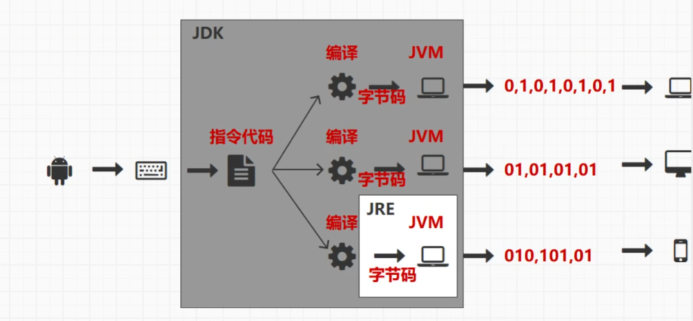
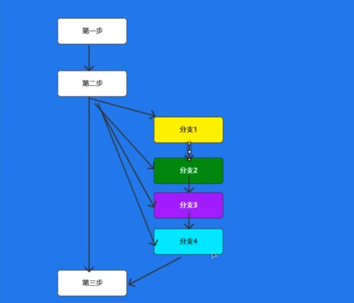

# Java基础复习

教程来自：【尚硅谷】7天搞定Java基础，Java零基础极速入门https://www.bilibili.com/video/BV1o841187iP/?p=5

2023 4 28

# 一、java基础常识




- JDK：java编程环境
- JRE：java运行环境
- JVM：java虚拟机

**编译器文件：**javac.exe

**源文件：**xxx.java

**字节码文件/类文件：**xxx.class

**启动Java虚拟机文件：**java.exe


idea常用快捷键:

1. ctrl + D : 复制当前行
2. ctrl + R : 替换当前文字内容


Java的第一段代码

```java
package chapter01;

public class Java02_HelloJava {
    public static void main(String[] args){
        System.out.println("Hello Java");
    }
}

```


## 1.变量原理

```java
package chapter02;

public class Java01_Variable {
    public static void main(String[] args) {

        //TODO 变量
        //所谓的变量其实就是可以改变的向量存储
        //1.变量的声明
        //数据类型  变量的名称
        String name;//String是一个类，表示一串字符序列

        //2.变量的赋值
        //变量名称 = 数据
        name = "zhangsan";

        //3.变量的使用
        //直接访问变量的名称即可
        System.out.println(name);

        //将变量的声明和赋值在一行代码中完成
        String username = "lisi";
        System.out.println(username);

        //在使用变量之前，必须给变量赋值，将这个操作称之为变量的初始化
    }
}

```


## 2.标识符

```java
package chapter02;

public class Java02_Identifier {
    public static void main(String[] args){

        //TODO 标识符
        //表示数据的符号，称之为标识符
        //变量名称就是标识符
        //标识符主要用于起名
        String name = "zhangsan";

        //TODO 标识符的命名规则
        //1.英文拉丁字母
        String username = "zhangsan";
        String xingming = "lisi";

        //2.符号
        //@,#,%,$
        //标识符只能采用下划线和美元 _ $ ,其他符号不能使用，称之为特殊符号
        //空格也属于特殊符号，所以不能作为标识符使用

        //3.数字
        //阿拉伯数字 0 到 9 可以作为标识符使用,但是不能开头
        //数字如果在标识符的开头位置，那么会被识别为数字，而不是标识符，所以会发生错误
        //String 1name = "zhangsan";
        String name1 = "zhangsan";

        //4.在大括号的范围内，标识符不能重复
        String name2 = "zhangsan";
        //标识符是区分大小写的
        String Name = "zhangsan";

        //5.Java语言中预先定义好了一些标识符名称，称之为关键字或保留字
        //可以使用大写来实现关键字名称的定义，但是容易造成歧义，不建议使用
        String Public = "zhangsan";

        //6.驼峰标识，组合的单词第二个大写
        String userName = "zhangsan";

        //7.标识符的长度
        //没有长度的限制

    }
}

```


# 二、数据类型


## 1.基本数据类型

```java
package chapter02;

public class Java03_Datatype_1 {
    public static void main(String[] args){

        //TODO 基本数据类型

        //TODO 1.整数类型
        //byte : 8位
        byte b = 10;
        //short : 16位
        short s = 10;
        //int : 32位
        int i = 10;
        //long : 64位
        long lon = 10;

        //TODO 2.浮点类型：含有小数点的数据类型
        //根据计算精度分为
        //默认情况下，小数点的数据会被识别为精度较高的双精度double类型
        //float : 单精度浮点类型，数据需要使用F（f）结尾
        float f = 1.0F;
        //double : 双精度浮点类型
        double d = 2.0;

        //TODO 3.字符类型
        //所谓的字符类型，其实就是使用符号表示文字内容
        char c ='@';

        //TODO 4.布尔类型
        //true,false,表示判断条件是否成立，如果成立，取值为true，如果不成立，那么取值为false
        boolean bln = true;

    }
}

```

## 2.数据类型之间的转换

```java
package chapter02;

public class Java03_Datatype_2 {
    public static void main(String[] args){

   //TODO 数据类型的转换

        String name = "zhangsan";
        int age = 30;

        //byte -> short -> int -> long -> float -> double
        byte b =10;

        short s = b;

        int i = s;

        long lon = i;

        float f = lon;

        double d = f;

        //java中范围小的值可以转换为范围大的数据，但是范围大的数据无法直接转换为范围小的数据
        //如果想要将范围大的数据转换为范围小的数据，那么需要使用小括号进行强制转换

        int i1 = (int)d;

    }
}

```

## 3.引用数据类型

```java
package chapter02;

public class Java03_Datatype_3 {
    public static void main(String[] args) {

        //TODO 引用数据类型
        //所谓的引用数据类型，其实就是可以被引用的数据类型
        String s = "abc";

        int i = 10; //10直接存储在向量存储内，没有指向其他数据存储，所以不是引用数据类型
    }
}

```


# 三、运算符


## 1.算数运算符：一元运算符+二元运算符

```java
package chapter02;

public class Java04_Operator {
    public static void main(String[] args) {

        //TODO 运算符
        //所谓的运算符就是参与数据运算的符号。Java定义的，无法自行定义

        //TODO 表达式
        //所谓的表达式就是采用运算符和数据连接在一起形成符合Java语法规则的指令代码，称之为表达式

        //TODO 算数运算符  最小使用的类型是int类型
        //1.二元运算符 ： 两个元素参与运算的运算符，1 + 2
        //  TODO 算术表达式 = 元素1 二元运算符 元素2
        //  TODO 这个表达式是有结果的，就需要有类型，这里的类型是元素中类型最大的那一种
        //   TODO 最小使用的类型是int类型
        System.out.println(1 + 2); // 3
        System.out.println(2 - 2); // 0
        System.out.println(3 * 2); // 6
        System.out.println(4 / 2); // 2
        System.out.println(5 % 2); // 1 （取余，模运算）

        System.out.println(1 / 2); // 0 （int,int）（选俩元素中类型最大的那一种） => int  本来是0.5，这里把小数去掉
        System.out.println(1.0 / 2);//0.5 (double,int) => double

        byte b1 = 10;
        byte b2 = 10;
        //b1 + b2; (byte,byte) 不行
        byte b3 = (byte) (b1 + b2);//强制转换

        System.out.println(1 + 2 * 3);//7
        System.out.println((1 + 2) * 3);//9

        //2.一元运算符 ： 一个元素参与运算的运算符
        //++,--
        //++ 运算符的本质其实就是加1操作的简化版本，自增运算符  自减运算符同理
        //int i = 0;
        //int j = i;
        //i = i + 1;
        int i = 0;
        int j = i++;//TODO 先赋值后运算 先将i赋值给j，然后i = i + 1，++i就是先运算后赋值
        System.out.println("i = " + i);
        System.out.println("j = " + j);

    }
}

```


## 2.赋值运算符

```java
package chapter02;

public class Java04_Operator_1 {
    public static void main(String[] args){

        //TODO 运算符 - 赋值运算符
        //等号就是赋值运算符：将等号右边表达式的结果赋值给左边的变量
        //赋值运算符需要考虑类型的关系
        String name = "zhangsan";
        byte b = 10;
        short s = b;

        //TODO 复合赋值运算符： += ...
        //  如果元素进行运算后重新赋值给自己，那么可以将运算和赋值的符号进行简化
        //  如果使用了复合赋值运算符，那么数据的类型不会发生变化
        int i = 1;
        //i = i + 1;
        i += 1; //先加后等
        System.out.println(i);

        byte b1 = 10;
        //b1 = b1 + 20; //+是二元运算符，最小适用类型是int //int =>byte
        b1 += 20; //复合赋值运算符不会让数据类型发生变化

    }
}

```


## 3.关系运算符

```java
package chapter02;

public class Java04_Operator_2 {
    public static void main(String[] args) {

        //TODO 运算符 - 关系运算符
        //所谓的关系运算符其实就是用于比较两个数据之间关系的运算符
        //关系运算符基本语法结构：
        //关系表达式 元素1（数据1/表达式1） 关系运算符[==,!=,>,>=,<,<=] 元素2（数据2/表达式2）、
        //关系表达式的结果为布尔类型：如果表达式的结果和预想一样，那么结果为true，如果表达式的结果和预想不一样，那么结果为false
        int i = 10;
        int j = 20;
        System.out.println(i > j); //false
        System.out.println(i < j); //true
        System.out.println(i == j); //false，双等号表示两个数据是否相等
        System.out.println(i != j); //true，感叹号表示两个数据是否不相等
        System.out.println(i >= j); //false，大于等于
        System.out.println(i <= j); //true，小于等于
    }
}

```


## 4.逻辑运算符

```java
package chapter02;

public class Java04_Operator_3 {
    public static void main(String[] args) {

        //TODO 运算符 - 逻辑运算符
        //逻辑运算符其实就是用于描述多个条件表达式之间的关系的运算符
        //TODO 基本语法结构：
        //变量 = （条件表达式1） 逻辑运算符 （条件表达式2）
        //结果变量的类型是布尔类型

        //TODO 逻辑运算符：&，称之为与运算
        //与运算，要求两个条件表达式都必须计算出结果，只有两个结果都为true的时候，最终结果为true，其他情况都为false
        int i = 10;
        boolean result = (i > 5) & (i < 20);
        System.out.println(result);

        //TODO 逻辑运算符：|，称之为或运算
        //或运算，要求两个表达式都能计算出结果，只要有任何一个结果为true，那么最后结果都为true
        //两个表达式结果都为false，最终结果才为false
        int j = 10;
        boolean result1 = (j > 5) | (j < 9);
        System.out.println(result1);

        //TODO 逻辑运算符：&&，称为短路与运算
        //短路与运算，会根据第一个条件表达式的结果来判断，是否执行第二个表达式
        //如果第一个表达式的结果为false，那么无需执行第二个表达式
        int t = 10;
        int y = 20;
        boolean result2 = (t > 10) && (++y > 30);
        System.out.println(result2);
        System.out.println(y); //20

        //TODO 逻辑运算符：||，称为短路或运算
        //短路与运算，会根据第一个条件表达式的结果来判断，是否执行第二个表达式
        //如果第一个表达式的结果为true，第二个表达式无需执行
        int n = 10;
        int s = 20;
        boolean result3 = (n == 10) || (++s > 30);
        System.out.println(result3);
        System.out.println(s); //20

        //TODO 逻辑运算符：！，逻辑非（相反）运算符
        int b = 10;
        boolean result4 = i == 10;
        System.out.println(!result4); //false
    }
}

```


## 5.三元运算符

```java
package chapter02;

public class Java04_Operator_4 {
    public static void main(String[] args) {

        //TODO 运算符 - 三元运算符
        //所谓的三元运算符其实就是三个元素参与运算的运算符
        //基本语法结构：
        //变量 = （条件表达式）？（任意表达式1）：（任意表达式2）
        //运算规则：判断条件表达式的结果，如果为true，那么执行表达式1的值，如果为false，执行表达式2的值
        int i = 10;
        int j = 20;

        int k = (i == 10) ? 1 + 1 : 2 + 2;
        System.out.println(k);
    }
}

```


# 四、流程控制

## 1.顺序执行

```java
package chapter03;

public class Java01_FlowControl {
    public static void main(String[] args) {

        //TODO 流程控制
        //所谓的流程控制，其实就是计算机在执行代码时，对指令代码的执行顺序的控制
        //Java中的流程控制主要分三种：
        //1.顺序执行：代码出现的先后顺序，以及语法的先后顺序
        //变量在使用之前，必须声明并且初始化
        int i = 10;
        int j = 20;
        System.out.println(i + j);
        //2.分支执行
        //3.重复执行
    }
}

```

## 2.分支执行

### ①可选分支，必选分支，多分支

```java
package chapter03;

public class Java02_FlowControl {
    public static void main(String[] args) {

        //TODO 流程控制 - 分支执行
        //分支结构
        //TODO 1.可选分支：单分支结构
        System.out.println("第一步");
        System.out.println("第二步");
        //判断：条件表达式的结果知否为true，如果为true，执行分支逻辑，如果为false，不执行分支逻辑
        //判断的语法使用if关键字，表示如果，在条件表达式之前使用，如果结果为true，那么分支逻辑应该在后续的大括号中执行
//        int i = 20;
//        if (i == 10) {
//            System.out.println("分支");
//        }

        //TODO 2.必选分支：双分支结构（二选一）
        //语法上使用if...else操作，这里的else表达其他场合
//        int i = 10;
//        if (i == 10) {
//            System.out.println("分支1");
//        } else {
//            System.out.println("分支2");
//        }

        //TODO 3.多分支结构
        //if...else if...else
        int i = 30;
        if (i == 10) {
            System.out.println("分支1");
        } else if (i == 20) {
            System.out.println("分支2");
        }
//        else {
//            System.out.println("分支3");
//        }

        System.out.println("第三步");


    }
}

```

### ②特殊的分支结构



```java
package chapter03;

public class Java03_FlowControl {
    public static void main(String[] args) {

        //TODO 流程控制 - 分支执行
        //特殊的分支结构
        //switch ( 数据 ) {}
        //switch语法会对数据进行判断，如果等于某一个分支数据的值，那么执行相应分支的逻辑代码和以下的逻辑代码
        //如果一个分支都无法匹配，那么一个分支都不会执行，如果想要无法匹配也需要执行分支（必选分支），那么可以增加default关键字
        //如果想要执行某一个分支后，不想继续执行其他分支的话，可以使用break关键字跳出分支
        System.out.println("第一步");
        System.out.println("第二步");
        int i = 10;
        switch (i) {
            case 10:
                System.out.println("分支1");
                break;
            case 20:
                System.out.println("分支2");
            case 30:
                System.out.println("分支3");
            default: //加上这个就变成必选的了
                System.out.println("其他分支");

        }
        System.out.println("第三步");
    }
}

```

### ③小练习

```java
package chapter03;

public class Java04_FlowControl_test {
    public static void main(String[] args) {

        //TODO 流程控制 - 分支执行 - 小练习
        int age = 30;
        //儿童（0~6），少年（7~17），青年（18~40），中年（41~65），老年（66）
        //if...else if...else if...else ： 多分支判断
        //switch...case...case...default ： 等值分支判断
        if (0 <= age && age <= 6) {
            System.out.println("儿童");
        } else if (7 <= age && age <= 17) {
            System.out.println("少年");
        } else if (18 <= age && age <= 40) {
            System.out.println("青年");
        } else if (41 <= age && age <= 65) {
            System.out.println("中年");
        } else if (66 <= age) {
            System.out.println("老年");
        } else {
            System.out.println("错误");
        }
    }
}

```

## 3.重复执行（循环执行）

### ①while

```java
package chapter03;

public class Java05_FlowControl {
    public static void main(String[] args) {

        //TODO 流程控制 - 重复执行（循环执行）
        //根据条件重复执行某段代码
        //Java中主要用于循环的语法有3个：
        //1.while：有条件重复
        //while (条件表达式) {需要循环的代码}
        //基本的执行原理：while循环会判断条件表达式的结果是否为true
        // 如果为true，会执行大括号内的逻辑代码，代码执行完毕后，会重新对条件表达式进行判断
        // 如果为false，那么跳出循环结构
        System.out.println("第一步");
        int age = 30;
        while (age < 40) { //执行十次
            System.out.println("循环的代码");
            age++;
        }
        //2.do...while
        //3.for
        System.out.println("第二步");
    }
}

```

### ②do...while


```java
package chapter03;

public class Java05_FlowControl {
    public static void main(String[] args) {

        //TODO 流程控制 - 重复执行（循环执行）
        //根据条件重复执行某段代码
        //Java中主要用于循环的语法有3个：
        //1.while：有条件重复
        //while (条件表达式) {需要循环的代码}
        //基本的执行原理：while循环会判断条件表达式的结果是否为true
        // 如果为true，会执行大括号内的逻辑代码，代码执行完毕后，会重新对条件表达式进行判断
        // 如果为false，那么跳出循环结构
        System.out.println("第一步");
        int age = 40;
//        while (age < 40) { //执行十次
//            System.out.println("循环的代码");
//            age++;
//        }

        //2.do...while
        //语法执行原理和while基本相同，区别在于循环代码是否至少执行一次
        //while循环语法可能执行，可能不执行
        //do...while循环语法中的循环代码至少执行一次
        /*
        do {
            循环代码
        } while(条件表达式)
         */
        do {
            System.out.println("循环的代码");
        } while (age < 40);
        //3.for
        System.out.println("第二步");
    }
}

```

### ③for

```java
package chapter03;

public class Java05_FlowControl {
    public static void main(String[] args) {

        //TODO 流程控制 - 重复执行（循环执行）
        //根据条件重复执行某段代码
        //Java中主要用于循环的语法有3个：
        //1.while：有条件重复
        //while (条件表达式) {需要循环的代码}
        //基本的执行原理：while循环会判断条件表达式的结果是否为true
        // 如果为true，会执行大括号内的逻辑代码，代码执行完毕后，会重新对条件表达式进行判断
        // 如果为false，那么跳出循环结构
        System.out.println("第一步");
        int age = 40;
//        while (age < 40) { //执行十次
//            System.out.println("循环的代码");
//            age++;
//        }

        //2.do...while
        //语法执行原理和while基本相同，区别在于循环代码是否至少执行一次
        //while循环语法可能执行，可能不执行
        //do...while循环语法中的循环代码至少执行一次
        /*
        do {
            循环代码
        } while(条件表达式)
         */
        do {
            System.out.println("循环的代码");
        } while (age < 40);

        //3.for
        //如果条件表达式返回结果为false，那么跳过循环语句，直接执行后续代码，如果返回结果为false，那么执行循环语句
        //初始化表达式用于对条件表达式中是用到的变量进行初始化
        //循环代码执行后，会重新进行表达式的判断，如果判断结果为true，会重复执行循环代码
        /*
        for( 初始化表达式 ; 条件表达式 ; 更新表达式 ) {
            循环的代码
        }
         */
        for (int i = 30; i < 40; i++) {
            System.out.println("循环的代码");
            System.out.println(i);
        }

        System.out.println("第二步");
    }
}

```

### ④break和continue关键字

```java
package chapter03;

public class Java05_FlowControl_1 {
    public static void main(String[] args) {

        //TODO 流程控制 - 重复执行（循环执行）
//        for (int i = 0; i < 10; i++) {
//            if (i != 4) {
//                System.out.println(i);
//            }
//        }

        //break关键字会跳出循环，不再执行循环后续的操作
        //continue关键字会跳过循环，执行下一次循环
        for (int i = 0; i < 10; i++) {
            if (i == 4) {
                //切断，跳出循环
                //break;
                continue;
            }
            System.out.println(i);
        }

    }
}

```

### ⑤小练习 - 九层妖塔

```java
package chapter03;

public class Java06_FlowControl_test {
    public static void main(String[] args) {

        //TODO 流程控制 - 小练习
        //九层妖塔
        /*
         *
         ***
         *****
         *******
         *********
         ***********
         *************
         ***************
         *****************
         */

        int level = 9; //优化代码，修改层数改这个数值就可以了

        //0 -> 8
        //1 -> 7
        //2 -> 6
        //...
        for (int i = 0; i < level; i++) {
            for (int n = 0; n < (level - 1) - i; n++) { //最后一层开头不需要空格
                System.out.print(' '); //打印开头的空格
            }

            //0 -> 1
            //1 -> 3
            //2 -> 5
            //3 -> 7
            //...
            for (int j = 0; j < 2 * i + 1; j++) {
                System.out.print('*'); //打印*号
            }
            System.out.println();
        }

    }
}

```


# 五、面向对象

