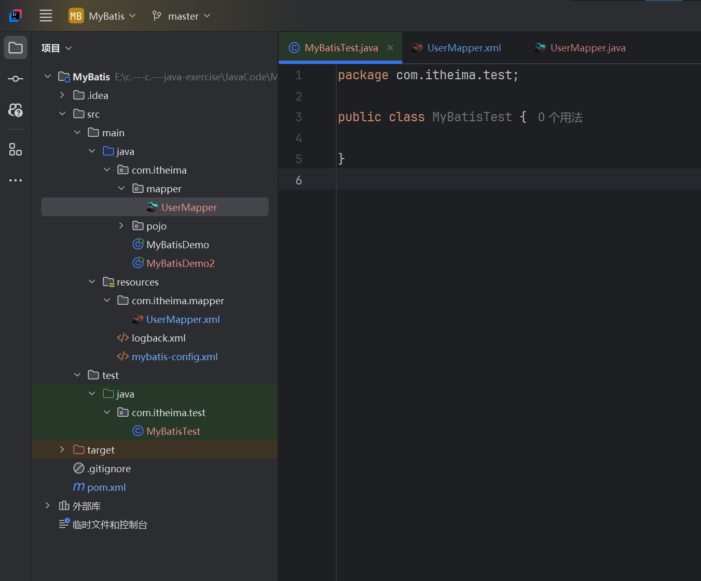

# 一、MyBatis 简介

**什么是MyBatis？**

- MyBatis是一款优秀的==持久层框架==，用于简化JDBC开发
- MyBatis 本是 Apache 的一个开源项目iBatis，2010年这个项目由apache software foundation迁移到了google code，并且改名为MyBatis。2013年11月迁移到GitHub
- 官网：[MyBatis中文网](https://mybatis.net.cn/)


**持久层**

- 负责将数据保存到数据库的那一层代码
- JavaEE三层架构：表现层、业务层、**持久层**


**框架**

- 框架就是一个半成品软件，是一套可重用的、通用的、软件基础代码模型
- 在框架的基础之上构建软件编写会更加高效、规范、通用、可拓展


**JDBC缺点**

1. 硬编码   =>   配置文件
   - 注册驱动，获取连接
   - SQL语句

2. 操作繁琐   =>   自动完成
   - 手动设置参数
   - 手动封装结果集


**MyBatis免除了几乎所有的JDBC代码以及设置参数和获取结果集工作**


各种持久层框架中，MyBatis在国内的使用率占比最高


**本课程笔记学习大纲：**

- MyBatis 快速入门
- Mapper 代理开发
- MyBatis 核心配置文件
- 配置文件完成增删改查
- 注解完成增删改查
- 动态 SQL


# 二、MyBatis 快速入门

**查询user表中所有数据**

1. 创建user表，添加数据
2. 创建模块，导入坐标
3. 编写 MyBatis 核心配置文件 -- > 替换连接信息，解决硬编码问题
4. 编写 SQL 映射文件 -- > 统一管理sql语句，解决硬编码问题
5. 编码
   1. 定义POJO类
   2. 加载核心配置文件，获取 SqlSessionFactory 对象
   3. 获取 SqlSession 对象，执行 SQL 语句
   4. 释放资源


**在MySQL中创建MyBatis数据库，然后创建User表，添加数据**

用到的SQL代码为：

```sql
create database mybatis;
use mybatis;

drop table if exists tb_user;

create table tb_user(
	id int primary key auto_increment,
	username varchar(20),
	password varchar(20),
	gender char(1),
	addr varchar(30)
);

INSERT INTO tb_user VALUES (1, 'zhangsan', '123', '男', '北京');
INSERT INTO tb_user VALUES (2, '李四', '234', '女', '天津');
INSERT INTO tb_user VALUES (3, '王五', '11', '男', '西安');
```

我使用的是Navicat for MySQL软件管理数据库

成功创建后如图所示：


**创建项目，导入坐标**

pom.xml文件内容

**注意**：注意导入的各组件的版本号，仅针对以下版本号组件的测试用例可以成功运行，如果版本号过高或过低可能会出现组件冲突等意外情况。这里不做演示。我尝试了全部配置为最新版本的组件，日志内容无法正常显示，换回以下版本后正常，我估计是因为组件升级后有冲突，所以不建议随便选择组件版本。

```xml
<?xml version="1.0" encoding="UTF-8"?>
<project xmlns="http://maven.apache.org/POM/4.0.0"
         xmlns:xsi="http://www.w3.org/2001/XMLSchema-instance"
         xsi:schemaLocation="http://maven.apache.org/POM/4.0.0 http://maven.apache.org/xsd/maven-4.0.0.xsd">
    <modelVersion>4.0.0</modelVersion>

    <groupId>org.example</groupId>
    <artifactId>MyBatis</artifactId>
    <version>1.0-SNAPSHOT</version>

    <properties>
        <maven.compiler.source>8</maven.compiler.source>
        <maven.compiler.target>8</maven.compiler.target>
        <project.build.sourceEncoding>UTF-8</project.build.sourceEncoding>
    </properties>

    <dependencies>
        <!--mybatis 依赖-->
        <dependency>
            <groupId>org.mybatis</groupId>
            <artifactId>mybatis</artifactId>
            <version>3.5.5</version>
        </dependency>
        <!--MySQL 驱动-->
        <dependency>
            <groupId>mysql</groupId>
            <artifactId>mysql-connector-java</artifactId>
            <version>8.0.33</version>
        </dependency>
        <!--Junit 单元测试-->
        <dependency>
            <groupId>junit</groupId>
            <artifactId>junit</artifactId>
            <version>4.13</version>
            <scope>test</scope>
        </dependency>
        <!-- 添加slf4j日志api -->
        <dependency>
            <groupId>org.slf4j</groupId>
            <artifactId>slf4j-api</artifactId>
            <version>1.7.20</version>
        </dependency>
        <!-- 添加logback-classic依赖 -->
        <dependency>
            <groupId>ch.qos.logback</groupId>
            <artifactId>logback-classic</artifactId>
            <version>1.2.3</version>
        </dependency>
        <!-- 添加logback-core依赖 -->
        <dependency>
            <groupId>ch.qos.logback</groupId>
            <artifactId>logback-core</artifactId>
            <version>1.2.3</version>
        </dependency>

    </dependencies>

</project>
```

记得将**Logback配置文件**放入：src/main/resources 下

logback.xml文件内容

```xml
<?xml version="1.0" encoding="UTF-8"?>
<configuration>
    <!--
        CONSOLE ：表示当前的日志信息是可以输出到控制台的。
    -->
    <appender name="Console" class="ch.qos.logback.core.ConsoleAppender">
        <encoder>
            <pattern>[%level] %blue(%d{HH:mm:ss.SSS}) %cyan([%thread]) %boldGreen(%logger{15}) - %msg %n</pattern>
        </encoder>
    </appender>

    <logger name="com.itheima" level="DEBUG" additivity="false">
        <appender-ref ref="Console"/>
    </logger>


    <!--

      level:用来设置打印级别，大小写无关：TRACE, DEBUG, INFO, WARN, ERROR, ALL 和 OFF
     ， 默认debug
      <root>可以包含零个或多个<appender-ref>元素，标识这个输出位置将会被本日志级别控制。
      -->
    <root level="DEBUG">
        <appender-ref ref="Console"/>
    </root>
</configuration>
```

mybatis-config.xml就是**MyBatis的核心配置文件**，放到src/main/resources文件夹中

mybatis-config.xml文件内容

```xml
<?xml version="1.0" encoding="UTF-8"?>
<!DOCTYPE configuration
        PUBLIC "-//mybatis.org//DTD Config 3.0//EN"
        "http://mybatis.org/dtd/mybatis-3-config.dtd">
<configuration>
    <environments default="development">
        <environment id="development">
            <transactionManager type="JDBC"/>
            <dataSource type="POOLED">
                <!--数据库连接信息-->
                <property name="driver" value="com.mysql.cj.jdbc.Driver"/>
                <property name="url" value="jdbc:mysql:///mybatis?useSSL=false"/>
                <property name="username" value="root"/>
                <property name="password" value="admin"/>
            </dataSource>
        </environment>
    </environments>
    <mappers>
        <!--加载sql映射文件-->
        <mapper resource="com/itheima/mapper/UserMapper.xml"/>
    </mappers>
</configuration>
```

UserMapper.xml是**Mapper配置文件**，放入src/main/resources

```xml
<?xml version="1.0" encoding="UTF-8" ?>
<!DOCTYPE mapper
        PUBLIC "-//mybatis.org//DTD Mapper 3.0//EN"
        "http://mybatis.org/dtd/mybatis-3-mapper.dtd">

<!--
    namespace:名称空间
-->
<mapper namespace="test">
    <select id="selectAll" resultType="com.itheima.pojo.User">
        select * from tb_user;
    </select>
</mapper>
```

**定义POJO类：User.java**

```java
package com.itheima.pojo;

public class User {

    //alt + 左键 : 整列编辑
    private Integer id;
    private String username;
    private String password;
    private String gender;
    private String addr;

    public Integer getId() {
        return id;
    }

    public void setId(Integer id) {
        this.id = id;
    }

    public String getUsername() {
        return username;
    }

    public void setUsername(String username) {
        this.username = username;
    }

    public String getPassword() {
        return password;
    }

    public void setPassword(String password) {
        this.password = password;
    }

    public String getGender() {
        return gender;
    }

    public void setGender(String gender) {
        this.gender = gender;
    }

    public String getAddr() {
        return addr;
    }

    public void setAddr(String addr) {
        this.addr = addr;
    }

    @Override
    public String toString() {
        return "User{" +
                "id=" + id +
                ", username='" + username + '\'' +
                ", password='" + password + '\'' +
                ", gender='" + gender + '\'' +
                ", addr='" + addr + '\'' +
                '}';
    }
}
```


**然后就可以编写测试类了**

```java
package com.itheima;

import org.apache.ibatis.io.Resources;
import org.apache.ibatis.session.SqlSession;
import org.apache.ibatis.session.SqlSessionFactory;
import org.apache.ibatis.session.SqlSessionFactoryBuilder;

import java.io.IOException;
import java.io.InputStream;
import java.util.List;

//TODO MyBatis快速入门代码
public class MyBatisDemo {
    public static void main(String[] args) throws IOException {
        //1.加载MyBatis的核心配置文件,获取 SqlSessionFactory
        String resource = "mybatis-config.xml";
        InputStream inputStream = Resources.getResourceAsStream(resource);
        SqlSessionFactory sqlSessionFactory = new SqlSessionFactoryBuilder().build(inputStream);

        //2.获取SqlSession对象,用它来执行sql
        SqlSession sqlSession=sqlSessionFactory.openSession();

        //3.执行sql
        List<Object> users = sqlSession.selectList("test.selectAll");

        System.out.println(users);

        //4.释放资源
        sqlSession.close();

    }
}
```


正确的输出结果：

```cmd
E:\JDK8\bin\java.exe "-javaagent:D:\IntelliJ IDEA Community Edition 2024.1\lib\idea_rt.jar=20643:D:\IntelliJ IDEA Community Edition 2024.1\bin" -Dfile.encoding=UTF-8 -classpath "E:\JDK8\jre\lib\charsets.jar;E:\JDK8\jre\lib\deploy.jar;E:\JDK8\jre\lib\ext\access-bridge-64.jar;E:\JDK8\jre\lib\ext\cldrdata.jar;E:\JDK8\jre\lib\ext\dnsns.jar;E:\JDK8\jre\lib\ext\jaccess.jar;E:\JDK8\jre\lib\ext\jfxrt.jar;E:\JDK8\jre\lib\ext\localedata.jar;E:\JDK8\jre\lib\ext\nashorn.jar;E:\JDK8\jre\lib\ext\sunec.jar;E:\JDK8\jre\lib\ext\sunjce_provider.jar;E:\JDK8\jre\lib\ext\sunmscapi.jar;E:\JDK8\jre\lib\ext\sunpkcs11.jar;E:\JDK8\jre\lib\ext\zipfs.jar;E:\JDK8\jre\lib\javaws.jar;E:\JDK8\jre\lib\jce.jar;E:\JDK8\jre\lib\jfr.jar;E:\JDK8\jre\lib\jfxswt.jar;E:\JDK8\jre\lib\jsse.jar;E:\JDK8\jre\lib\management-agent.jar;E:\JDK8\jre\lib\plugin.jar;E:\JDK8\jre\lib\resources.jar;E:\JDK8\jre\lib\rt.jar;E:\c.---c.---java-exercise\JavaCode\MyBatis\target\classes;E:\Maven Local repository\org\mybatis\mybatis\3.5.5\mybatis-3.5.5.jar;E:\Maven Local repository\mysql\mysql-connector-java\5.1.46\mysql-connector-java-5.1.46.jar;E:\Maven Local repository\org\slf4j\slf4j-api\1.7.20\slf4j-api-1.7.20.jar;E:\Maven Local repository\ch\qos\logback\logback-classic\1.2.3\logback-classic-1.2.3.jar;E:\Maven Local repository\ch\qos\logback\logback-core\1.2.3\logback-core-1.2.3.jar" com.itheima.MyBatisDemo
[DEBUG] 22:34:08.232 [main] o.a.i.l.LogFactory - Logging initialized using 'class org.apache.ibatis.logging.slf4j.Slf4jImpl' adapter. 
[DEBUG] 22:34:08.261 [main] o.a.i.d.p.PooledDataSource - PooledDataSource forcefully closed/removed all connections. 
[DEBUG] 22:34:08.261 [main] o.a.i.d.p.PooledDataSource - PooledDataSource forcefully closed/removed all connections. 
[DEBUG] 22:34:08.262 [main] o.a.i.d.p.PooledDataSource - PooledDataSource forcefully closed/removed all connections. 
[DEBUG] 22:34:08.262 [main] o.a.i.d.p.PooledDataSource - PooledDataSource forcefully closed/removed all connections. 
[DEBUG] 22:34:08.333 [main] o.a.i.t.j.JdbcTransaction - Opening JDBC Connection 
[DEBUG] 22:34:08.538 [main] o.a.i.d.p.PooledDataSource - Created connection 21257599. 
[DEBUG] 22:34:08.538 [main] o.a.i.t.j.JdbcTransaction - Setting autocommit to false on JDBC Connection [com.mysql.jdbc.JDBC4Connection@1445d7f] 
[DEBUG] 22:34:08.546 [main] test.selectAll - ==>  Preparing: select * from tb_user; 
[DEBUG] 22:34:08.569 [main] test.selectAll - ==> Parameters:  
[DEBUG] 22:34:08.581 [main] test.selectAll - <==      Total: 3 
[User{id=1, username='zhangsan', password='123', gender='男', addr='北京'}, User{id=2, username='李四', password='234', gender='女', addr='天津'}, User{id=3, username='王五', password='11', gender='男', addr='西安'}]
[DEBUG] 22:34:08.581 [main] o.a.i.t.j.JdbcTransaction - Resetting autocommit to true on JDBC Connection [com.mysql.jdbc.JDBC4Connection@1445d7f] 
[DEBUG] 22:34:08.582 [main] o.a.i.t.j.JdbcTransaction - Closing JDBC Connection [com.mysql.jdbc.JDBC4Connection@1445d7f] 
[DEBUG] 22:34:08.582 [main] o.a.i.d.p.PooledDataSource - Returned connection 21257599 to pool. 

进程已结束，退出代码为 0

```


# 三、Mapper 代理开发

Mappers：映射器

- 目的

  - 解决原生方式中的硬编码
  - 简化后期执行SQL

  


**使用 Mapper 代理方式完成入门案例**

1. 定义与SQL映射文件同名的Mapper接口，并且将Mapper接口和SQL映射文件放置在同一目录下
2. 设置SQL映射文件的namespace属性为Mapper接口全限定名
3. 在 Mapper 接口中定义方法，方法名就是SQL映射文件中sql语句的id，并保持参数类型和返回值类型一致
4. 编码
   1. 通过 SqlSession 的 getMapper 方法获取 Mapper 接口的代理对象
   2. 调用对应方法完成sql的执行


1.resources目录下这么创建文件目录，然后把UserMapper放到com/itheima/mapper目录下就可以和UserMapper编译后的文件存在一个目录中了


效果如下


2.将UserMapper的配置文件的命名空间改成Mapper接口的全限定名


3.在Mapper接口中定义方法，方法名就是SQL映射文件中sql语句的id，上例中就是selectAll，并且保持参数类型和返回值类型一致


记得改一下mybatis-config配置文件中sql映射文件的路径


4.然后我们就可以开始编码了，我们在com.itheima包下整个MyBatisDemo2.java

```java
package com.itheima;

import com.itheima.mapper.UserMapper;
import com.itheima.pojo.User;
import org.apache.ibatis.io.Resources;
import org.apache.ibatis.session.SqlSession;
import org.apache.ibatis.session.SqlSessionFactory;
import org.apache.ibatis.session.SqlSessionFactoryBuilder;

import java.io.IOException;
import java.io.InputStream;
import java.util.List;

//TODO MyBatis代理开发
public class MyBatisDemo2 {
    public static void main(String[] args) throws IOException {
        //1.加载MyBatis的核心配置文件,获取 SqlSessionFactory
        String resource = "mybatis-config.xml";
        InputStream inputStream = Resources.getResourceAsStream(resource);
        SqlSessionFactory sqlSessionFactory = new SqlSessionFactoryBuilder().build(inputStream);

        //2.获取SqlSession对象,用它来执行sql
        SqlSession sqlSession=sqlSessionFactory.openSession();

        //3.执行sql
//        List<Object> users = sqlSession.selectList("test.selectAll");
        //3.1 获取UserMapper接口的代理对象
        UserMapper userMapper = sqlSession.getMapper(UserMapper.class);
        List<User> users = userMapper.selectAll();

        System.out.println(users);

        //4.释放资源
        sqlSession.close();

    }
}

```


**细节：如果Mapper接口名称和SQL映射文件名称相同，并在同一目录下，则可以使用包扫描的方式简化SQL映射文件的加载**


这样写系统会自动把com.itheima.mapper路径下的接口对应的xml配置文件全部一起扫描进来，就不用我们自己一个一个手动加载sql映射文件了


# 四、MyBatis 核心配置文件

MyBatis 核心配置文件详解

MyBatis 核心配置文件的顶层结构如下：


- 类型别名（typeAliases）

  ```xml
  <typeAliases>
  	<package name="com.itheima.pojo"/>
  </typeAliases>
  ```

  配置好类型别名就意味着下图位置（结果类型）只需要写类名即可（不用区分大小写）

  

  

  **细节：配置各个标签时，需要遵守前后顺序**


核心配置文件更新后：

```xml
<?xml version="1.0" encoding="UTF-8"?>
<!DOCTYPE configuration
        PUBLIC "-//mybatis.org//DTD Config 3.0//EN"
        "http://mybatis.org/dtd/mybatis-3-config.dtd">
<configuration>

    <typeAliases>
        <package name="com.itheima.pojo"/>
    </typeAliases>

    <!--
    enviroments : 配置数据库连接环境信息,可以配置多个enviroment,通过default属性切换不同的enviroment
    -->
    <environments default="development">
        <environment id="development">
            <!--事务的管理方式-->
            <transactionManager type="JDBC"/>
            <!--数据库连接池-->
            <dataSource type="POOLED">
                <!--数据库连接信息-->
                <property name="driver" value="com.mysql.cj.jdbc.Driver"/>
                <property name="url" value="jdbc:mysql:///mybatis?useSSL=false"/>
                <property name="username" value="root"/>
                <property name="password" value="admin"/>
            </dataSource>
        </environment>
    </environments>
    <mappers>
        <!--加载sql映射文件-->
        <!--        <mapper resource="com/itheima/mapper/UserMapper.xml"/>-->

        <!--Mapper代理方式-->
        <package name="com.itheima.mapper"/>
    </mappers>
</configuration>
```


# 五、配置文件完成增删改查

## 1.MyBatis 案例 - 环境准备

**完成品牌数据的增删改查操作**

产品原型样式：


- 要完成的功能列表清单：
  1. 查询
     - 查询所有数据
     - 查看详情
     - 条件查询
  2. 添加
  3. 修改
     - 修改全部字段
     - 修改动态字段
  4. 删除
     - 删除一个
     - 批量删除


**准备环境**

- 数据库表 tb-brand
- 实体类 Brand
- 测试用例
- 安装 MyBatisX 插件


1.导入数据库表

```sql
-- 删除tb_brand表
drop table if exists tb_brand;
-- 创建tb_brand表
create table tb_brand
(
    -- id 主键
    id           int primary key auto_increment,
    -- 品牌名称
    brand_name   varchar(20),
    -- 企业名称
    company_name varchar(20),
    -- 排序字段
    ordered      int,
    -- 描述信息
    description  varchar(100),
    -- 状态：0：禁用  1：启用
    status       int
);
-- 添加数据
insert into tb_brand (brand_name, company_name, ordered, description, status)
values ('三只松鼠', '三只松鼠股份有限公司', 5, '好吃不上火', 0),
       ('华为', '华为技术有限公司', 100, '华为致力于把数字世界带入每个人、每个家庭、每个组织，构建万物互联的智能世界', 1),
       ('小米', '小米科技有限公司', 50, 'are you ok', 1);


SELECT * FROM tb_brand;
```


2.准备实体类 Brand，放入项目的pojo包中

```java
package com.itheima.pojo;

/**
 * 品牌
 *
 * alt + 鼠标左键：整列编辑
 *
 * 在实体类中，基本数据类型建议使用其对应的包装类型
 */

public class Brand {
    // id 主键
    private Integer id;
    // 品牌名称
    private String brandName;
    // 企业名称
    private String companyName;
    // 排序字段
    private Integer ordered;
    // 描述信息
    private String description;
    // 状态：0：禁用  1：启用
    private Integer status;


    public Integer getId() {
        return id;
    }

    public void setId(Integer id) {
        this.id = id;
    }

    public String getBrandName() {
        return brandName;
    }

    public void setBrandName(String brandName) {
        this.brandName = brandName;
    }

    public String getCompanyName() {
        return companyName;
    }

    public void setCompanyName(String companyName) {
        this.companyName = companyName;
    }

    public Integer getOrdered() {
        return ordered;
    }

    public void setOrdered(Integer ordered) {
        this.ordered = ordered;
    }

    public String getDescription() {
        return description;
    }

    public void setDescription(String description) {
        this.description = description;
    }

    public Integer getStatus() {
        return status;
    }

    public void setStatus(Integer status) {
        this.status = status;
    }

    @Override
    public String toString() {
        return "Brand{" +
                "id=" + id +
                ", brandName='" + brandName + '\'' +
                ", companyName='" + companyName + '\'' +
                ", ordered=" + ordered +
                ", description='" + description + '\'' +
                ", status=" + status +
                '}';
    }
}

```


3.写一个测试用例




4.安装 **MyBatisX 插件**

- **MyBatisX **是一款基于 IDEA 的快速开发插件，为**效率**而生

- 主要功能：

  - XML 和 接口方法 相互跳转
  - 根据接口方法生成 statement

- 安装：

  


## 2.查询 - 查询所有&结果映射

**查询 - 查询所有数据**


1. 编写接口方法：Mapper接口

   ```java
   List<Brand> selectAll();
   ```

   - 参数：无
   - 结果：List\<Brand>

2. 编写SQL语句：

   SQL映射文件：

   ```xml
   <select id="selectAll" resultType="brand">
   	select * from tb_brand;
   </select>
   ```

3. 执行方法

