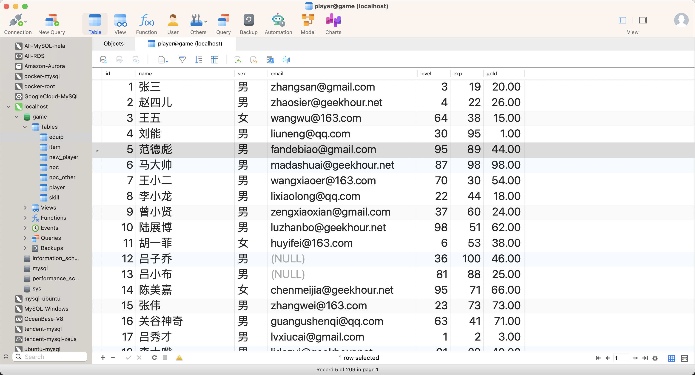

# README

_Read this in other languages:_
[_简体中文_](README.md)

This is the accompanying data for the "One-Hour Beginner's Course on MySQL" from GeekHour, includes the SQL statements and data files used in the course.

## Course Links

* [YouTube]()
* [B站]()


## How to import the data

After installing MySQL, access the MySQL command-line interface and create a database named "game" by following these steps:

1. Open the terminal and enter the following command:
```bash
mysql -u your_username -p
```
Replace your_username with your MySQL username. You will be prompted to enter your MySQL password.

Once logged in, you should see the MySQL prompt (mysql>).
```css
mysql>
```

2. Create a database named "game" by entering the following command:
```sql
CREATE DATABASE game;
```
3. You can confirm that the database has been created by using the following command:
```sql
SHOW DATABASES;
```
4. Exit the MySQL command-line interface by typing:
```sql
exit;
```
5. In the terminal, enter the following command to import the data:
```bash
mysql -u root -p game < game.sql
```

Example：


Data preview：


There are also some other data that can be used for practice:

* city_data: Chinese province, city, and district data, including the latitude and longitude of each region and the first six digits of the ID card.
* game.npc: Three Kingdoms-themed game generals data.
* shop: A simple e-commerce data, including product, order, user, and other information.
* company: MySQL official sample company data.
* sakila: MySQL official sample movie rental data.
* world: MySQL official sample world country and city data.


