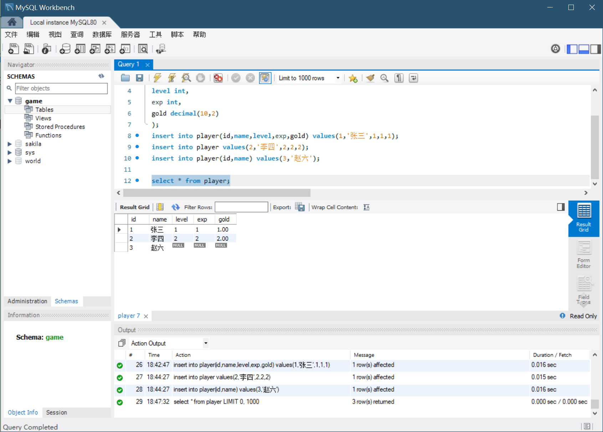
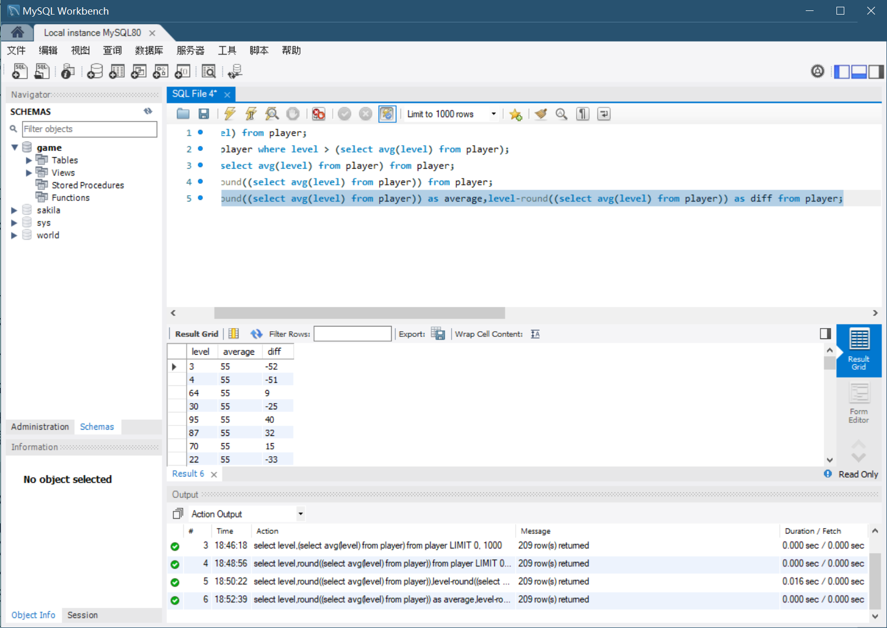
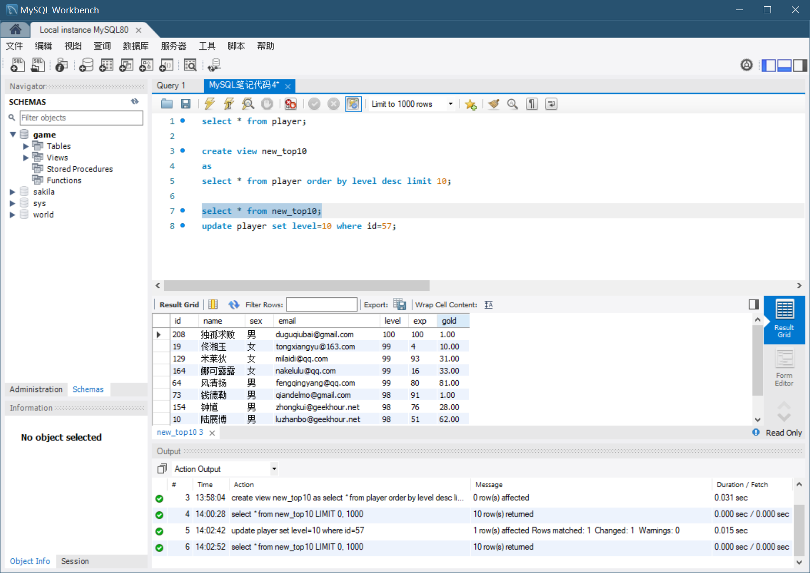
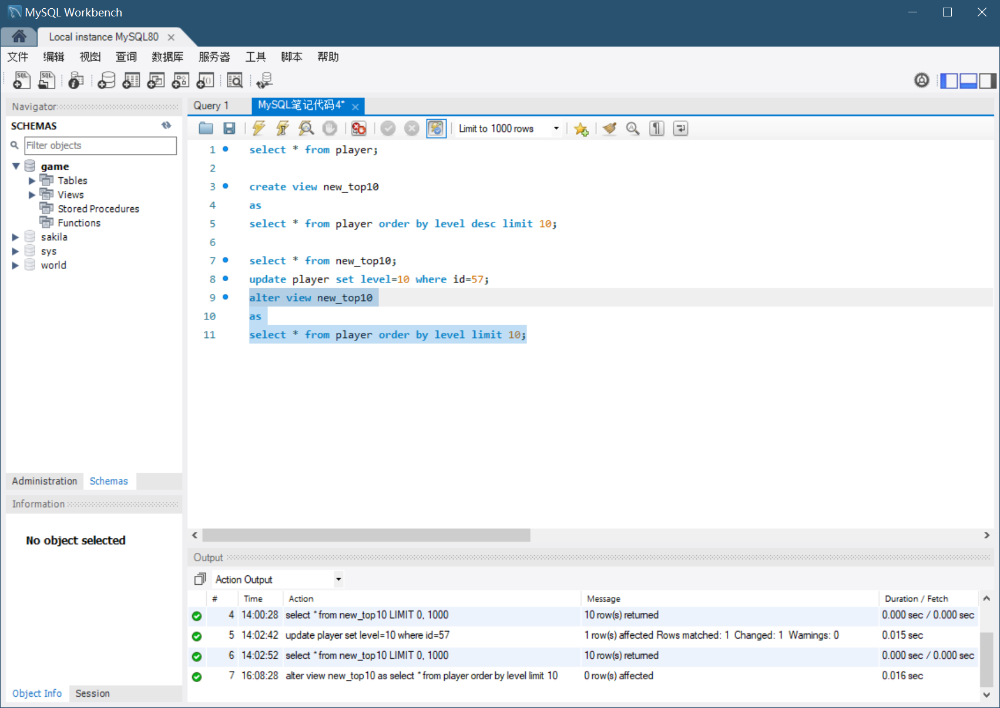
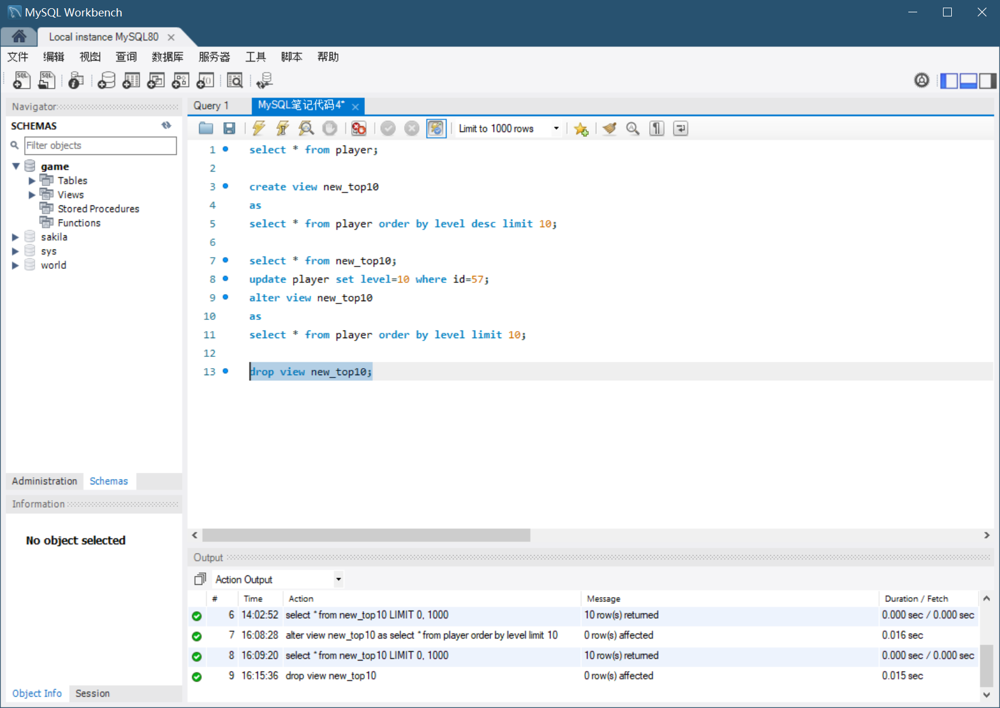

# 一、MYSQL简介

MySQL是一种关系型数据库管理系统（**注意，它是管理系统，不只是数据库**）

安装过程本笔记不过多介绍，详情可以在b站、CSDN等网站查询


# 二、MySQL-Shell的使用

MySQL-Shell是一个交互式的JavaScript Python和SQL的终端，可以用于执行数据库管理任务

它提供了自动语法高亮，语法检查，自动完成和上下文感知的提示，从而提高了开发人员和DBA的生产力

MySQL-Shell是支持JS，Python和SQL三种语言的，默认使用JS

MySQL-Shell比较适合用来做一些数据库管理工作，它可以通过编写一些日常经常重复使用到的脚本来提高工作效率，比如备份数据库，管理集群等等


# 三、SQL基础

**RDBMS（关系型数据库管理系统）**和**NON-RDBMS（非关系型数据库管理系统）**是两种不同的数据库管理系统


**RDBMS采用了关系模型来组织数据**

**MySQL就是RDBMS类型的**

借助于集合，代数等数学概念和方法来处理数据

通过二维表来表示数据之间的联系，二维表的每一行表示一条数据记录，每一列表示一个字段，也就是记录的某个属性，不同的表之间通过关联字段来建立联系，这种关联关系就是关系型数据库管理系统的特点


**非关系型管理系统（NON-RDBMS）是对关系型数据库管理系统（RDBMS）的补充和拓展**

由于互联网快速发展，仅仅使用关系型数据库已经不能满足需求了，比如各种短视频、流媒体、地理位置信息、社交网络等等，这些数据的特点是数据量大，数据结构复杂，数据类型多种多样，这就决定了RDBMS不能很好的处理这些数据，因此出现了NON-RDBMS

常见的NON-RDBMS有以下这些：


**SQL是一种用来操作关系型数据库的语言**

RDBMS中数据一般是以表的形式来存储的，SQL可以用来操作表中的数据，几乎所有RDBMS都支持SQL

我们可以在MySQL的客户端命令行中执行SQL语句，也可以在可视化的GUI工具，比如Workbench或者Navicat中执行这些语句

一般来说，SQL语句**不区分大小写**，但是为了提高可读性，我们一般会把关键字大写，把表名、列名和其他名称小写

**按照功能不同，SQL语句可以分为以下几类：**

| 缩写 | 名称                                    | 相关的关键字                  |
| ---- | --------------------------------------- | ----------------------------- |
| DDL  | 数据定义语言 Data Definition Language   | CREATE、DROP、ALTER、TRUNCATE |
| DML  | 数据操作语言 Data Manipulation Language | INSERT、UPDATE、DELETE、CALL  |
| DQL  | 数据查询语言 Data Query Language        | SELECT、WHRER                 |
| DCL  | 数据控制语言 Data Control Language      | GRANT、REVOKE                 |


# 四、创建数据库

可以在MySQL的命令行客户端或者GUI工具中，执行一个CREATE DATABASE语句，来创建一个数据库

注意：在进行以上操作之前，最好将MySQL添加到系统环境变量，这里不做介绍


1. `show databases;`：查看当前已经存在的数据库

   

   可以看到现在我有4个数据库

2. 然后我们来创建一个名字叫做game的数据库，在命令行输入`CREATE DATABASE game;`回车创建完成

   

   使用`show databases;`查看一下是否创建成功

   


# 五、创建表

有了数据库之后，我们就可以在数据库中创建表了

1. 在创建表之前，我们需要先使用use语句选择一个数据库

   比如我们现在选择game数据库

   

2. 然后使用create语句来建表（从这里开始以下的代码使用MySQL Workbench执行）

   create后面加一个table关键字再加表的名称，最后加上一对括号，括号中是字段的名称和数据类型，字段之间用逗号隔开，最后一个字段不需要加逗号

   比如我们要做的游戏需要一个玩家表，表中需要包含玩家的ID、名字、等级、经验、金币等信息

   那么就可以输入：CREATE + TABLE关键字 + 表的名称比如player + 一对括号，括号中包含：

   - 玩家的ID，整数
   - 玩家名字，字符串，大小是100个字符
   - 等级，整数
   - 经验值，整数
   - 金钱，十进制数值

   

   **这里就涉及到MySQL的数据类型**

   MySQL中的数据类型大致分为五大类别：

   1. **数值类型**
   2. **日期和时间类型**
   3. **字符串类型**
   4. **JSON类型（新增）**
   5. **空间类型（新增）**

   每种类型也都包括一些不同的子类型，我们可以根据需要来选择

   

   1. 比如数值类型包括整数类型和浮点数类型

      整数类型根据占用的存储空间不同，又包括TINYINT、SMALLINT、INT和BIGINT，分别对应1-8个字节的存储空间，可以存储不同范围的整数

      浮点数类型包括Float和Double，分别对应4个字节和8个字节的存储空间，可以存储不同范围的浮点数

   2. 日期和时间类型包括DATE、TIME、DATETIME和TIMESTAMP，分别对应日期，时间，日期时间和时间戳

   3. 字符串类型包括CHAR、VARCHAR、TEXT和BLOB等等，分别对应定长字符串，变长字符串，文本和二进制数据，比如我们刚才定义的VARCHAR（100）就代表长度为100的变长字符串，而DECIMAL（10,2）就表示长度为10，并且保留两位小数的十进制数值

   4. 比较新的版本的MySQL还支持JSON类型以及点、线、多边形等几何空间类型

   

3. 创建好表之后我们可以使用DESC语句来查看表的结构，DESC是describe的缩写，意思是描述，用来描述表的结构，比如如果想查看刚刚创建的player表的结构，就可以输入DESC后面加上表名player，然后点击执行

   

   在执行结果中就可以看到表的结构，包括表中每一列的名称，数据类型，是否允许为空，默认值等等

   

4. 如果我们创建表的时候，发现表结构有问题，需要修改的话，那么就可以使用ALTER语句来修改表的结构

   比如我们发现玩家名字的长度可能不够，需要修改为更长的长度，ALTER跟上TABLE关键字和表名，然后跟上MODIFY COLUMN关键字，表示修改列，然后跟上想要修改的列名和新的数据类型

   然后我们再查看一下新的表结构

   

   

   除了数据类型之外，字段名称也是可以修改的，比如我们可以把name这一列改成nick_name昵称

   那么可以输入ALTER TABLE关键字，后面加上表名player，然后再加上一个RENAME COLUMN关键字，表示重命名字段，后面加上旧的字段名和一个TO关键字，最后加上我们想要修改的新的字段名nick_name

   然后再查看一下表结构

   

   

   除了修改列的名称和数据类型之外，也可以使用ADD COLUMN来添加一个新的字段，比如我们就来添加一个玩家最后登录的时间

   那么就可以输入ALTER TABLE player，后面加上ADD COLUMN关键字，然后加上想要添加的字段名last_login，最后是一个datetime的数据类型

   然后再查看一下表的结构

   

   

   可以添加字段的话，当然也可以使用 DROP COLUMN来删除一个字段，比如我们把刚添加的last_login字段再删除掉，只需要输入ALTER TABLE player，后面加上一个DROP COLUMN关键字，最后加上想要删除的字段就可以了

   然后我们再查看一下表结构

   

   

   最后如果我们想要删除整个表的话，可以使用DROP TABLE语句，比如来删除刚刚创建的player表的话

   只需要输入DROP TABLE加上表名player，执行就可以了

   


以上就是创建和管理表的一些基本操作


# 六、数据的增删改查

到目前为止，我们已经学会了如何创建数据库和表，一句如何来修改他们的结构，这节课我们来看一下如何对表中的数据进行一些常用的操作


1. 首先还是创建一个玩家表

   

2. INSERT插入数据：创建完成之后，我们向这个表中插入一条数据

   可以使用INSERT语句，他的语法结构是这样的，首先是一个INSERT INTO关键字，后面跟上表的名称，然后是括号括起来的列的名称，再用VALUES关键字，后面加上具体的值就可以了

   如果表名后面的括号中包括了所有的列，并且顺序也和表结构保持一致的话，那么这个括号以及它里面的列名就都可以省略掉，直接在表名后面加上VALUES关键字，然后加上值就可以了

   也可以只写上部分列的名称，这样没有列出来的部分，就会使用我们在建表时设置的默认值来填充

   

3. 然后可以使用SELECT语句查看一下数据

   SELECT后面跟上要查询的列名，也可以使用一个星号来代替所有的列，然后跟上FROM关键字和想要查询的表名，表示从哪个表来查询数据，然后来执行以下这条语句，就可以看到我们插入的数据了

   

   INSERT也可以插入多条数据，直接在VALUES后面加上多组数据就可以了，数据之间用逗号隔开

   插入后查询数据

   

   这里有很多null，是因为我们在创建表的时候没有指定默认值，那默认就会是一个null，表示一个空值

   这样显然不是很合理，比如一般游戏中玩家等级都是从1级开始

   那我们就可以修改一下表结构，把等级的默认值改为1

   使用ALTER TABLE关键字，后面加上表的名称，然后加上一个MODIFY，然后是字段的名称和类型，最后加上一个DEFAULT 1表示默认值是1级

   然后再来插入一条数据，执行之后再来查看一下数据

   

   可以看到，后面最后插入的曹操记录虽然没有指定他的等级，但是已经默认赋值为1了

   

   除了默认值之外，还可以使用NULL或者NOT NULL来指定这个字段是否允许为空值

   或者使用UNIQUE来制定这个字段必须是唯一的

   这些都是一种约束，用来保证数据的正确性和完整性

   

   经常用到的约束有以下几种：

   除了上面提到的默认值、非空和唯一约束之外，还有主键约束和外键约束等等

   - 主键约束用来保证数据的唯一性，不为空，并且每个表只能有1个主键

   - 外键约束用来保证数据的一致性，一个表的外键必须是另一个表的主键

   

4. UPDATE修改数据：我们之前插入的赵六和王五同学的等级还是NULL

   我们可以使用UPDATA语句来修改一下他们的等级

   UPDATE语句后面跟上表的名称，然后用set关键字加上要修改的列名和值，后面跟上一个WHERE条件字句，表示要修改哪些数据，比如把赵六同学的等级修改成1级，就可以在WHERE后面指定name为赵六，这样就可以把赵六同学的等级修改成1级了

   

   用同样的方法修改一下王五和李二的等级吧

   

   

   这样所有玩家的等级的都是1级了，但是后面的经验和金币还是NULL

   如果也像刚才那样一条一条修改的话，显然是非常麻烦的

   其实是可以**一次性修改所有的数据**的

   只要把后面的WHERE条件子句去掉就可以了，这样就会把所有的数据都修改掉

   比如我们要把所有玩家的经验和金钱都修改成0的话

   我们可以用UPDATE关键字加上表名player和关键字set再加上想要设置的字段名称和值就可以了，如果有多个字段的话，中间可以用逗号隔开

   我们执行一下，看结果

   

   可以看到所有玩家的经验和金钱都修改成0了

   **但是这里需要提醒大家：在实际开发中，不加WHERE条件是非常危险的行为，尤其是在执行UPDATE或者DELETE语句的时候**

   

5. DELETE删除数据：我们可以使用DELETE语句，后面跟上表名，然后使用WHERE条件子句来指定要删除哪些数据，比如我们要删除所有金钱为0的玩家，就可以在WHERE条件子句后面指定gold等于0

   然后再来查看一下数据

   

   这样所有的玩家都被删除了


# 七、数据的导入和导出

有的时候我们需要对数据库执行一些导入和导出的操作，方便我们对数据进行备份，或者将数据从一个库迁移到另一个库中，这里我提前找到了一些数据库文件，里面包含了以后需要使用的一些数据

数据的导入导出可以使用命令来完成，也可以在图形化界面直接操作


**我们首先看一下命令行的方式**

可以使用mysqldump来导出数据

`mysqldump -u root -p game > game.sql `

-u 指定用户名，-p 指定密码，后面加上数据库的名称和表的名称，表的名称可以省略，如果省略就会导出整个数据库的所有数据

最后再加上一个大于号和文件名来表示将数据导出到这个文件中

比如我们来导出一下game数据库中的数据

使用cmd执行，不用打开进入SQL，会直接导出到cmd当前的文件夹中，例如我现在导出到桌面文件夹中

然后用type命令显示文件内容


可以看到里面就是一条条的SQL语句，这些语句就是用来创建表以及插入数据的

这样我们就可以将这个文件分享给其他人，就可以直接导入到自己的数据库中了


接下来我们来看一下如何导入数据

由于后续的课程中，会涉及到一些复杂的SQL语句，会对数据有一些要求，这里也提前准备好了一份数据，刚好趁着这个机会来导入一下，这样后面的课程中就可以直接使用了


我们先用dir命令看一下这个文件夹内存在的文件


导入数据使用的是mysql命令：`mysql -u root -p game < game.sql`

输入mysql之后，后面一样也跟上-u指定用户名，然后是-p参数指定密码，然后是数据库的名称，最后再加上一个小于号和文件名


如果没有错误提示的话，导入就完成了，我们打开图形化工具查询一下


# 八、常用语句

## 1.where 子句

WHERE子句用来提取那些满足指定标准的记录

他可以同SELECT、UPDATE和DELETE一起使用

比如查找所有等级为1的玩家，就可以在WHERE后面加上条件level=1即可


除了等号之外，还有其他的比较运算符都可以使用，比如大于、小于、大于等于、小于等于、不等于等等


有的时候我们需要查找满足多个条件的数据

比如查找等级大于1并且小于5的玩家，就可以使用AND来连接这两个条件

WHERE后面加上第一个条件level>1，然后再加上一个AND，在加上一个条件level<5

结果如下：


同样的，我们如果想查找经验大于1小于5的玩家，更改属性名即可


除了AND以外，还有OR和NOT这两个逻辑运算符

需要注意的是，如果同时使用他们的话，是需要注意一下他们的优先级的

优先级顺序是 NOT>AND>OR

比如我们想查找等级大于1小于5或者经验大于1小于5的玩家，就可以把上面两条AND语句用OR来连接起来

这样就可以把刚刚的两个查询结果合并起来了


我们也可以使用括号来改变优先级

比如使用括号把中间的两个条件括起来的话，那么就会先执行中间括号中的OR条件，然后在执行两边的AND条件


## 2.IN 指定多个值

如果我们想查找多个不同等级的玩家，就可以使用IN来指定多个值

比如查找等级为1,3,5的玩家的话，就可以在WHERE条件后面加上一个IN，然后在括号中指定1,3,5这三个值，中间使用逗号隔开


IN还经常会和子查询一起使用，这个后面再详细讲解


## 3.BETWEEN...AND...

可以使用BETWEEN和AND来指定一个连续的范围

比如我们想查找等级在1和10之间的玩家，就可以在WHERE条件后面加上一个level字段，然后使用BETWEEN和AND来指定一个范围，比如1到10，就可以查找等级在1到10之间的玩家了，包括1和10


这条语句也等价于level大于等于1并且小于等于10


## 4.NOT 取反

我们可以在条件语句的掐年来表示取反

比如刚刚的条件前面加上NOT的话，就表示等级不在1到10之间的玩家了

NOT可以加在任何一个条件语句前面，比如我们刚刚执行过的IN，或者是各种比较运算符都可以


## 5.LIKE 模糊查询

有的时候我们需要进行一些模糊查询

比如查找姓王的玩家或者名字里包含王的玩家，这个时候可以LIKE来查找

LIKE后面加上一个用来匹配的模式，模式中可以使用下面两种通配符：

- %：任意个字符
- _：任意一个字符

比如查找姓王的玩家的话，就可以在WHERE条件后面加上一个name LIKE，然后使用一对单引号把王括起来，后面加上一个百分号，这表示的是名字中第一个字是王，后面可以是任意多个字符的玩家


而如果我们想要查找名字中包含王字的玩家，就可以在王的前面加上一个百分号，表示前面也有可能是任意多个字符，这样就可以查找到名字中包含王的玩家了


如果我们想查找姓王，但是名字只有两个字的玩家呢

这个时候就可以使用下划线来匹配一个字符，这样结果中就只剩下王五一个了


## 6.REGEXP 正则表达式

有时候我们需要查找的模式比较复杂，就可以使用REGEXP来匹配正则表达式

正则表达式中可以使用通配符来定义匹配规则，可以使用的通配符包括以下这些：

（常用通配符）

- .：任意一个字符
- ^：开头
- $：结尾
- [abc]：其中任意一个字符
- [a-z]：范围内的任意一个字符
- A|B：A或者B

例如，我们想查找姓王并且名字只有两个字的玩家

WHERE后面加上一个字段name，然后是表示使用正则表达式的关键字REGEXP，后面加上一个我们想要的正则表达式就可以了


这里的^表示开头，$表示结尾，.表示匹配任意一个字符


那如果想查找名字中包含王字的玩家呢，那就只留下王字，其他都去掉就可以了


注意这里并不需要加上%或者_，正则表达式中没有这两个通配符，只有LIKE中才有


如果想查找名字中包含王或者张的玩家，就是用中括号把王和张括起来，表示匹配其中任意一个字符，这样只要名字中包含王或者张的玩家


另外一种方式是使用竖线来表示或者，可以把中括号去掉，然后在王和张之间加上一个竖线


和上面中括号的方式结果是一样的


## 7.NULL 空值

有时候我们需要查找某个列的值是空的数据

这时，注意不能使用等号来判断

正确的做法是使用IS NULL来判断


同样，我们想查找填写了邮箱的玩家，就可以使用IS NOT NULL来判断


MySQL还提供了一个专门用来比较NULL值的比较操作符

就是在等号两边加上尖括号把它括起来

这样也是可以查找到邮箱为NULL的玩家的

**但是我还是推荐大家使用IS NULL来判断**


还有一点需要注意的是，有的时候数据库中的数据是一个空字符串，表面上看它和NULL都是空吗，但实际上它们也是不一样的

NULL需要使用IS NULL来判断，而空字符串应该使用等号来判断

看一下例子，这里还是查询一下没有填写邮箱的玩家


这里可以找到两条记录，邮箱存在空值和空字符串两种情况

NULL表示没有值，空字符串表示填写一个空的值


## 8.ORDER BY 排序

ORDER BY用来对查询结果按照某个字段来进行排序

如果不指定的话，默认是升序排序

比如想要按照等级从小到大的顺序来把玩家排列起来，就可以在查询语句后面加上一个ORDER BY，然后指定一个列的名称，比如这里就用等级level，这样就可以按照等级升序排列了


如果想要降序排列的话，可以在列名后面加上DESC


如果想要按照多个列来进行排序的话，可以在后面加上一个列名

比如我们在等级降序的基础上，再加上一个按照等级升序排列

只写exp就是默认升序排序，当然也可以显示地写上一个ASC来表示升序


ORDER BY后面除了可以使用列名之外，还可以使用列的序号来排序

比如我们想要按照等级降序来排列的话，就可以在后面加上一个5，因为等级level是这个表的第五列，然后后面再加上表示降序的DESC


## 9.聚合函数

聚合函数用来对某个列执行一些计算，比如求平均值，最大值，最小值等等

常用的聚合函数包含一下这些：

- AVG()：返回集合的平均值
- COUNT()：返回集合中的项目数
- MAX()：返回最大值
- MIN()：返回最小值
- SUM()：求和
- SUBSTR(xxx,x,x)：截取字符串的一部分（第一个参数是要截取的字符串，第二个参数是开始位置，第三个是要截取的长度）

比如想知道所有玩家的总人数，就可以使用COUNT，SELECT后面加上一个COUNT星号，然后是FROM和表名


或者查询所有玩家的平均等级，就可以使用AVG这个函数，括号中指定要计算的列名就可以了


## 10.GROUP BY 分组

有的时候我们想要统计一下所有玩家中的男女比例，就可以使用分组查询的方式来实现

GROUP BY用来对查询结果进行分组，后面加上一个或者多个列名，表示按照这些列来分组，然后前面的SELECT语句中，就可以使用我们刚刚学到的COUNT或者SUM这些聚合函数来对这个列进行计算了


我们来看另一个例子，如果我们想知道每个等级的玩家有多少名，就可以使用GROUP BY来统计

GROUP BY后面加上一个level表示按照等级来分组，前面的SELECT语句后面加上等级和一个COUNT(level)来计算每个等级的玩家有多少名


## 11.HAVING 筛选分组后的数据

GROUP BY还经常和HAVING一起使用，用来对分组后的结果进行过滤

比如我们想知道刚刚的结果中，数量大于4的等级有哪些，就可以在后面加上一个HAVING COUNT(level) > 4


另外一个经常同GROUP BY一起使用的是ORDER BY，来对结果进行排序

比如刚刚的结果并没有一个固定的顺序，如果我们想要按照数量来降序排列的话，就可以在后面加上一个ORDER BY COUNT(level)，然后加上一个表示降序的DESC就可以了


下面来做一个小练习，统计每个姓氏玩家的数量，并将结果按照数量来降序排列，只显示数量大于等于5的姓氏


这里的substr(name,1,1)表示截取name字段的第一个字符，然后在使用GROUP BY来按照姓氏分组，在使用HAVING来过滤数量大于等于5的姓氏，最后使用ORDER BY来降序排列


## 12.LIMIT 限制数量

LIMIT用来限制查询结果的数量

如果我们只想返回姓氏排行榜的前三名，这个时候在后面加上一个LIMIT 3就可以了


LIMIT也可以指定一个偏移量，比如我们想返回第四名到第六名的话，就可以在后面再加上一个逗号3

第一个3表示偏移量，表示从第四名开始，第二个3表示返回的数量


这里有个问题就是由于我们前面已经先定了数量大于等于5，所以这里只返回了第四名和第五名的姓氏，因为第六名的数量不到5个，所以被过滤掉了

这种方式其实也是分页查询的原理


## 13.DISTINCT 去重

DISTINCT的关键字，可以用来去除重复的记录

比如我们想知道所有玩家的性别，就可以使用DISTINCT来去除重复的记录


## 14.UNION 合并查询结果集（并集）

UNION用来合并两个查询的结果

在之前我们查询过等级为1-3的玩家


然后我们再查询一下经验为1-3的玩家


如果想把这两个查询结果合并起来的话，也就是所有等级为1-3，以及所有经验为1-3的玩家


**需要注意的是UNION默认会去除重复的记录**

比如刚刚的结果中，第一条语句有3条记录，第二条语句有4条记录，但是如果我们把两条语句合并起来执行的话，结果却只有6条，因为其中一个玩家既满足等级为1-3级，又满足经验为1-3级

如果不想去掉的话，可以使用UNION ALL来合并，在UNION后面加上一个ALL的关键字


UNION和OR有些类似，只不过OR是用来合并两个条件的，而UNION是用来合并两个查询结果的


## 15.INTERSECT 合并结果集（交集）

INTERSECT是用来查找两个结果的交集的

还是刚才的例子，我们把UNION换成INTERSECT，就可以查找这两个结果的交集了


## 16.EXCEPT 合并结果集（差集）

EXCEPT用来查找两个查询结果的差集

还是刚刚的例子，我们把INTERSECT换成EXCEPT就可以查找这两个结果的差集了

就是说查找等级为1-3的玩家，但是经验不在1-3之间的玩家，只剩下两条记录，刚才的吕秀才被过滤掉了


# 九、子查询

有的时候我们需要使用一个查询的结果，作为另一个查询的结果的条件，这个时候就可以使用子查询了

比如我们想要知道所有等级大于平均等级的玩家，就可以先查询一下平均等级


然后再把这个平均等级作为条件，来查询大于这个平均等级的玩家，在前面加上一个WHERE level大于就可以了


子查询除了可以用在WHERE子句之外，还可以用在SELECT语句中

比如我们想知道所有玩家的等级和平均等级的差值，就可以在SELECT语句中使用子查询

我们先来查询一下所有玩家的等级，然后在后面加上一个平均等级


这里的 select avg(level) from player 就是一个子查询

可以看到平均等级是一个浮点数，看起来不是很方便，可以使用ROUND函数来做一个四舍五入的操作，这样就可以得到一个整数的平均等级了


再用玩家的等级减去这个平均等级，那就得到了每个玩家的等级，平均等级，以及他们之间的差值了


注意看结果中每一列的名字，最后两列的名字直接使用了我们刚刚的表达式，这样不太方便阅读

那我们也可以**使用一个AS关键字，来给这个列起一个别名**

比如平均值这一列我们可以起一个名字叫做average，最后这个差值的列叫做diff




除了在WHERE子句或者SELECT语句中使用之外，子查询还可以用在UPDATE语句、DELETE语句或者INSERT语句等等各种语句中使用

我们也可以使用子查询来创建一个新的表，比如可以把所有等级小于5的玩家数据，插入到一个新的表中

还是先来查询一下所以等级小于5的玩家


然后在前面加上CREATE TABLE，后面加上表名就可以了


再来查询一下，可以看到这个新的表被成功的创建了

它的结构和player表是完全相同的，里面只有等级小于5的玩家数据


最后再来看一下如何使用子查询来插入数据

比如刚刚我们创建的新表中，只有等级5级以下的玩家，现在我们想把等级在6-10之间的玩家也插入到这个新的表中，那么就可以使用INSERRT INTO语句来插入数据

INSERT INTO后面加上要插入的表名，然后后面加上子查询的结果就可以了


然后再来查询一下这个新的表


EXISTS用来判断一个查询是否有结果，他的返回值只有0和1两种

比如我们想知道是否有等级大于100的玩家

EXISTS后面加上一个子查询，也就是我们想要判断的查询，这里的话就是查询所有等级大于100的玩家


这里0表示并不存在等级大于100的玩家


# 十、表关联

表关联用来查询多个表中的数据

关联的表之间必须有相同的字段

一般会使用表的主键和外键来关联

表关联分为下面几种类型：

- INNER JOIN 内连接，只返回两个表中有的数据（）
- LEFT JOIN 左连接，就是返回左表中所有的数据和右表中匹配的数据，右表中没有的数据用NULL填充
- RIGHT JOIN 右连接，就是返回右表中所有的数据和左表中匹配的数据，左表中没有的数据用NULL填充

下面来看一下这几种关联的具体用法


比如游戏中除了玩家之外，还需要有装备，我们先来看一下装备表的结构


DESC是DESCRIBE的缩写，用来查看表结构

这个表的结构非常简单，只有三个字段

分别是装备的ID，名称，以及所属玩家的ID


内连接就是使用INNER JOIN关键字来指定关联的表，然后是ON关键字和两个表中关联的字段，最后加上WHERE关键字和查询条件


这样就把玩家表和装备表关联起来了

可以看到我们结果中既包含玩家的信息也包含了对应装备的信息，他们之间使用玩家ID这个字段关联起来


接下来尝试一下左连接，还是刚刚的例子，我们来使用左连接来查询一下

直接把INNER JOIN换成LEFT JOIN就可以了


结果中包含了玩家表的所有数据，然后是玩家对应的装备信息，有装备的话就会显示装备的信息，如果没有的话会使用NULL来填充


右连接同理


结果包含了装备表的所有数据，以及这些装备所对应的玩家的信息，没有对应关系的玩家信息部分，就会使用NULL来填充


表连接除了使用JOIN和ON关键字来指定关联的字段之外，还可以使用WHERE关键字来指定

还是刚才的例子，我们可以把JOIN去掉，表的后面加上逗号，然后在WHERE后面加上关联的条件


也可以在表名后面加上别名，然后在WHERE关键字后面，使用别名来指定关联的条件


**表关联也可以使用多个表**

时间关系这里就不演示了


使用连接的时候有一个需要注意的问题，就是**笛卡尔积**的问题

如果连接没有指定条件或者条件不正确的话，就会产生笛卡尔积

比如如果把上面查询语句的条件去掉的话

那结果就会成这个样子


我们结果中的每一条数据都会和另一个表中的每一条数据进行组合，这样就会产生很多的数据，一般这并不是我们希望看到的，所以在使用连接的时候，一定要注意连接的条件是不是正确的

其实表连接的本质，就是笛卡尔积再加上条件过滤，如果不加条件过滤的话，那当然就会把所有的数据都组合起来了


# 十一、索引

索引是一种用来提高查询效率的数据结构，他可以帮助我们快速定位到我们想要的数据，如果没有索引的话，就只能从头开始遍历所有的数据，知道找到满足条件的数据为止

当数据比较少的时候，这样并不会有什么问题但是如果当数据量非常大的时候，查询效率就会直线下降，索引就是为了解决这个问题产生的

## 1.CREATE INDEX 创建索引

这里先来看一下如何在MySQL中创建和使用索引

可以在建表的时候直接指定索引，也可以在建表之后再来添加一个索引

索引的创建语法像下面这样：

```sql
CREATE [UNIQUE|FULLTEXT|SPATIAL] INDEX index_name
	on tbl_name(index_col_name,...)
```

CREATE INDEX是创建索引的关键字，INDEX前面可以加上可选的索引类型，UNIQUE表示唯一索引，FULLTEXT表示全文索引，SPATIAL表示空间索引，再加上一个索引的名称，后面是ON关键字和表名，表示要在哪张表上创建索引，最后是用括号括起来的一个或者多个字段名，这些字段名就是我们要对哪些字段来创建索引

一般来说，我们会对一张表的主键字段或者经常用来查询的字段创建索引，也就是WHERE后面的查询条件字段，这样可以提高查询的效率

为了让大家可以最直观的看到索引的效果，我们随机生成了两张有2000万条数据的表，这两张表的结构和内容都是完全相同的（我没有这两张表，所以以下将课程截图展示）


他们的结构非常简单，只有四个字段，再分别来看一下这两张表的数据量


下面我们在其中一张表上建立索引，另一张表上不建立，然后比较一下他们的查询效率

我们给fast这张表的email字段来创建一个索引

CREATE INDEX后面加上索引名称，比如这里就叫做email_index，然后是一个ON关键字，后面加上表名fast，最后是用括号括起来的email字段


然后执行一下，注意这里根据数据量的不同，创建索引的时间也会有所不同，这里我们的数据量比较大，所以创建索引的时间会比较长一些，我们需要等待一下


等到的过程中，我们先来介绍一下如何查看索引

可以使用SHOW INDEX FROM语句来查询，后面加上表的名称就可以了


可以看到刚刚的索引已经创建完成了

再来执行一下这个查询语句，然后在下面就可以看到索引的名称，字段的名称，索引的类型等信息了


下面就来比较一下这里两张表的查询效率

我们就一查询邮箱以abcd开头的数据为例

先来查询一下没有索引的这张表，为了让两边的结果一样，我们再按照ID字段来排个序，然后来执行一下

在页面下方一般可以看到执行的时间


执行完成了，执行时间大概5秒左右

同样的语句，我们再来查询一下有索引的这张表


瞬间就完成了

这就是索引的作用，可以帮我们快速定位到我们想要的数据，从而来提高查询的效率


除了使用CREATE INDEX语句来创建索引之外，还可以在修改表结构的时候来创建索引

比如我们想要给fast表的name字段创建一个索引的话，那么就可以使用ALTER TABLE语句，后面加上表名fast，然后是ADD INDEX关键字，表示要添加一个索引，后面加上索引的名称name_index，最后是用括号括起来的name字段


也可以在建表语句中直接指定一个索引，时间关系这里就不演示了


## 2.DROP INDEX 删除索引

删除索引，使用DROP INDEX语句，后面加上索引的名称，然后是ON关键字和表的名称

比如我们想要删除刚刚创建的这个索引的话，就输入DROP INDEX然后是索引的名称email_index后面加上ON关键字和表的名称fast


执行之后再来查询一下


索引已经被删除了


# 十二、视图

视图是一种虚拟存在的表，他本身并不包含数据，而是作为一个查询语句，保存在数据字典中，当我们查询视图的时候，他会根据查询语句的定义来动态的生成数据

## 1.CREATE VIEW 创建视图

创建视图使用CREATE VIEW语句

比如我们可以创建一个玩家表中等级在前10名的排行榜视图，CREATE VIEW后面加上视图的名称，然后是AS关键字，后面加上一个想要查询的SELECT语句就可以了


这里就是查询玩家表中等级在前10名的数据，然后来执行一下


## 2.使用视图（和使用表一样）

视图的使用和表是一样的，可以使用正常的SELECT语句来查询视图

比如来查询一下刚刚创建的视图


而且当表中的数据发生变化的时候，视图中的数据也会随之变化，比如把第一名的等级改成10，执行一下UPDATE语句，然后再来查询一下视图




可以看到视图中的数据也发生了变化，这就是视图的一个特性

**视图中的数据是动态的，他会随着表中的数据变化而变化**


## 3.ALTER VIEW 修改视图

修改视图使用ALTER VIEW语句，后面加上视图的名称，然后是AS关键字和新的语句就可以了

比如我们想要把数据改成从小到大排序的话，就可以在ALTER VIEW后面加上视图的名称new_top10，然后是AS关键字，后面加上一个新的SELECT语句，把上面的语句复制一下然后去掉DESC



这样视图就修改成功了

然后我们来查询一下修改后的视图


## 4.DROP VIEW 修改视图

我们可以使用DROP VIEW语句来删除视图，后面加上想要删除的视图的名称就可以了


