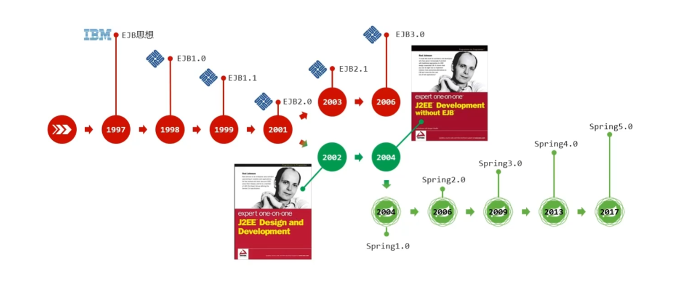
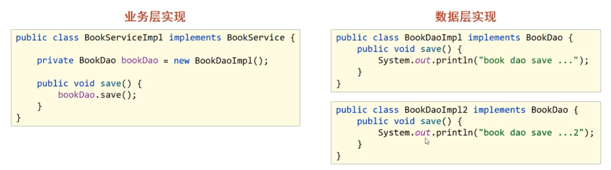

# 一、Spring 课程介绍

**==！！建议搭配本笔记学习以下视频教程！！==**

【黑马Spring框架视频教程，全面深入解读Spring源码】 https://www.bilibili.com/video/BV18F411c7eL/?share_source=copy_web&vd_source=d9edc224153cc08d2737066e5ff7b890

**为什么要学？**

- Spring技术是javaEE开发必备技能，企业开发技术选型命中率**>90%**（java企业级开发必学）
- 专业角度
  - **简化开发**，降低企业级开发的复杂性
  - **框架整合**，搞笑整合其他技术，提高企业级应用开发与运行效率

**学什么？**

- 简化开发
  - **IoC**
  - **AOP**
    - **事务处理**
- 框架整合
  - **Mybatis**
  - MyBatis-plus
  - struts
  - struts2
  - Hibernate
  - ......

**怎么学？**

- 学习Spring框架设计思想
- 学习基础操作，思考操作与思想间的联系
- 学习案例，熟练应用操作的同时，体会思想

# 二、初识 Spring

**了解Spring家族**

- 官网：spring.io
- Spring发展到今天已经形成了一种开发的生态圈，Spring提供了若干个项目，每个项目用于完成特定的功能

**了解Spring发展史**

# 三、Spring Framework 系统架构

- Spring Framework系统架构图
- Spring Framework课程学习路线

## 1.Spring Framework系统架构

- Spring Framework是Spring生态圈中最基础的项目，是其他项目的根基

（Spring实际上是一个管理对象的技术）

**我们要学习的模块：**

- Core Container：核心容器
- AOP：面向切面编程（不惊动原始程序的基础上，给它增强功能）
- Aspects：AOP思想实现（做的比Spring本身的AOP好，所以被Spring收录）
- Data Access：数据访问
- Data Integration：数据集成
- Web：Web开发（在后续的SpringMVC课程中详细学习）
- Test：单元测试与集成测试

## 2.Spring Framework学习线路

- 第一部分：**核心容器**
  - 核心概念（IoC/DI）
  - 容器基本操作
- 第二部分：**整合**
  - 整合数据层技术MyBatis
- 第三部分：**AOP**
  - 核心概念
  - AOP基础操作
  - AOP实用开发
- 第四部分：**事务**
  - 事务实用开发
    
- 第五部分：**家族**（后续课程学习，本课程不涉及）
  - SpringMVC
  - SpringBoot
  - SpringCloud

# 四、核心概念

**IoC/DI**

**IoC容器**

**Bean**

- 代码书写现状
  - 耦合度偏高
- 解决方案
  - 使用对象时，在程序中不要主动使用new产生对象，转换为由**外部**提供对象
- **==IoC（Inversion of contorl）控制反转==**
  - 对象的创建控制权转移到**外部**，这种思想称为控制反转（==为了解耦==）
- Spring技术对IoC思想进行了实现
  - Spring提供了一个容器，称为**IoC容器**，用来充当IoC思想中的“**外部**”

