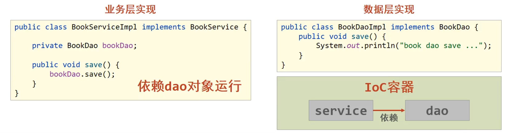

# 一、Spring 课程介绍

**==！！建议搭配本笔记学习以下视频教程！！==**

【黑马Spring框架视频教程，全面深入解读Spring源码】 https://www.bilibili.com/video/BV18F411c7eL/?share_source=copy_web&vd_source=d9edc224153cc08d2737066e5ff7b890


**为什么要学？**

- Spring技术是javaEE开发必备技能，企业开发技术选型命中率**>90%**（java企业级开发必学）
- 专业角度
  - **简化开发**，降低企业级开发的复杂性
  - **框架整合**，搞笑整合其他技术，提高企业级应用开发与运行效率


**学什么？**

- 简化开发
  - **IoC**
  - **AOP**
    - **事务处理**
- 框架整合
  - **Mybatis**
  - MyBatis-plus
  - struts
  - struts2
  - Hibernate
  - ......


**怎么学？**

- 学习Spring框架设计思想
- 学习基础操作，思考操作与思想间的联系
- 学习案例，熟练应用操作的同时，体会思想


# 二、初识 Spring

**了解Spring家族**

- 官网：spring.io
- Spring发展到今天已经形成了一种开发的生态圈，Spring提供了若干个项目，每个项目用于完成特定的功能


**了解Spring发展史**


# 三、Spring Framework 系统架构

- Spring Framework系统架构图
- Spring Framework课程学习路线


## 1.Spring Framework系统架构

- Spring Framework是Spring生态圈中最基础的项目，是其他项目的根基

（Spring实际上是一个管理对象的技术）

**我们要学习的模块：**


- Core Container：核心容器
- AOP：面向切面编程（不惊动原始程序的基础上，给它增强功能）
- Aspects：AOP思想实现（做的比Spring本身的AOP好，所以被Spring收录）
- Data Access：数据访问
- Data Integration：数据集成
- Web：Web开发（在后续的SpringMVC课程中详细学习）
- Test：单元测试与集成测试


## 2.Spring Framework学习线路

- 第一部分：**核心容器**
  - 核心概念（IoC/DI）
  - 容器基本操作
- 第二部分：**整合**
  - 整合数据层技术MyBatis
- 第三部分：**AOP**
  - 核心概念
  - AOP基础操作
  - AOP实用开发
- 第四部分：**事务**
  - 事务实用开发
  
- 第五部分：**家族**（后续课程学习，本课程不涉及）
  - SpringMVC
  - SpringBoot
  - SpringCloud


# 四、核心概念

**IoC/DI**

**IoC容器**

**Bean**


- 代码书写现状
  - 耦合度偏高
- 解决方案
  - 使用对象时，在程序中不要主动使用new产生对象，转换为由**外部**提供对象
- **==IoC（Inversion of contorl）控制反转==**
  - 对象的创建控制权转移到**外部**，这种思想称为控制反转（==为了解耦==）
- Spring技术对IoC思想进行了实现
  - Spring提供了一个容器，称为**IoC容器**，用来充当IoC思想中的“**外部**”
- **DI（Dependency Injection）依赖注入**
- 目标：==充分解耦==
  - 实用IoC容器管理bean（IoC）
  - 在IoC容器内将有依赖关系的bean进行关系绑定（DI）

- 最终效果
  - 实用对象时不仅可以直接从IoC容器中获取，并且获取到的bean已经绑定了所有的依赖关系


**传统代码实现**


**新的代码实现**（依赖注入）




# 五、IoC 入门案例

**IoC 入门案例思路分析**

**IoC 入门案例实现**


## 1.IoC 入门案例实录分析

1. 管理什么？（Service和Dao）
2. 如何将被管理的对象告知IoC容器？（配置文件）
3. 被管理的对象交给IoC容器，如何获取到IoC容器？（接口）
4. IoC容器得到后，如何从容器中获取到bean？（接口方法）
5. 使用Spring导入哪些坐标？（pom.xml）


## 2.IoC 入门案例（XML版）

①：导入Spring坐标

```xml
<dependencies>
    <dependency>
        <groupId>org.springframework</groupId>
        <artifactId>spring-context</artifactId>
        <version>5.2.10.RELEASE</version>
    </dependency>
```

②：定义Spring管理的类（接口）

```java
public interface BookService {
    public void save();
}
```

```java
public class BookServiceImpl implements BookService {

    private BookDao bookDao = new BookDaoImpl();

    public void save() {
        System.out.println("book service save ...");
        bookDao.save();
    }
}
```

三：创建Spring配置文件，配置对应类作为Spring管理的bean

```java
<?xml version="1.0" encoding="UTF-8"?>
<beans xmlns="http://www.springframework.org/schema/beans"
       xmlns:xsi="http://www.w3.org/2001/XMLSchema-instance"
       xmlns:context="http://www.springframework.org/schema/context"
       xsi:schemaLocation="http://www.springframework.org/schema/beans
       http://www.springframework.org/schema/beans/spring-beans.xsd http://www.springframework.org/schema/context http://www.springframework.org/schema/context/spring-context.xsd">
    <!--1.导入spring的坐标spring-context，对应版本是5.2.10 RELEASE-->

    <!--2.配置bean-->
    <!--bean标签表示配置bean-->
    <!--id属性表示给bean起名字-->
    <!--class属性表示给bean定义类型-->

    <bean id="bookDao" class="com.itheima.dao.impl.BookDaoImpl"/>

    <bean id="bookService" class="com.itheima.service.impl.BookServiceImpl"/>

</beans>

```

**注意事项：**bean定义时id属性在同一个上下文中不能重复

④：初始化IoC容器（Spring核心容器/Spring容器），通过容器获取bean

```java
public class App2 {
    public static void main(String[] args) {
        //3.获取IoC容器
        ApplicationContext ctx = new ClassPathXmlApplicationContext("applicationContext.xml");
        //4.获取bean
        BookDao bookDao = (BookDao) ctx.getBean("bookDao");

        BookService bookService = (BookService) ctx.getBean("bookService");

        bookDao.save();
        bookService.save();
    }
}
```


小结：

1. IoC入门案例思路分析
2. 实现IoC入门案例


# 六、DI 入门案例

**DI入门案例思路分析**

**DI入门案例实现**


## 1.DI 入门案例思路分析

1. 基于IoC管理bean
2. Service中使用new形式创建的Dao对象是否保留？（不能）
3. Service中需要的Dao对象如何进入到Service中？（提供方法）
4. Service与Dao间的关系如何描述？（配置）


## 2.DI 入门案例（XML版）

①：删除使用new的形式创建对象的代码

②：提供依赖对象对应的setter方法

```java
public class BookServiceImpl implements BookService {
    //5.删除业务层中使用new的方式创建的dao对象
    private BookDao bookDao;

    public void save() {
        System.out.println("book service save ...");
        bookDao.save();
    }
    //6.提供对应的set方法
    public void setBookDao(BookDao bookDao) {
        this.bookDao = bookDao;
    }
}
```

③：配置service与dao之间的关系

```java
<?xml version="1.0" encoding="UTF-8"?>
<beans xmlns="http://www.springframework.org/schema/beans"
       xmlns:xsi="http://www.w3.org/2001/XMLSchema-instance"
       xmlns:context="http://www.springframework.org/schema/context"
       xsi:schemaLocation="http://www.springframework.org/schema/beans
       http://www.springframework.org/schema/beans/spring-beans.xsd http://www.springframework.org/schema/context http://www.springframework.org/schema/context/spring-context.xsd">
    <!--1.导入spring的坐标spring-context，对应版本是5.2.10 RELEASE-->

    <!--2.配置bean-->
    <!--bean标签表示配置bean-->
    <!--id属性表示给bean起名字-->
    <!--class属性表示给bean定义类型-->

    <bean id="bookDao" class="com.itheima.dao.impl.BookDaoImpl"/>

    <bean id="bookService" class="com.itheima.service.impl.BookServiceImpl">
        <!--7.配置service和dao的关系-->
        <!--property标签表示配置当前bean的属性-->
        <!--name属性表示配置哪一个具体的属性-->
        <!--ref属性表示配置哪一个bean-->
        <property name="bookDao" ref="bookDao"/>
    </bean>

</beans>

```


小结：

1. DI入门案例思路分析
2. 实现DI入门案例


# 七、bean 配置

**bean 基础配置**

**bean 别名配置**

**bean 作用范围配置**


| 类别     | 描述                                                         |
| -------- | ------------------------------------------------------------ |
| 名称     | bean                                                         |
| 所属     | beans标签                                                    |
| 功能     | 定义Spring核心容器管理的对象                                 |
| 格式     | \<beans><br />      \<bean/><br />      \<bean>\</bean><br />\</beans> |
| 属性列表 | id：bean的id，使用容器可以通过id值获取对应的bean，在一个容器中id值唯一<br />class：bean的类型，即配置的bean的全路径名 |
| 范例     | \<bean id="bookDao" class="com.itheima.dao.impl.BookDaoImpl"/><br />\<bean id="bookService" class="com.itheima.service.impl.BookServiceImpl">\</bean> |

**注意事项：**

获取bean无论是通过id获取还是name获取，如果无法获取到，将抛出异常NoSuchBeanDefinitionException


| 类别 | 描述                                                         |
| ---- | ------------------------------------------------------------ |
| 名称 | scope                                                        |
| 类型 | 属性                                                         |
| 所属 | bean标签                                                     |
| 功能 | 定义bean的作用范围，可选范围如下<br />1.singleton：单例（默认）<br />2.prototype：非单例 |
| 范例 | \<bean id="bookDao" name="dao" class="com.itheima.dao.impl.BookDaoImpl" scope="prototype"/> |

- 为什么bean默认为单例？
- 适合交给容器进行管理的bean
  - 表现层对象
  - 业务层对象
  - 数据层对象
  - 工具对象
- 不适合交给容器进行管理的bean
  - 封装实体的域对象（会记录成员变量的属性值，不适合交给spring管理，用了一次之后下一次就不方便再用了，因为对象内已有之前使用的数据）


**小结：**

1. bean 基础配置
2. bean 别名配置
3. bean 作用范围配置


# 八、bean 实例化

