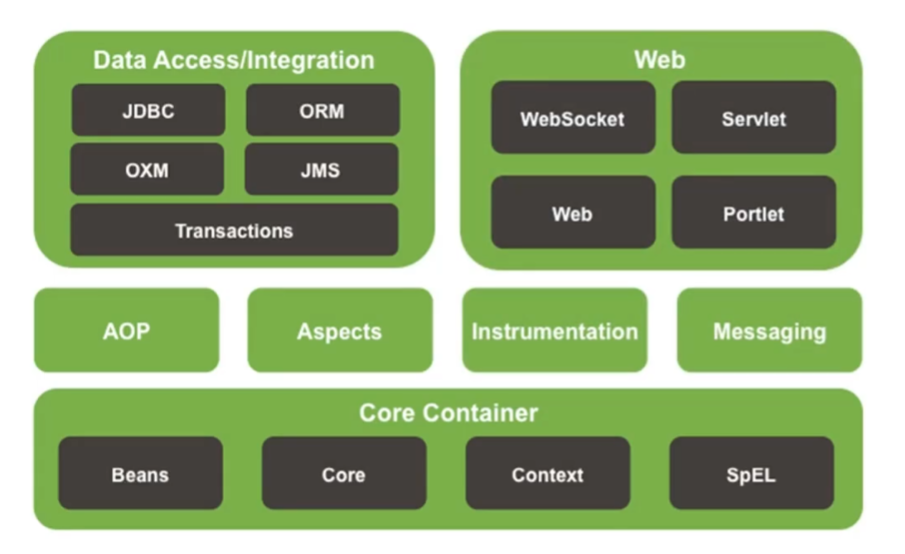

**==！！！特别注意！！！==**

**本笔记==仅包含 初识Spring 到 AOP入门案例== 的内容，即视频内 Spring01 - Spring30 的内容**

**剩余的一点内容由于时间关系笔者没空写，以后补全**

# 一、Spring 课程介绍

==建议搭配 本笔记 学习以下 **视频教程**==

【黑马Spring框架视频教程，全面深入解读Spring源码】 https://www.bilibili.com/video/BV18F411c7eL/?share_source=copy_web&vd_source=d9edc224153cc08d2737066e5ff7b890


**为什么要学？**

- Spring技术是javaEE开发必备技能，企业开发技术选型命中率**>90%**（java企业级开发必学）
- 专业角度
  - **简化开发**，降低企业级开发的复杂性
  - **框架整合**，搞笑整合其他技术，提高企业级应用开发与运行效率


**学什么？**

- 简化开发
  - **IoC**
  - **AOP**
    - **事务处理**
- 框架整合
  - **Mybatis**
  - MyBatis-plus
  - struts
  - struts2
  - Hibernate
  - ......


**怎么学？**

- 学习Spring框架设计思想
- 学习基础操作，思考操作与思想间的联系
- 学习案例，熟练应用操作的同时，体会思想


# 二、初识 Spring

**了解Spring家族**

- 官网：spring.io
- Spring发展到今天已经形成了一种开发的生态圈，Spring提供了若干个项目，每个项目用于完成特定的功能


**了解Spring发展史**


# 三、Spring Framework 系统架构

- Spring Framework系统架构图
- Spring Framework课程学习路线


## 1.Spring Framework系统架构

- Spring Framework是Spring生态圈中最基础的项目，是其他项目的根基

（Spring实际上是一个管理对象的技术）

**我们要学习的模块：**



- Core Container：核心容器
- AOP：面向切面编程（不惊动原始程序的基础上，给它增强功能）
- Aspects：AOP思想实现（做的比Spring本身的AOP好，所以被Spring收录）
- Data Access：数据访问
- Data Integration：数据集成
- Web：Web开发（在后续的SpringMVC课程中详细学习）
- Test：单元测试与集成测试


## 2.Spring Framework学习线路

- 第一部分：**核心容器**
  - 核心概念（IoC/DI）
  - 容器基本操作
- 第二部分：**整合**
  - 整合数据层技术MyBatis
- 第三部分：**AOP**
  - 核心概念
  - AOP基础操作
  - AOP实用开发
- 第四部分：**事务**
  - 事务实用开发
  
- 第五部分：**家族**（后续课程学习，本课程不涉及）
  - SpringMVC
  - SpringBoot
  - SpringCloud


# 四、核心概念

**IoC/DI**

**IoC容器**

**Bean**


- 代码书写现状
  - 耦合度偏高
- 解决方案
  - 使用对象时，在程序中不要主动使用new产生对象，转换为由**外部**提供对象
- **==IoC（Inversion of contorl）控制反转==**
  - 对象的创建控制权转移到**外部**，这种思想称为控制反转（==为了解耦==）
- Spring技术对IoC思想进行了实现
  - Spring提供了一个容器，称为**IoC容器**，用来充当IoC思想中的“**外部**”
- **DI（Dependency Injection）依赖注入**
- 目标：==充分解耦==
  - 实用IoC容器管理bean（IoC）
  - 在IoC容器内将有依赖关系的bean进行关系绑定（DI）

- 最终效果
  - 实用对象时不仅可以直接从IoC容器中获取，并且获取到的bean已经绑定了所有的依赖关系


**传统代码实现**


**新的代码实现**（依赖注入）


# 五、IoC 入门案例

**IoC 入门案例思路分析**

**IoC 入门案例实现**


## 1.IoC 入门案例实录分析

1. 管理什么？（Service和Dao）
2. 如何将被管理的对象告知IoC容器？（配置文件）
3. 被管理的对象交给IoC容器，如何获取到IoC容器？（接口）
4. IoC容器得到后，如何从容器中获取到bean？（接口方法）
5. 使用Spring导入哪些坐标？（pom.xml）


## 2.IoC 入门案例（XML版）

①：导入Spring坐标

```xml
<dependencies>
    <dependency>
        <groupId>org.springframework</groupId>
        <artifactId>spring-context</artifactId>
        <version>5.2.10.RELEASE</version>
    </dependency>
```

②：定义Spring管理的类（接口）

```java
public interface BookService {
    public void save();
}
```

```java
public class BookServiceImpl implements BookService {

    private BookDao bookDao = new BookDaoImpl();

    public void save() {
        System.out.println("book service save ...");
        bookDao.save();
    }
}
```

三：创建Spring配置文件，配置对应类作为Spring管理的bean

```java
<?xml version="1.0" encoding="UTF-8"?>
<beans xmlns="http://www.springframework.org/schema/beans"
       xmlns:xsi="http://www.w3.org/2001/XMLSchema-instance"
       xmlns:context="http://www.springframework.org/schema/context"
       xsi:schemaLocation="http://www.springframework.org/schema/beans
       http://www.springframework.org/schema/beans/spring-beans.xsd http://www.springframework.org/schema/context http://www.springframework.org/schema/context/spring-context.xsd">
    <!--1.导入spring的坐标spring-context，对应版本是5.2.10 RELEASE-->

    <!--2.配置bean-->
    <!--bean标签表示配置bean-->
    <!--id属性表示给bean起名字-->
    <!--class属性表示给bean定义类型-->

    <bean id="bookDao" class="com.itheima.dao.impl.BookDaoImpl"/>

    <bean id="bookService" class="com.itheima.service.impl.BookServiceImpl"/>

</beans>

```

**注意事项：**bean定义时id属性在同一个上下文中不能重复

④：初始化IoC容器（Spring核心容器/Spring容器），通过容器获取bean

```java
public class App2 {
    public static void main(String[] args) {
        //3.获取IoC容器
        ApplicationContext ctx = new ClassPathXmlApplicationContext("applicationContext.xml");
        //4.获取bean
        BookDao bookDao = (BookDao) ctx.getBean("bookDao");

        BookService bookService = (BookService) ctx.getBean("bookService");

        bookDao.save();
        bookService.save();
    }
}
```


小结：

1. IoC入门案例思路分析
2. 实现IoC入门案例


# 六、DI 入门案例

**DI入门案例思路分析**

**DI入门案例实现**


## 1.DI 入门案例思路分析

1. 基于IoC管理bean
2. Service中使用new形式创建的Dao对象是否保留？（不能）
3. Service中需要的Dao对象如何进入到Service中？（提供方法）
4. Service与Dao间的关系如何描述？（配置）


## 2.DI 入门案例（XML版）

①：删除使用new的形式创建对象的代码

②：提供依赖对象对应的setter方法

```java
public class BookServiceImpl implements BookService {
    //5.删除业务层中使用new的方式创建的dao对象
    private BookDao bookDao;

    public void save() {
        System.out.println("book service save ...");
        bookDao.save();
    }
    //6.提供对应的set方法
    public void setBookDao(BookDao bookDao) {
        this.bookDao = bookDao;
    }
}
```

③：配置service与dao之间的关系

```java
<?xml version="1.0" encoding="UTF-8"?>
<beans xmlns="http://www.springframework.org/schema/beans"
       xmlns:xsi="http://www.w3.org/2001/XMLSchema-instance"
       xmlns:context="http://www.springframework.org/schema/context"
       xsi:schemaLocation="http://www.springframework.org/schema/beans
       http://www.springframework.org/schema/beans/spring-beans.xsd http://www.springframework.org/schema/context http://www.springframework.org/schema/context/spring-context.xsd">
    <!--1.导入spring的坐标spring-context，对应版本是5.2.10 RELEASE-->

    <!--2.配置bean-->
    <!--bean标签表示配置bean-->
    <!--id属性表示给bean起名字-->
    <!--class属性表示给bean定义类型-->

    <bean id="bookDao" class="com.itheima.dao.impl.BookDaoImpl"/>

    <bean id="bookService" class="com.itheima.service.impl.BookServiceImpl">
        <!--7.配置service和dao的关系-->
        <!--property标签表示配置当前bean的属性-->
        <!--name属性表示配置哪一个具体的属性-->
        <!--ref属性表示配置哪一个bean-->
        <property name="bookDao" ref="bookDao"/>
    </bean>

</beans>

```


小结：

1. DI入门案例思路分析
2. 实现DI入门案例


# 七、bean 配置

**bean 基础配置**

**bean 别名配置**

**bean 作用范围配置**


| 类别     | 描述                                                         |
| -------- | ------------------------------------------------------------ |
| 名称     | bean                                                         |
| 所属     | beans标签                                                    |
| 功能     | 定义Spring核心容器管理的对象                                 |
| 格式     | \<beans><br />      \<bean/><br />      \<bean>\</bean><br />\</beans> |
| 属性列表 | id：bean的id，使用容器可以通过id值获取对应的bean，在一个容器中id值唯一<br />class：bean的类型，即配置的bean的全路径名 |
| 范例     | \<bean id="bookDao" class="com.itheima.dao.impl.BookDaoImpl"/><br />\<bean id="bookService" class="com.itheima.service.impl.BookServiceImpl">\</bean> |

**注意事项：**

获取bean无论是通过id获取还是name获取，如果无法获取到，将抛出异常NoSuchBeanDefinitionException


| 类别 | 描述                                                         |
| ---- | ------------------------------------------------------------ |
| 名称 | scope                                                        |
| 类型 | 属性                                                         |
| 所属 | bean标签                                                     |
| 功能 | 定义bean的作用范围，可选范围如下<br />1.singleton：单例（默认）<br />2.prototype：非单例 |
| 范例 | \<bean id="bookDao" name="dao" class="com.itheima.dao.impl.BookDaoImpl" scope="prototype"/> |

- 为什么bean默认为单例？
- 适合交给容器进行管理的bean
  - 表现层对象
  - 业务层对象
  - 数据层对象
  - 工具对象
- 不适合交给容器进行管理的bean
  - 封装实体的域对象（会记录成员变量的属性值，不适合交给spring管理，用了一次之后下一次就不方便再用了，因为对象内已有之前使用的数据）


**小结：**

1. bean 基础配置
2. bean 别名配置
3. bean 作用范围配置


# 八、bean 实例化

**bean是如何创建的**

**实例化 bean的三种方式**


- bean本质上就是对象，创建bean使用构造方法完成


## 1.构造方法（常用）

- 提供可访问的构造方法

  ```java
  public class BookDaoImpl implements BookDao {
  
      public BookDaoImpl() {
          System.out.println("book dao constructor is running ...");
      }
  
      public void save(){
          System.out.println("book dao save ...");
      }
  }
  ```

- 配置

  ```xml
  <bean id="bookDao" class="com.itheima.dao.impl.BookDaoImpl"/>
  ```

- 无参构造方法如果不存在，将抛出异常**BeanCreationException**


## 2.静态工厂（了解）

- 静态工厂

  ```java
  public class OrderDaoFactory {
      public static OrderDao getOrderDao(){
          System.out.println("factory setup ...");
          return new OrderDaoImpl();
      }
  }
  ```

- 配置

  ```xml
  <bean id="orderDao" class="com.itheima.factory.OrderDaoFactory" factory-method="getOrderDao"/>
  ```


# 九、bean 实例化 - 实例工厂与FactoryBean

## 1.实例工厂（了解）

- 实例工厂

  ```java
  public class UserDaoFactory {
      public UserDao getUserDao(){
          return new UserDaoImpl();
      }
  }
  
  ```

- 配置

  ```xml
  <!--方式三：使用实例工厂实例化bean-->
      <bean id="userFactory" class="com.itheima.factory.UserDaoFactory"/>
      <bean id="userDao" factory-method="getUserDao" factory-bean="userFactory"/>
  ```

  


## 2.FactoryBean（==实用方法==）

- FactoryBean

  ```java
  public class UserDaoFactoryBean implements FactoryBean<UserDao> {
  //代替原始实例工厂中创建对象的方法
      @Override
      public UserDao getObject() throws Exception {
          return new UserDaoImpl();
      }
  //确认对象的类型
      @Override
      public Class<?> getObjectType() {
          return UserDao.class; //给一个UserDao的字节码
      }
  
      @Override
      public boolean isSingleton() { //规定创建的是否为单例对象，true就是创建单例对象，false就是创建非单例对象
          //一般不重写这个方法，默认为单例对象
          return true;
      }
  }
  ```

- 配置

  ```xml
  <!--！！重要方式！！-->
  <!--方式四（方式三的进阶版）：使用FactoryBean实例化Bean-->
      <bean id="userDao" class="com.itheima.factory.UserDaoFactoryBean"/>
  ```


**实例化bean的三种方式**

- **构造方法（常用）**
- 静态工厂（了解）
- 实例工厂（了解）
  - **FactoryBean（实用）**


# 十、bean 生命周期

**bean生命周期控制**


- 生命周期：从创建到消亡的完整过程
- bean生命周期：bean从创建到销毁的整体过程
- bean生命周期控制：在bean创建后到小会前做的一些事情


- 提供生命周期控制方法

  ```java
  public class BookDaoImpl implements BookDao {
      public void save(){
          System.out.println("book dao save ...");
      }
      //表示bean初始化对应的操作
      public void init(){
          System.out.println("init...");
      }
      //表示bean销毁前对应的操作
      public void destory(){
          System.out.println("destory...");
      }
  }
  ```

- 配置生命周期控制方法

  ```xml
  <bean id="bookDao" name="dao" class="com.itheima.dao.impl.BookDaoImpl" init-method="init" destroy-method="destory"/>
  ```


**接口控制（了解）**

- 实现InitializingBean，DisposableBean接口

  ```java
  public class BookServiceImpl implements BookService, InitializingBean, DisposableBean {
      //5.删除业务层中使用new的方式创建的dao对象
      private BookDao bookDao;
  
      public void save() {
          System.out.println("book service save ...");
          bookDao.save();
      }
  
      //6.提供对应的set方法
      public void setBookDao(BookDao bookDao) {
          System.out.println("set ...");
          this.bookDao = bookDao;
      }
  
      @Override
      public void destroy() throws Exception {
          System.out.println("service destory");
      }
  
      @Override
      public void afterPropertiesSet() throws Exception { //在属性设置之后运行
          System.out.println("service init");
      }
  }
  ```


**经历的阶段**

- 初始化容器
  1. 创建对象（内存分配）
  2. 执行构造方法
  3. 执行属性注入（set操作）
  4. **执行bean初始化方法**
- 使用bean
  1. 执行业务操作
- 关闭/销毁容器
  1. **执行bean销毁方法**


**bean销毁时机**

- 容器关闭前触发bean的销毁

- 关闭容器方式：

  - 手工关闭容器

    **ClassPathXmlApplicationContext**接口**close()**操作

  - 注册关闭钩子，在虚拟机退出前先关闭容器再退出虚拟机

    **ClassPathXmlApplicationContext**接口**registerShutdownHook()**操作

  ```java
  public class AppForLifeCycle {
      public static void main(String[] args) {
          ClassPathXmlApplicationContext ctx=new ClassPathXmlApplicationContext("applicationContext.xml");
  //        ctx.registerShutdownHook(); //注册关闭钩子 - 容器在启动以后如果要关闭Java虚拟机将先关闭容器，关闭钩子在任何时间都可以注册，但是close放在前面会提前关闭，比较暴力
  
          BookDao bookDao = (BookDao) ctx.getBean("bookDao");
          bookDao.save();
          ctx.close();
      }
  }
  ```


1. bean生命周期控制
   1. 配置
      - init-method
      - destory-method
   2. 接口（了解）
      - InitializingBean
      - DisposavleBean
   3. 关闭容器
      - ConfigurableApplicationContext
        - close()
        - registerShutdownHook()


# 十一、依赖注入方式

- 思考：向一个类中传递数据的方式有几种？
  - 普通方法（set方法）
  - 构造方法
- 思考：依赖注入描述了在容器中建立bean和bean之间依赖关系的过程，如果bean运行需要的是数字和字符串呢？
  - 引用类型
  - 简单类型（基本数据类型和String）
- 依赖注入方式
  - setter注入
    - 简单类型
    - **引用类型**
  - 构造器注入
    - 简单类型
    - 引用类型


## 1.setter注入——引用类型

- 在bean中定义引用类型属性并提供可访问的**set**方法

  ```java
  public class BookServiceImpl implements BookService{
      private BookDao bookDao;
  
      //6.提供对应的set方法
      public void setBookDao(BookDao bookDao) {
          System.out.println("set ...");
          this.bookDao = bookDao;
      }
  ```

- 配置中使用**property**标签**ref**属性注入引用类型对象

  ```xml
      <bean id="bookDao" name="dao" class="com.itheima.dao.impl.BookDaoImpl" init-method="init" destroy-method="destory"/>
  
      <!--逗号,分号,空格 分隔都可以-->
      <bean id="bookService" name="service service2 bookEbi" class="com.itheima.service.impl.BookServiceImpl">
          <!--7.配置service和dao的关系-->
          <!--property标签表示配置当前bean的属性-->
          <!--name属性表示配置哪一个具体的属性-->
          <!--ref属性表示配置哪一个bean-->
          <property name="bookDao" ref="bookDao"/>
      </bean>
  ```


## 2.setter注入——简单类型

- 在bean中定义引用类型属性并提供可访问的**set**方法

  ```java
  public class BookDaoImpl implements BookDao {
  
      private int connectionNum;
      private String databaseName;
  
      public void setConnectionNum(int connectionNum) {
          this.connectionNum = connectionNum;
      }
  
      public void setDatabaseName(String databaseName) {
          this.databaseName = databaseName;
      }
  
      public void save(){
          System.out.println("book dao save ..."+databaseName+","+connectionNum);
      }
  }
  ```

- 配置中使用**property**标签**value**属性注入简单类型数据

  ```xml
      <bean id="bookDao" name="dao" class="com.itheima.dao.impl.BookDaoImpl">
          <property name="databaseName" value="mysql"/>
          <property name="connectionNum" value="10"/>
      </bean>
  ```


## 3.构造器注入——引用类型（了解）

- 在bean中定义引用类型属性并提供可访问的**构造**方法

  ```java
  public class BookServiceImpl implements BookService {
      //5.删除业务层中使用new的方式创建的dao对象
      private BookDao bookDao;
      private UserDao userDao;
  
      public void save() {
          System.out.println("book service save ...");
          bookDao.save();
          userDao.save();
      }
  
      public BookServiceImpl(BookDao bookDao, UserDao userDao) {
          this.bookDao = bookDao;
          this.userDao = userDao;
      }
  }
  ```

- 配置中使用**constructor-arg**标签**ref**属性注入引用类型对象

  ```xml
          <bean id="bookDao" name="dao" class="com.itheima.dao.impl.BookDaoImpl">
              <constructor-arg name="databaseName" value="mysql"/>
              <constructor-arg name="connectionNum" value="10"/>
          </bean>
          <bean id="userDao" class="com.itheima.dao.impl.UserDaoImpl"/>
  
          <!--逗号,分号,空格 分隔都可以-->
          <bean id="bookService" name="service service2 bookEbi" class="com.itheima.service.impl.BookServiceImpl">
              <!--7.配置service和dao的关系-->
              <!--property标签表示配置当前bean的属性-->
              <!--name属性表示配置哪一个具体的属性-->
              <!--ref属性表示配置哪一个bean-->
  
      <!--这里的bookDao是构造函数的形参变量名，和代码耦合度较高-->
      <constructor-arg name="bookDao" ref="bookDao"/>
      <constructor-arg name="userDao" ref="userDao"/>
          </bean>
  ```

  

## 4.构造器注入——简单类型（了解）

- 在bean中定义引用类型属性并提供可访问的**set**方法

  ```java
  public class BookDaoImpl implements BookDao {
      private String databaseName;
      private int connectionNum;
  
      public BookDaoImpl(String databaseName, int connectionNum) {
          this.databaseName = databaseName;
          this.connectionNum = connectionNum;
      }
  
      public void save(){
          System.out.println("book dao save ..."+databaseName+","+connectionNum);
      }
  }
  ```

- 配置中使用**constructor-arg**标签**value**属性注入简单类型数据

  ```xml
          <bean id="bookDao" name="dao" class="com.itheima.dao.impl.BookDaoImpl">
              <constructor-arg name="databaseName" value="mysql"/>
              <constructor-arg name="connectionNum" value="10"/>
          </bean>
  ```

  

## 5.构造器注入——参数适配（了解）

- 配置中使用**constructor-arg**标签**type**属性设置按形参类型注入

  ```xml
          <bean id="bookDao" name="dao" class="com.itheima.dao.impl.BookDaoImpl">
              <constructor-arg type="java.lang.String" value="mysql"/>
              <constructor-arg type="int" value="10"/>
          </bean>
  ```

- 配置中使用**constructor-arg**标签**index**属性设置按形参位置注入

  ```xml
      <bean id="bookDao" name="dao" class="com.itheima.dao.impl.BookDaoImpl">
          <constructor-arg index="0" value="mysql"/>
          <constructor-arg index="1" value="10"/>
      </bean>
  ```

  

## 6.依赖注入方式选择

1. 强制依赖使用构造器进行，使用setter注入有概率不进行注入导致null对象出现
2. 可选依赖使用setter注入进行，灵活性强
3. Spring框架倡导使用构造器，第三方框架内部大多数采用构造器注入的方式进行数据初始化，相对严谨
4. 如果有必要可以两者同时使用，使用构造器注入完成强制依赖的注入，使用setter注入完成可选依赖的注入
5. 实际开发过程中还要根据实际情况分析，如果受控对象没有提供setter就必须使用构造器注入
6. **自己开发的模块推荐使用setter注入**


**小结**

1. 依赖注入方式
   - setter注入
     - 简单类型
     - 引用类型
   - 构造器注入
     - 简单类型
     - 引用类型
2. 依赖注入方式选择
   - 推荐使用setter注入
   -  第三方技术根据情况选择


# 十二、依赖自动装配

- IoC容器根据bean所依赖的资源在容器中自动查找并注入到bean中的过程称为自动装配
- 自动装配的方式
  - **按类型（常用）**
  - 按名称
  - 按构造方法
  - 不启用自动装配


- 配置中使用**bean**标签**autowire**属性设置自动装配的类型：按类型 byType，按名称 byName

  ```xml
      <bean id="bookDao" class="com.itheima.dao.impl.BookDaoImpl"/>
      <bean id="bookService" class="com.itheima.service.impl.BookServiceImpl" autowire="byType"/>
  ```


- 自动装配用于引用类型依赖注入，不能对简单类型进行操作
- 使用按类型装配时（byType）必须保障容器中相同类型的bean唯一，推荐使用
- 使用按名称装配时（byName）必须保障容器中具有指定名称的bean，因变量名和配置耦合，不推荐使用
- 自动装配优先级低于setting注入与构造器注入，同时出现时自动装配配置失效


小结：

1. 自动装配概念
2. 自动装配类型


# 十三、集合注入

- 数组
- List
- Set
- Map
- Properties


- 注入**数组**对象

  ```xml
          <property name="array">
              <array>
                  <value>100</value>
                  <value>200</value>
                  <value>300</value>
              </array>
          </property>
  ```

- 注入**List**对象（重点）

  ```xml
          </property>
          <property name="list">
              <list>
                  <value>itcast</value>
                  <value>itheima</value>
                  <value>boxuegu</value>
              </list>
          </property>
  ```

- 注入**Set**对象

  ```xml
          <property name="set">
              <set>
                  <value>itcast</value>
                  <value>itheima</value>
                  <value>boxuegu</value>
                  <value>boxuegu</value>
              </set>
          </property>
  ```

- 注入**Map**对象（重点）

  ```xml
          <property name="map">
              <map>
                  <!--entry：实体-->
                  <entry key="country" value="china"/>
                  <entry key="province" value="henan"/>
                  <entry key="city" value="kaifeng"/>
              </map>
          </property>
  ```

- 注入**Properties**对象

  ```xml
          <property name="properties">
              <props>
                  <prop key="country">china</prop>
                  <prop key="province">henan</prop>
                  <prop key="city">kaifeng</prop>
              </props>
          </property>
  ```

  

**小结：**

1. 注入集合


# 案例：数据源对象管理

**第三方资源配置管理**

- 导入druid坐标

  ```xml
      <dependency>
        <groupId>com.alibaba</groupId>
        <artifactId>druid</artifactId>
        <version>1.1.16</version>
      </dependency>
  ```

- 配置数据源对象作为spring管理的bean

  ```xml
      <!--管理DruidDataSource对象-->
      <bean id="dataSource" class="com.alibaba.druid.pool.DruidDataSource">
          <property name="driverClassName" value="com.mysql.jdbc.Driver"/>
          <property name="url" value="jdbc:mysql://localhost:3306/game"/>
          <property name="username" value="root"/>
          <property name="password" value="admin"/>
      </bean>
  ```


小结：

1. spring管理第三方资源
   - DruidDataSource
   - ComboPooledDataSource


# 十四、加载 properties 文件

**加载properties配置信息**

- 开启context命名空间

  ```xml
  <?xml version="1.0" encoding="UTF-8"?>
  <beans xmlns="http://www.springframework.org/schema/beans"
         xmlns:xsi="http://www.w3.org/2001/XMLSchema-instance"
         xmlns:context="http://www.springframework.org/schema/context"
         xsi:schemaLocation="
         http://www.springframework.org/schema/beans
         http://www.springframework.org/schema/beans/spring-beans.xsd
         http://www.springframework.org/schema/context
         http://www.springframework.org/schema/context/spring-context.xsd
         ">
  </beans>
  ```

  

- 使用context命名空间，加载指定properties文件

  ```xml
      <context:property-placeholder location="jdbc.properties"/>
  ```

- 使用 ${} 读取加载的属性值

  ```xml
      <property name="name" value="${jdbc.driver}"/>
  ```

- 不加载系统文件

  ```xml
      <context:property-placeholder location="jdbc.properties" system-properties-mode="NEVER"/>
  ```

- 加载多个properties文件

  ```xml
      <context:property-placeholder location="jdbc.properties,jdbc2.properties"/>
  ```

- 加载所有properties文件

  ```xml
      <context:property-placeholder location="*.properties"/>
  ```

- 加载properties文件==**标准格式**==

  ```xml
      <context:property-placeholder location="classpath:*.properties"/>
  ```

- 从类路径或者jar包中搜索并加载properties文件

  ```xml
      <context:property-placeholder location="classpath*:*.properties"/>
  ```

  

**小结：**

1. 加载properties配置文件信息
2. 开启命名空间方式


# 十五、容器

**创建容器**

**获取bean**

**容器类层次结构**

**BeanFactory**


## 1.创建容器

- 方式一：类路径加载配置文件

  ```java
  ApplicationContext ctx = new ClassPathXmlApplicationContext("applicationContext.xml");
  ```

- 方式二：文件路径加载配置文件

  ```java
  ApplicationContext ctx = new FileSystemXmlApplicationContext("E:\\c.---c.---java-exercise\\JavaCode\\spring_10_container\\src\\main\\resources\\applicationContext.xml");
  ```

- 加载多个配置文件(不管是哪种配置方式，都可以同时写很多个"bean"进去，同时加载多个配置文件)

  ```java
  ApplicationContext ctx = new ClassPathXmlApplicationContext("bean1.xml","bean2.xml");
  ```


## 2.获取bean

- 方式一：使用bean名称获取

  ```java
  BookDao bookDao = (BookDao) ctx.getBean("bookDao");
  ```

- 方式二：使用bean名称获取并指定类型（和方式一意义相同）

  ```java
  BookDao bookDao=ctx.getBean("bookDao", BookDao.class);
  ```

- 方式三：使用bean类型获取（要求容器中这个类型的bean只能有一个，多个的话会报错）

  ```java
  BookDao bookDao = ctx.getBean(BookDao.class);
  ```


## 3.容器类层次结构图


## 4.BeanFactory初始化（了解）

- 类路径加载配置文件

  ```java
  Resource resources=new ClassPathResource("applicationContext.xml");
  BeanFactory bf = new XmlBeanFactory(resources);
  BookDao bookDao = bf.getBean(BookDao.class);
  bookDao.save();
  ```

- BeanFactory创建完毕后，所有的bean均为延迟加载


**小结**

1. 创建容器（2种）
   - ClassPathXmlApplicationContext
   - FileSystemXmlApplicationContext
2. 获取bean（3种）
3. 容器类层次结构
4. BeanFactory


# 十六、核心容器总结

**容器相关**

**bean相关**

**依赖注入相关**


## 1.容器相关

- **BeanFactory**是IoC容器的**顶层接口**，初始化BeanFactory对象时，加载的bean延迟加载
- **ApplicationContext**接口是Spring容器的**核心接口**，初始化时bean立即加载
- **ApplicationContext**接口提供**基础**的bean操作相关方法，通过**其他接口拓展**其功能
- **ApplicationContext**接口**常用初始化类**
  - ClassPathXmlApplicationContext（常用）
  - FileSystemXmlApplicationContext（很少使用）


## 2.bean相关

```xml
<bean
      id="bookDao"										bean的ID
      name="dao bookDaoImpl daoImpl"					bean别名
      class="com.itheima.dao.impl.BookDaoImpl"			bean类型，静态工厂类，FactoryBean类
      scope="singleton"									控制bean的实例数量（默认单例）
      init-method="init"								生命周期初始化方法
      init-method="destroy"								生命周期销毁方法
      autowire="byType"									自动装配类型
      factory-method="getInstence"						bean工厂方法，应用于静态工厂或实例工厂
      factory-bean="com.itheima.factory.BookDaoFactory"	实例工厂bean
      lazy-init="true"									控制bean延迟加载
      />
```


## 3.依赖注入相关

```xml
<bean id="bookService" class="com.itheima.service.impl.BookServiceImpl">
	<constructor-arg name="bookDao" ref="bookDao"/>						构造器注入引用类型
	<constructor-arg name="userDao" ref="userDao"/>
    <constructor-arg name="msg" ref="WARN"/>							构造器注入简单类型
    <constructor-arg name="java.long.String" index="3" value="WARN"/>	类型匹配与索引匹配
    
    <!--重点！-->
    <property name="bookDao" ref="bookDao"/>							setter注入引用类型
    <property name="userDao" ref="userDao"/>
    <property name="msg" ref="WARN"/>									setter注入简单类型
    
    <property name="names">												setter注入集合类型
    	<list>															list集合
        	<value>itcast</value>										集合注入简单类型
            <ref bean="dataSource"/>									集合注入引用类型
        </list>
    </property>
</bean>
```


**小结**

1. 容器相关
2. bean相关
3. 依赖注入相关


# 十七、注解开发

**注解开发定义bean**

**纯注解开发**


## 1.注解开发定义bean

- 使用@Component定义bean（@Component后括号内指定名称，未指定名称的bean需要在使用时加载class按照类型访问）

  ```java
  @Component("bookDao")
  public class BookDaoImpl implements BookDao {
  }
  @Component
  public class BookServiceImpl implements BookService {
  }
  ```

  ```java
  public class App {
      public static void main(String[] args) {
          ApplicationContext ctx=new ClassPathXmlApplicationContext("applicationContext.xml");
          BookDao bookDao = (BookDao) ctx.getBean("bookDao");
          System.out.println(bookDao);
  
          BookService bookService=ctx.getBean(BookService.class);
          System.out.println(bookService);
      }
  }
  ```

- 核心配置文件中通过组件扫描加载bean

  ```xml
  <context:component-scan base-package="com.itheima"/>
  ```


- Spring提供@Component注解的三个衍生注解（以下注解和Component功能完全一样，只是名字不同方便分辨）

  - @Controller：用于表现层bean定义
  - @Service：用于业务层bean定义
  - @Repository：用于数据层bean定义

  ```java
  @Repository("bookDao")
  public class BookDaoImpl implements BookDao {
  }
  @Service
  public class BookServiceImpl implements BookService {
  }
  ```


## 2.纯注解开发

- Spring3.0升级了纯注解开发模式，使用Java类替代配置文件，开启了Spring快速开发赛道

- Java类代替Spring核心配置文件

  ```xml
  <?xml version="1.0" encoding="UTF-8"?>
  <beans xmlns="http://www.springframework.org/schema/beans"
         xmlns:xsi="http://www.w3.org/2001/XMLSchema-instance"
         xmlns:context="http://www.springframework.org/schema/context"
         xsi:schemaLocation="http://www.springframework.org/schema/beans
         http://www.springframework.org/schema/beans/spring-beans.xsd http://www.springframework.org/schema/context http://www.springframework.org/schema/context/spring-context.xsd">
      
          <context:component-scan base-package="com.itheima"/>
  
  </beans>
  ```

  ```java
  @Configuration
  @ComponentScan("com.itheima")
  public class SpringConfig {
  }
  ```

  

- @Configuration注解用于设定当前类为配置类

- @ComponentScan注解用于设定扫描路径，此注解只能添加一次，多个数据请用数组格式

  ```java
  @ComponentScan({"com.itheima.service","com.itheima.dao"})
  ```

- 读取Spring核心配置文件初始化容器对象切换为读取Java配置类初始化容器对象

  ```java
  //加载配置文件初始化容器
  ApplicationContext ctx = new ClassPathXmlApplicationContext("applicationContext.xml");
  //加载配置类初始化容器
  ApplicationContext ctx = new AnnotationConfigApplicationContext(SpringConfig.class);
  ```

  

**小结**

1. 定义bean
   - @Component
     - @Controller
     - @Service
     - @Repository
   - \<context:component-scan/>
2. 纯注解开发
   - @Configuration
   - @ComponentScan
   - AnnotationConfigApplicationContext


# 十八、bean 管理

**bean作用范围**

**bean生命周期**


## 1.bean作用范围

- 使用@Scope定义bean作用范围

  ```java
  @Repository
  @Scope("singleton")
  public class BookDaoImpl implements BookDao {
  }
  ```


## 2.bean生命周期

- 使用@PostConstruct、@PreDestroy定义bean生命周期

  ```java
  @Repository
  @Scope("singleton")
  public class BookDaoImpl implements BookDao {
      public void save(){
          System.out.println("book dao save ...");
      }
  
      @PostConstruct //构造方法后
      public void init(){
          System.out.println("init ...");
      }
  
      @PreDestroy //彻底销毁前
      public void destroy(){
          System.out.println("destory ...");
      }
  }
  ```

  

**总结**

1. bean作用范围
   - @Scope
2. bean生命周期
   - @PostConstruct
   - @PreDestroy


# 十九、依赖注入

**自动装配**


- 使用@Autowired注解开启自动装配模式（按类型）

  ```java
  @Service
  public class BookServiceImpl implements BookService {
      @Autowired //按类型自动装配/如果有多个实现类，按名称自动装配（按照变量名查找）
  
      private BookDao bookDao;
  
      public void save() {
          System.out.println("book service save ...");
          bookDao.save();
      }
  }
  ```

- 注意：自动装配基于反射设计创建对象并暴力反射对应属性为私有属性初始化数据，因此无需提供setter方法

- 注意：自动装配建议使用无参构造方法创建对象（默认），如果不提供对应构造方法，请提供唯一的构造方法


- 使用@Qualifier注解开启指定名称装配bean

  ```java
  @Service
  public class BookServiceImpl implements BookService {
      @Autowired //按类型自动装配/按名称自动装配
      @Qualifier("bookDao") //指定名称装配，本注解必须依赖上面的Autowired
  
      private BookDao bookDao;
  
  }
  ```

- 注意：@Qualifier注解无法单独使用，必须配合@Autowired注解使用


- 使用@Value实现简单类型注入

  ```java
  @Repository("bookDao")
  public class BookDaoImpl implements BookDao {
  
      @Value("itheima")
      private String name;
  
  }
  ```

  

- 使用@PropertySource注解加载properties文件

  ```java
  @Configuration
  @ComponentScan("com.itheima")
  @PropertySource("classpath:jdbc.properties") //classpath: 可以不写
  public class SpringConfig {
  }
  ```

- 注意：路径仅支持单一文件配置，多文件请使用数组格式配置，不允许使用通配符*


**小结**

1. 自动装配
   - @Autowired
   - @Qualifier
   - @Value
2. 读取properties文件
   - @PropertySource


# 二十、第三方 bean 管理

**第三方bean管理**

**第三方bean依赖注入**


## 1.第三方bean管理

- 使用@Bean配置第三方bean（有些像工厂模式，重点：@Bean，一个方法，返回值就是我们需要的bean）

  ```java
  @Configuration
  public class SpringConfig {
      //1.定义一个方法获得要管理的对象
      //2.添加@Bean，表示当前方法的返回值是一个bean
      @Bean
      public DataSource dataSource(){
          DruidDataSource ds = new DruidDataSource();
          ds.setDriverClassName("com.mysql.jdbc.driver");
          ds.setUrl("jdbc:mysql://localhost:3306/db1");
          ds.setUsername("root");
          ds.setPassword("admin");
          return ds;
      }
  }
  ```

  

- 使用独立的配置类管理第三方bean

  ```java
  public class JdbcConfig {
      //1.定义一个方法获得要管理的对象
      //2.添加@Bean，表示当前方法的返回值是一个bean
      @Bean
      public DataSource dataSource(){
          DruidDataSource ds = new DruidDataSource();
          ds.setDriverClassName("com.mysql.jdbc.driver");
          ds.setUrl("jdbc:mysql://localhost:3306/db1");
          ds.setUsername("root");
          ds.setPassword("admin");
          return ds;
      }
  }
  ```

- 将独立的配置类加入核心配置

- 方式一：导入式**（推荐使用）**

  ```java
  public class JdbcConfig {
      //1.定义一个方法获得要管理的对象
      //2.添加@Bean，表示当前方法的返回值是一个bean
      @Bean
      public DataSource dataSource(){
          DruidDataSource ds = new DruidDataSource();
  		//相关配置
          return ds;
      }
  }
  ```

- 使用@Import注解手动加入配置类到核心配置，此注解只能添加一次，多个数据请用数组格式

  ```java
  @Configuration
  @Import(JdbcConfig.class)
  public class SpringConfig {
  }
  ```

- 方式二：扫描式

  ```java
  @Configuration
  public class JdbcConfig {
      //1.定义一个方法获得要管理的对象
      //2.添加@Bean，表示当前方法的返回值是一个bean
      @Bean
      public DataSource dataSource(){
          DruidDataSource ds = new DruidDataSource();
  		//相关配置
          return ds;
      }
  }
  ```

- 使用@ComponentScan注解扫描配置类所在的包，加载对应的配置类信息

  ```java
  @Configuration
  @ComponentScan("com.itheima.config")
  public class SpringConfig {
  }
  ```


## 2.第三方bean依赖注入

- 简单类型依赖注入

  ```java
  public class JdbcConfig {
      //1.定义一个方法获得要管理的对象
      //2.添加@Bean，表示当前方法的返回值是一个bean
  
      @Value("com.mysql.jdbc.driver")
      private String driver;
      @Value("jdbc:mysql://localhost:3306/db1")
      private String url;
      @Value("root")
      private String username;
      @Value("admin")
      private String password;
  
      @Bean
      public DataSource dataSource(){
          DruidDataSource ds = new DruidDataSource();
          ds.setDriverClassName(driver);
          ds.setUrl(url);
          ds.setUsername(username);
          ds.setPassword(password);
          return ds;
      }
  }
  ```

  

- 引用类型依赖注入

  ```java
      @Bean
      public DataSource dataSource(BookDao bookDao){ //扫描容器按类型自动装配
          System.out.println(bookDao);
          DruidDataSource ds = new DruidDataSource();
          //属性设置
          return ds;
      }
  ```

- 引用类型注入只需要为bean定义方法设置形参即可，容器会根据类型自动装配对象


**小结**

1. 第三方bean管理
   - @Bean
2. 第三方bean依赖注入
   - 引用类型：方法形参
   - 简单类型：成员变量


# 二十一、注解开发总结

**XML配置与注解配置比较**

| 功能           | XML配置                                                      | 注解                                                         |
| -------------- | ------------------------------------------------------------ | ------------------------------------------------------------ |
| 定义bean       | bean标签<br />    id属性<br />    class属性                  | @Component<br />    @Controller<br />    ==@Service==<br />    @Repository<br />==@ComponentScan== |
| 设置依赖注入   | setter注入（Set方法）<br />    引用/简单<br />构造器注入（构造方法）<br />    引用/简单<br />自动装配 | ==@Autowired==<br />    @Qualifier<br />@Value               |
| 配置第三方bean | bean标签<br />静态工厂、实例工厂、FactoryBean                | ==@Bean==                                                    |
| 作用范围       | scope属性                                                    | @Scope                                                       |
| 生命周期       | 标准接口<br />    init-method<br />    destroy-method        | @PostContructor<br />@PreDestroy                             |


**小结**

1. XML配置与注解配置比较


# 二十二、Spring整合MyBatis

- MyBatis程序核心对象分析

  ```java
  //1.创建SqlSessionFactoryBuilder对象
  SqlSessionFactoryBuilder sqlSessionFactoryBuilder = new SqlSessionFactoryBuilder();
  //2.加载SqlMapConfig.xml配置文件
  InputStream inputStream = Resources.getResourceAsStream("SqlMapConfig.xml");
  //3.创建SqlSessionFactory对象
  SqlSessionFactory sqlSessionFactory = sqlSessionFactoryBuilder.build(inputStream);
  //4.获取SqlSession
  SqlSession sqlSession = sqlSessionFactory.openSession();
  //5.执行SqlSession对象执行查询，获取结果User
  AccountDao accountDao = sqlSession.getMapper(AccountDao.class);
  
  Account ac = accountDao.findById(2);
  System.out.println(ac);
  
  //6.释放资源
  sqlSession.close();
  ```

  

  **其中最重要的对象就是：==SqlSessionFactory==**


- 整合MyBatis（干掉下方的配置文件，用Bean代替）

  ```xml
  <?xml version="1.0" encoding="UTF-8" ?>
  <!DOCTYPE configuration
          PUBLIC "-//mybatis.org//DTD Config 3.0//EN"
          "http://mybatis.org/dtd/mybatis-3-config.dtd">
  <configuration>
  
      <properties resource="jdbc.properties">
      </properties>
      <typeAliases>
          <package name="com.itheima.domain"/>
      </typeAliases>
  
      <environments default="mysql">
          <environment id="mysql">
              <transactionManager type="JDBC"/>
              <dataSource type="POOLED">
                  <property name="driver" value="${jdbc.driver}"/>
                  <property name="url" value="${jdbc.url}"/>
                  <property name="username" value="${jdbc.username}"/>
                  <property name="password" value="${jdbc.password}"/>
              </dataSource>
          </environment>
      </environments>
      <mappers>
          <package name="com.itheima.dao"/>
      </mappers>
  </configuration>
  ```

  

  **替换如下：**

  

  


**小结**：

1. 整合MyBatis
   - SqlSessionFactoryBean
   - MapperScannerConfigurer


# 二十三、整合JUnit

- 使用Spring整合JUnit专用的类加载器

  ```java
  @RunWith(SpringJUnit4ClassRunner.class)
  @ContextConfiguration(classes = SpringConfig.class)
  public class AccountServiceTest {
  
      @Autowired
      private AccountService accountService;
  
      @Test
      public void testFindById() {
          System.out.println(accountService.findById(1));
      }
  
      @Test
      public void testFindAll() {
          System.out.println(accountService.findAll());
      }
  }
  ```

  

**小结**

1. 整合JUnit（重点掌握使用以下两个注解）
   - @RunWith(SpringJUnit4ClassRunner.class)
   - @ContextConfiguration


# 二十四、AOP简介

**AOP核心概念**

**AOP作用**


## 1.AOP概念与作用

- AOP（Aspect Oriented Programming）面向切口编程，一种编程范式，指导开发者如何组织程序结构
  - OOP（Object Oriented Programming）面向对象编程
- 作用：在不惊动原始设计的基础上为其进行功能增强
- Spring理念：无入侵式/无侵入式


## 2.AOP核心概念

```java
@Repository
public class BookDaoImpl implements BookDao {
    public void save() {
        //记录程序当前执行（开始时间）
        Long startTime = System.currentTimeMillis();
        //业务执行万次
        for (int i = 0; i < 10000; i++) {
            System.out.println("book dao save ...");
        }
        //记录程序当前执行（结束时间）
        Long endTime = System.currentTimeMillis();
        //计算时间差
        Long totalTime = endTime - startTime;
        System.out.println("执行万次业务消耗时间：" + totalTime + "ms");
    }

    public void update(){
        System.out.println("book dao update ...");
    }

    public void delete(){
        System.out.println("book dao delete ...");
    }

    public void select(){
        System.out.println("book dao select ...");
    }

}
```


- 连接点（JoinPoint）：程序执行过程中的任意位置，粒度为执行方法、抛出异常、设置变量等
  - 在SpringAOP中，理解为方法的执行
- 切入点（Pointcut）：匹配连接点的式子
  - 在SpringAOP中，一个切入点可以只描述一个具体方法，也可以匹配多个方法
    - 一个具体方法：com.itheima.dao包下的BookDao接口中的无形参无返回值的save方法
    - 匹配多个方法：所有的save方法、所有的get开头的方法、所有以Dao结尾的接口中的任意方法、所有带有一个参数的方法（相当于匹配的规则）
- 通知（Advice）：在切入点处执行的操作，也就是共性功能
  - 在SpringAOP中，功能最终以方法的形式呈现
- 通知类：定义通知的类
- 切面（Aspect）：描述通知与切入点的对应关系


**小结：**

1. AOP概念与作用
2. AOP核心概念
   - 连接点（JoinPoint）
   - 切入点（Pointcut）
   - 通知（Advice）
   - 通知类
   - 切面（Aspect）


# 二十五、AOP入门案例

**AOP入门案例思路分析**

**AOP入门案例实现**


## 1.AOP入门案例思路分析

案例设定：测定接口执行效率

简化设定：在接口执行前输出当前系统时间

开发模式：XML or **注解**

思路分析：

1. 导入坐标（pom.xml）
2. 制作连接点方法（原始操作，Dao接口与实现类）
3. 制作共性功能（通知类与通知）
4. 定义切入点
5. 绑定切入点与通知关系（切面）


## 2.AOP入门案例实现（注解版）

1. 导入AOP相关坐标

   ```xml
         <dependency>
             <groupId>org.aspectj</groupId>
             <artifactId>aspectjweaver</artifactId>
             <version>1.9.4</version>
         </dependency>
   ```

   说明：spring-context坐标依赖spring-aop坐标

   

2. 定义dao接口与实现类

   ```java
   public interface BookDao {
       public void save();
       public void update();
   }
   
   ```

   ```java
   @Repository
   public class BookDaoImpl implements BookDao {
       public void save() {
           System.out.println(System.currentTimeMillis());
           System.out.println("book dao save ...");
       }
   
       public void update(){
           System.out.println("book dao update ...");
       }
   
   }
   ```

3. 定义通知类，制作通知

   ```java
   public class MyAdvice {
       public void method() {
           System.out.println(System.currentTimeMillis());
       }
   }
   ```

4. 定义切入点

   ```java
   public class MyAdvice {
       @Pointcut("execution(void com.itheima.dao.BookDao.update())") //定义好切入点
       private void pt() {}
   }
   ```

   说明：切入点定义依托一个不具有实际意义的方法进行，即无参数，无返回值，方法体无实际逻辑

5. 绑定切入点与通知关系，并指定通知添加到原始连接点的具体执行**位置**

   ```java
   public class MyAdvice {
       @Pointcut("execution(void com.itheima.dao.BookDao.update())") //定义好切入点
       private void pt() {
       }
   
       @Before("pt()") //把切入点和通知绑定好，通过方法名
       public void method() {
           System.out.println(System.currentTimeMillis());
       }
   }
   ```

6. 定义通知类受Spring容器管理，并定义当前类为切面类

   ```java
   @Component //告诉spring来加载我
   @Aspect //告诉spring这个东西是用来做aop的
   public class MyAdvice {
       @Pointcut("execution(void com.itheima.dao.BookDao.update())") //定义好切入点
       private void pt() {
       }
   
       @Before("pt()") //把切入点和通知绑定好，通过方法名
       public void method() {
           System.out.println(System.currentTimeMillis());
       }
   }
   ```

7. 开启Spring对AOP注解驱动支持

   ```java
   @Configuration
   @ComponentScan("com.itheima")
   @EnableAspectJAutoProxy //告诉spring我这里有用注解开发的东西，启动了我们注解开发里的@Aspect
   public class SpringConfig {
   }
   ```

   

**小结：**

1. AOP入门案例思路分析
2. 实现AOp入门案例


------

**==实在实在不好意思，由于时间关系，本笔记在这里就要暂时结束了==**
